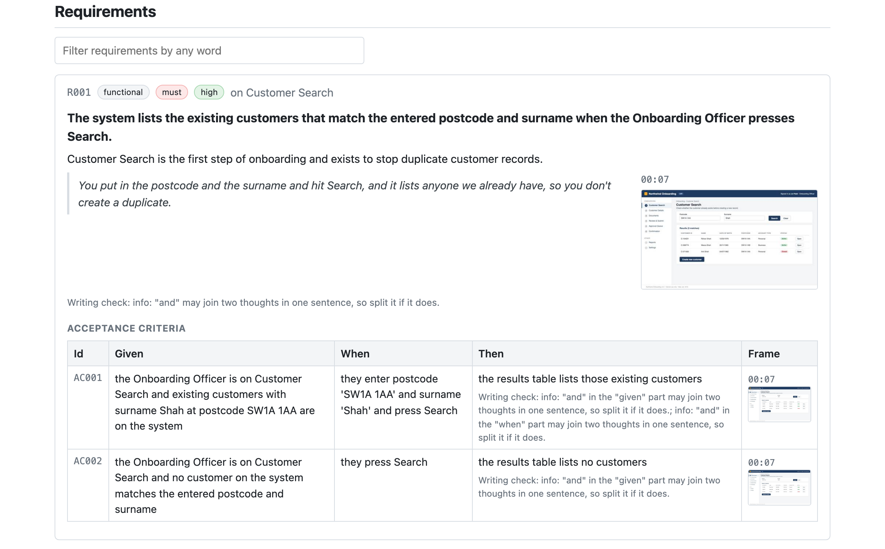
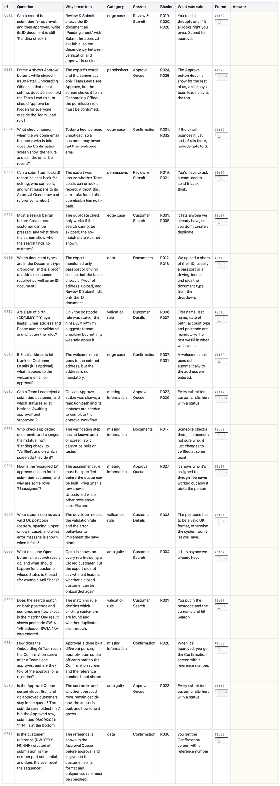
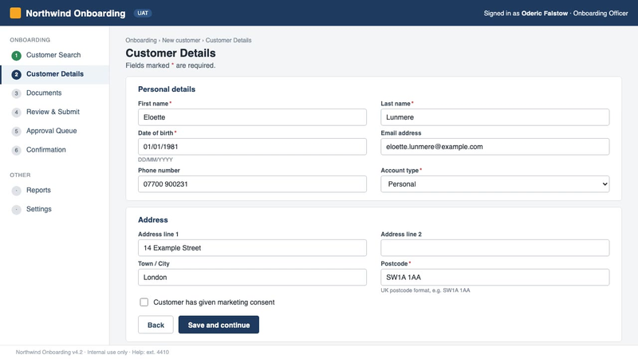

# specto

Watches a screen recording of an SME [expert] walking through a system and writes
down what the system must do.

An expert records themselves clicking through the screens and talking: "this
is where we look up the customer, we type the postcode here, then Save sends it
to the approvals queue". Today a business analyst sits through the recording and
types that up by hand. specto does the first draft. It listens to what was said,
looks at what was on screen at that moment, and produces one spreadsheet:

| Sheet | What is in it |
|---|---|
| Journey | The process step by step, one row per screen visited |
| Screens | Every screen seen, what it is for, and a picture of it |
| Data Fields | Every box, dropdown and column seen or mentioned, with the values on screen |
| Actions | Every button and link the expert used, and where it led |
| Requirements | What the system must do, in the expert's own words, with a picture of the moment |
| Acceptance Criteria | How to check each requirement is met (Given / When / Then) |
| SME Questions | What the expert did not say and someone must ask before building |
| Transcript | Everything said, with the time and the screen that was showing |
| Glossary | Every role, screen, field and button named, where it first appeared, and a Definition column to fill in |
| Gaps | What the analysis does not cover yet: screens with no requirement, fields never mentioned, requirements with no criteria, buttons that lead nowhere |
| Personal Data | Every email, phone number, postcode, date of birth, card or account number, name and address that appeared on screen or was said, masked, with the frame it was on |







Every row links to a still image from the recording, so a reader can check any
claim against the screen in one click. The reports also carry a screen-flow
picture: the screens as boxes in the order the expert reached them, with the
button that led from each to the next on the arrow. A Markdown report with the same content
is written next to the workbook.

An expert walking through a real system shows real customer records. The
Personal Data sheet lists what personal data the recording captured and on
which frame, with the values masked. Check it before the workbook, the
report or the frames folder is shared or stored. Then:

```bash
specto redact out/walkthrough
```

paints over every email, phone number, postcode, date of birth, card or
account number, name and address on the still frames, masks the same values
inside the outputs, and rewrites the workbook and reports. The untouched
frames are kept under `frames/original/` until you delete that folder (do
that before the output leaves the team); `specto restore` puts them back.
Needs the OCR extra.

## Try it

```bash
pip install -e .
export ANTHROPIC_API_KEY=...
specto run walkthrough.mp4 --transcript walkthrough.vtt
```

Output lands in `out/walkthrough/`: `analysis.xlsx`, `report.md`,
`report.html`, a `frames/` folder, two ticket import files, and the JSON
files the stages hand to each other.

**One file to send.** `report.html` is the whole analysis in a single page
with the frames inside it, so it can be emailed or dropped in a chat and
opens anywhere with nothing else attached. The SME Questions table has
answer cells you can type into during the follow-up call, then print to PDF.

**Into Jira or Azure DevOps.** `jira_import.csv` holds one Story per
requirement with its acceptance criteria and source in the description, and
one Task per question. In Jira go to Settings, System, External System
Import, CSV, and pick the file; the columns map by name. `azure_devops_import.csv`
holds one User Story per requirement and one Issue per question. In Azure
DevOps go to Boards, Queries, Import Work Items, pick the file, then Save
items. On a Scrum or Basic project change "User Story" to "Product Backlog
Item" in the file first.

If you have no transcript file, leave `--transcript` off and specto transcribes
the audio on your machine (needs `pip install -e ".[whisper]"`; the first run
downloads a speech model). Every word then gets its own start and end time, so
a sentence that runs across a screen change is cut at the word and each screen
only gets what was said while it was showing. Word times land within about a
third of a second; `pip install -e ".[whisper-precise]"` adds stable-ts, which
lands them about three times closer at the price of a 600 MB download.

Transcript files from meeting tools (`.vtt`, `.srt`, `.json`) carry no word
times, so when a sentence runs across a screen change specto spreads its
words evenly over the sentence's time (a long word gets a little more) and
cuts it there, which lands within a word or two of the right place. They are
still the faster and usually more accurate route when you have them.

To check the pipeline without spending anything, `--fake` runs it with a
stand-in model. There is a ready-made example recording in the repo, a
two-minute narrated walkthrough of a fake onboarding tool:

```bash
specto run examples/onboarding/walkthrough.mp4 --transcript examples/onboarding/walkthrough.vtt --fake
```

With `pip install -e ".[ocr]"` the text on each frame is also read and given
to the model next to the image, so small labels and values are not lost when
the frame is scaled down. It is on by default when installed; `--no-ocr` turns
it off.

## A meeting recording with the share in the middle

A Teams or Zoom recording shows the shared window inside a border with a
toolbar and a strip of faces. `--crop auto` finds the part of the picture
that actually changes over the recording and keeps only that, so the model
reads the shared window and not the meeting around it. If it picks the
wrong area, pass the box yourself as `--crop x,y,w,h` in pixels.

## No key at all: answer the requests yourself

```bash
specto run walkthrough.mp4 --transcript walkthrough.vtt --ingest-only
specto requests out/walkthrough      # writes requests/chunk_01.json, chunk_02.json ...
```

Some teams cannot put an API key on a machine but can paste into a chat
window or run a model through their own gateway. Each request file holds
the instructions, the frames to attach (by file name), the words spoken,
and the exact shape the answer must take. Put the model's answer in
`chunk_01.response.json`, run `specto requests out/walkthrough --regenerate 2`
so the next request knows the screens already named, and carry on. When
every chunk is answered, `specto requests` writes the final merge request;
answer it, then:

```bash
specto load out/walkthrough          # reads the answers, writes every output
```

`specto status out/walkthrough` says what is answered and what comes next.

## Using Gemini instead of Claude

```bash
export GEMINI_API_KEY=...   # or GOOGLE_API_KEY; a free key comes from https://aistudio.google.com/apikey
specto run walkthrough.mp4 --transcript walkthrough.vtt --provider gemini --model gemini-2.5-pro
```

The same stages run against Google's Gemini; `gemini-2.5-flash` is the
cheaper choice for the frame-reading pass. If the first call fails with a
403 saying the API "has not been used in project", open that Google Cloud
project's APIs & Services, Library, enable the Generative Language API, and
run it again. An existing Google API key from another product (Maps,
YouTube) works once that API is enabled on its project.

## No recording, just screenshots

```bash
specto run shots/ --transcript notes.md
```

When the expert sent a folder of screenshots and some written notes instead
of a recording, point specto at the folder. Times come from the file names
when they carry one (`shot_12.png`, a date-time), otherwise the screenshots
are spaced ten seconds apart in name order. Notes without timestamps are
spread over the screenshots in order, one paragraph per picture.

## During a call, not after it

```bash
specto live --out out/todays-call
```

Live mode runs on macOS, Windows and Linux. It grabs the shared screen every
three seconds and records the microphone in thirty-second pieces, keeps only
the moments the screen changed, and every five minutes runs the whole
session so far through the same analysis. `out/todays-call/live_questions.md`
holds just the open questions, most blocking first, so it can sit in a
window and be asked before the expert leaves. Press Ctrl-C to stop; the
full workbook and reports are written at the end. If the folder already
exists the session is resumed. To try it without a call,
`--replay DIR --transcript FILE` feeds a folder of screenshots named
`shot_<seconds>.png` through the same path.

For the screen, install the small `mss` library with
`pip install -e ".[live]"`; it works on all three systems. Without it specto
falls back to what the system already has: `screencapture` on macOS,
PowerShell on Windows, and `grim` (Wayland) or ImageMagick's `import` (X11)
on Linux. For the microphone, the bundled ffmpeg uses the input each system
has; on Windows the first microphone it lists is used and the log says
which, and `--audio-device` picks another.

On macOS, give your terminal Screen Recording and Microphone permission
first (System Settings, Privacy & Security). Without Screen Recording, live
mode stops with a line saying so rather than recording an empty desktop.
`specto doctor` shows which screen backend and microphone input will be
used on your machine and, on a Mac, whether the permission is granted.

## After the follow-up call

Type the expert's answers into the Answer column of the SME Questions sheet
(and "not needed" in Status for the ones that no longer matter), then:

```bash
specto answers out/walkthrough
specto resolve out/walkthrough
```

The first reads the answers back and rewrites every output with them. The
second sends only the answered questions to the model and adds what the
answers establish: new requirements with their source marked as the answer,
changed wording on existing ones with the reason recorded, criteria for
each, and any follow-up questions the answers raised. Running it again only
sends newly answered questions.

## How it works

1. **Ingest.** One frame per second is compared with the last kept frame
   using an image fingerprint that notices colour and typed text, and a still
   is saved whenever the screen changed. The transcript is read (or made),
   and each sentence is matched to the image that was showing when it was
   said. Each still is compared with the one before it to find where the
   screen changed; a small change (a typed value, a pressed button) gets a
   close-up crop so the model can read it. If OCR is installed, the text on
   each still is read too.
2. **Extract.** Claude reads the images and the words in batches of eight
   frames and writes down the screens, fields, actions and candidate
   requirements it sees, keeping the same screen names across batches. One
   final pass over the whole session merges those notes into requirements with
   acceptance criteria and a list of questions.
3. **Export.** The notes become the workbook and the report, with every row
   pointing at its frame. Every requirement and criterion is checked against
   plain writing rules (one thought per sentence, no vague words, no escape
   clauses, a visible outcome) and the findings go in a "Writing check"
   column, so a reader sees at a glance which rows need a rewrite.

Each stage saves its result in the output folder. Running the same command
again skips the stages already done, so a prompt change re-runs only the
extraction, and a workbook layout change re-runs only the export
(`specto export out/walkthrough`). A model run that dies halfway (network,
Ctrl-C) saves what it has read so far and picks up from there next time.
`--force` redoes everything, including the model reads.

## Commands

| Command | What it does |
|---|---|
| `specto run VIDEO` | the whole pipeline on a recording |
| `specto live --out DIR` | screen and microphone during a call, questions every five minutes |
| `specto export DIR` | rebuild every output from a finished analysis |
| `specto score DIR KEY` | compare an output with an answer key |
| `specto doctor` | what is installed and what is missing |
| `specto requests DIR`, `specto load DIR`, `specto status DIR` | write the model requests as files, read the answers back, see what is left; no key needed |
| `specto merge DIR DIR... --out DIR` | several sessions into one workbook: same screens, requirements and questions folded together, no model call |
| `specto redact DIR` | paint over the personal data on the frames and mask it in the outputs; `specto restore DIR` undoes it |
| `specto answers DIR` | read the Answer and Status columns typed into the workbook back in |
| `specto resolve DIR` | turn the answered questions into requirements and criteria, and raise any follow-ups |

## Options

| Flag | Meaning | Default |
|---|---|---|
| `--transcript FILE` | `.vtt`, `.srt`, timestamped `.txt`, or a meeting-tool `.json` | transcribe locally |
| `--out DIR` | where to write | `out/<video name>` |
| `--provider claude|gemini` | which model service to call | `claude` |
| `--model ID` | model id for the provider | `claude-opus-5` |
| `--reader-model ID` | a cheaper model for reading the frames, e.g. `claude-sonnet-5`; the final merge still uses `--model` | same as `--model` |
| `--effort` | how hard the model thinks: low, medium, high, xhigh, max | `high` |
| `--frames-per-call N` | images per model call | 8 |
| `--max-frames N` | cap on still images kept; over the cap, the frames that changed least from their neighbour are dropped first | 240 |
| `--crop x,y,w,h` or `--crop auto` | keep only part of the picture; `auto` finds the shared window and drops the meeting border, toolbar and gallery strip | whole picture |
| `--detect hash|scene` | find screen changes by image fingerprint, or by ffmpeg brightness | `hash` |
| `--hash-distance N` | how different a frame must be to count as new; lower catches typed text | 8 |
| `--sample-fps X` | frames looked at per second in hash mode | 1 |
| `--scene-threshold X` | brightness change that counts as a new screen, scene mode only | 0.3 |
| `--ocr / --no-ocr` | read the text on each frame for the model | on |
| `--ingest-only` | stop after frames and transcript | |
| `--estimate` | print the expected cost for each model and stop | |
| `--max-cost USD` | stop before the model if the estimate is above this | |
| `--fake` | stand-in model, no key needed | |
| `--force` | redo every stage | |

## Does it work?

On the example recording, read by Claude through the bring-your-own-model
path (the agents in a Claude Code session acting as the model, so no API
key was involved), the result was 6 screens, 59 fields, 12 actions, 32
requirements, 44 acceptance criteria and 17 questions. Against the
hand-written answer key:

| What the key asks for | Found |
|---|---|
| Screens | 6 of 6 |
| Fields | 14 of 14 |
| Actions | 4 of 4 |
| Requirements | 6 of 7 (the seventh is there too, folded into one requirement with another) |
| Questions | 5 of 5 |

Two things the model noticed that the narration never said: the Approve
button is visible on screen while the expert says only team leads see it,
and a record can be submitted while its ID document is still "Pending
check". Both became questions, each naming the requirements it holds up.
The full result is in `examples/onboarding/reference/`.

The same stages have not yet been run through the API itself, so the first
run with a key should be on the example, and the score compared with that
folder.

## Checking the output against an answer key

`examples/onboarding/expected.json` lists what a good analysis of the example
must contain: screen names, field labels, and keyword groups for actions,
requirements and questions. After a run, the score command reports how much
of it was found and what was missed:

```bash
specto score out/walkthrough examples/onboarding/expected.json --min 0.7
```

This is how a prompt change is judged: run, score, compare. Write an answer
key for your own recording the same way.

## What it costs

Before any real run specto prints what it expects to spend, and
`--estimate` prints the figure for each model and stops:

```bash
specto run walkthrough.mp4 --transcript walkthrough.vtt --estimate
```

`--max-cost 5` stops before the model whenever the estimate is above five
dollars, so a long recording cannot run up a bill by accident.

`specto doctor` lists what is installed and what is missing (ffmpeg, the
speech model, OCR, the API key) and what to do about each.

A one-hour walkthrough typically yields 60 to 120 still images. Each image is
scaled to 1280 pixels wide and costs roughly 1,500 tokens to read, and the
system prompt is cached between calls. Expect a few dollars per hour of
recording on Claude Opus 5; `--effort medium` and a lower `--max-frames` cut
that further.

## Limits

- On Linux, `grim` and `import` capture every monitor together, so `--display` only selects a monitor when `mss` is installed. Each analysis round reuses what the model
  already read, so only the newest frames and one merge call are paid for
  each time.
- It writes a first draft. The Requirements sheet carries a confidence column:
  "high" means the expert said it plainly, "low" means it was inferred from
  the screen. Read the low ones with care.
- Small text on a high-resolution screen may be unreadable at 1280 pixels
  wide; raise `max_width` in `specto/ingest.py` if fields are being missed.
- Speaker names appear only when the transcript file carries them.
- Screen changes are found by taking one still a second and keeping it when
  its layout, text or colour differs from the last one kept by more than
  `--hash-distance` (default 8; lower it to catch smaller changes, raise it
  to ignore a ticking clock or a moving cursor); `--detect scene` switches to
  ffmpeg's brightness detector, which misses a page that only changes colour
  or gains typed text.

## Development

```bash
python -m venv .venv && .venv/bin/pip install -e ".[dev]"
.venv/bin/python -m pytest -q
```

The tests build a small synthetic video, run every stage with a stand-in model,
and open the resulting workbook. They need no network and no API key.
