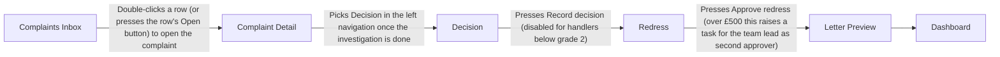

# Meridian Complaints: working a complaint from inbox to final response letter

## Summary

Meridian Complaints is the tool the complaints team uses to log and work every customer complaint. A complaint handler picks a complaint from the Inbox, investigates it on the Complaint Detail screen and writes notes as they go. When the investigation is done the handler records a decision to uphold, partially uphold or reject the complaint, with a reason and a written summary. For an upheld or partially upheld complaint the handler works out the refund and interest on the Redress screen, with a team lead as second approver over £500. The handler then sends the final response letter from Letter Preview, and the team lead watches the team's workload and SLA position on the Dashboard.

- Actors: Complaint handler (grade 2 and above), Trainee complaint handler (below grade 2), Supervisor, Team lead, Complaint logger (whoever logs the complaint), Customer, Finance (owner of the interest rate table), Ombudsman (external body)
- Recording: examples/claims/walkthrough.mp4
- Duration: 02:58
- Transcript source: file
- Screens: 6
- Data fields: 42
- Actions: 14
- Journey steps: 9
- Requirements: 46
- Acceptance criteria: 60
- Questions: 23
- Writing check: 5 requirements and 9 criteria have warnings; 81 notes
- Naming check: 61 terms in the glossary; 6 naming clashes to check on the Glossary sheet
- Personal data: Personal data seen: 1 email, 2 phone numbers, 10 names, 2 addresses on 6 frames. Check before sharing.
- Gaps: 11 gaps to close: 3 fields never mentioned, 8 actions leading nowhere; 12 notes.
- Model: bring-your-own
- Model calls: 2
- Input tokens: 0
- Output tokens: 0
- Cache read tokens: 0
- Cache write tokens: 0
- Generated: 2026-09-14 21:23

## The journey, step by step

1. **Complaints Inbox** (Complaint handler): The handler lands on the Complaints Inbox, which lists the open complaints sorted by SLA remaining. ([frame 0 @ 00:00](frames/frame_0000.jpg))
2. **Complaints Inbox** (Complaint handler): The handler double-clicks a row to open the complaint. ([frame 0 @ 00:00](frames/frame_0000.jpg))
3. **Complaint Detail** (Complaint handler): On Complaint Detail the handler reviews the customer details and timeline, investigates, and records what they did as notes. ([frame 1 @ 00:38](frames/frame_0001.jpg))
4. **Complaint Detail** (Complaint handler): If the category is wrong the handler changes it and adds a note saying why. ([frame 1 @ 00:38](frames/frame_0001.jpg))
5. **Decision** (Complaint handler (grade 2 or above)): When the investigation is done the handler goes to Decision, picks an outcome and a reason, writes a summary of at least 50 words and presses Record decision. ([frame 2 @ 01:11](frames/frame_0002.jpg))
6. **Redress** (Complaint handler): If the complaint is upheld or partially upheld the handler goes to Redress, enters the refund amount and days out of pocket, checks the calculated interest and total, and presses Approve redress. ([frame 3 @ 01:41](frames/frame_0003.jpg))
7. **Redress** (Team lead): If the redress is over £500 the system raises a task for the team lead to give second approval. ([frame 3 @ 01:41](frames/frame_0003.jpg))
8. **Letter Preview** (Complaint handler): The handler opens Letter Preview, checks the merged final response letter and presses Send letter, which goes to print or, if the customer asked for it, email. ([frame 4 @ 02:05](frames/frame_0004.jpg))
9. **Dashboard** (Team lead): The team lead reviews the Dashboard figures and chart and can export them as a spreadsheet. ([frame 5 @ 02:36](frames/frame_0005.jpg))

## Screen flow

Each box is a screen the expert showed, in the order they reached them; a labelled arrow is the action that moves from one screen to the next, and an unlabelled arrow is a step of the journey with no recorded action between the two.

If the diagram above does not show, read the same flow as a list:

1. S01 Complaints Inbox → (Double-clicks a row (or presses the row's Open button) to open the complaint) → S02 Complaint Detail
2. S02 Complaint Detail → (Picks Decision in the left navigation once the investigation is done) → S03 Decision
3. S03 Decision → (Presses Record decision (disabled for handlers below grade 2)) → S04 Redress
4. S04 Redress → (Presses Approve redress (over £500 this raises a task for the team lead as second approver)) → S05 Letter Preview
5. S05 Letter Preview → S06 Dashboard

## Screens

### S01: Complaints Inbox

Lists every open complaint sorted by SLA remaining, so a handler can pick the next one to work. ([frame 0 @ 00:00](frames/frame_0000.jpg))

**Data fields**

- F001 Reference (table column; required: unknown; both; example: CMP-2026-01518). Format seen on screen: CMP-YYYY-NNNNN. Column header is sortable. ([frame 0 @ 00:00](frames/frame_0000.jpg))
- F002 Customer (table column; required: unknown; both; example: Vinel Ashby). ([frame 0 @ 00:00](frames/frame_0000.jpg))
- F003 Received (table column; required: unknown; both; example: 01/08/2026). Date the complaint came in. Expert says handlers double-check this date when the SLA clock looks wrong. ([frame 0 @ 00:00](frames/frame_0000.jpg))
- F004 Category (table column; required: unknown; both; example: Delayed claim). Values seen on screen: Delayed claim, Renewal, Mis-sold cover, Policy wording, Poor service. ([frame 0 @ 00:00](frames/frame_0000.jpg))
- F005 Status (table column; required: unknown; both; example: Investigating). Shown as a coloured badge. Values seen on screen: New, Investigating, Awaiting customer, Decided, Referred. ([frame 0 @ 00:00](frames/frame_0000.jpg))
- F006 Owner (table column; required: unknown; seen on screen; example: Mabo Grawell). One row shows 'Unassigned'. ([frame 0 @ 00:00](frames/frame_0000.jpg))
- F007 SLA remaining (table column; required: unknown; both; example: 1d 05h). Countdown in days and hours; shown red when low (1d 05h) and as the word 'Breached' when past the deadline. Sorted ascending by default on this frame. Footer says 'Final response due within 8 weeks of receipt'. ([frame 0 @ 00:00](frames/frame_0000.jpg))

**Actions**

- A001 Clicks a column header to sort the inbox by that column [other]. ([frame 0 @ 00:00](frames/frame_0000.jpg))
- A002 Double-clicks a row (or presses the row's Open button) to open the complaint [other]. Leads to Complaint Detail. ([frame 0 @ 00:00](frames/frame_0000.jpg))

### S02: Complaint Detail

Shows one complaint's customer details, its timeline of events and the handler's notes, and lets the handler add notes or change the category. ([frame 1 @ 00:38](frames/frame_0001.jpg))

**Data fields**

- F008 Name (read-only; required: unknown; both; example: Vinel Ashby). In the Customer panel. ([frame 1 @ 00:38](frames/frame_0001.jpg))
- F009 Policy (read-only; required: unknown; seen on screen; example: POL-766800 · Pet insurance). Policy number and product name shown together. ([frame 1 @ 00:38](frames/frame_0001.jpg))
- F010 Phone (read-only; required: unknown; both; example: 07700 900148). ([frame 1 @ 00:38](frames/frame_0001.jpg))
- F011 Email (read-only; required: unknown; both; example: vinel.ashby@example.com). ([frame 1 @ 00:38](frames/frame_0001.jpg))
- F012 Address (read-only; required: unknown; both; example: 5 Graford Road, Penbrook). ([frame 1 @ 00:38](frames/frame_0001.jpg))
- F013 Received (read-only; required: unknown; seen on screen; example: 01/08/2026 by Letter). Date plus channel the complaint arrived by. ([frame 1 @ 00:38](frames/frame_0001.jpg))
- F014 Category (other; required: unknown; both; example: Delayed claim). Shown as a value with a 'Change' button next to it. Set by whoever logged the complaint; can be changed here but a note saying why is required. ([frame 1 @ 00:38](frames/frame_0001.jpg))
- F015 Status (read-only; required: unknown; seen on screen; example: Investigating). Badge, same style as the inbox. No control to change it is visible on this frame. ([frame 1 @ 00:38](frames/frame_0001.jpg))
- F016 Owner (read-only; required: unknown; seen on screen; example: Mabo Grawell). Note the timeline says 'Assigned to Vibo Walridge' while Owner shows Mabo Grawell; see question Q005. ([frame 1 @ 00:38](frames/frame_0001.jpg))
- F017 Timeline (read-only; required: unknown; both; example: 01/08/2026 Complaint received — Logged by Mabo Grawell from a letter). Dated list of events in order. Events seen: Complaint received; Acknowledgement sent (Standard acknowledgement letter, 4 working days); Assigned to Vibo Walridge (Auto-assigned from the Delayed claim queue); Customer contacted; Evidence requested; Final response due (8-week deadline). ([frame 1 @ 00:38](frames/frame_0001.jpg))
- F018 Notes (read-only; required: unknown; both; example: Vibo Walridge · 01/07/2026 — Read the claim file. The claim sat unallocated for three weeks before anyone picked it up.). List of saved notes, each stamped with author name and date. Cannot be edited or deleted once saved. ([frame 1 @ 00:38](frames/frame_0001.jpg))
- F019 Write a note (text; required: unknown; both). Multi-line text box at the bottom of the Notes panel. Placeholder reads 'Write a note. Notes are stamped with your name and today's date and cannot be edited afterwards.' The 'Add note' button the expert mentions is below the visible area of the frame. ([frame 1 @ 00:38](frames/frame_0001.jpg))

**Actions**

- A003 Types in the Write a note box and presses Add note [button]. ([frame 1 @ 00:38](frames/frame_0001.jpg))
- A004 Presses Change next to Category to correct the category [button]. ([frame 1 @ 00:38](frames/frame_0001.jpg))
- A005 Picks Decision in the left navigation once the investigation is done [menu]. Leads to Decision. ([frame 1 @ 00:38](frames/frame_0001.jpg))

### S03: Decision

Records the outcome of the investigation (uphold, partially uphold or reject) with a reason and a written summary of findings. ([frame 2 @ 01:11](frames/frame_0002.jpg))

**Data fields**

- F020 Outcome (radio; required: yes; both; example: Partially uphold). Three options with help text: Uphold ('The complaint is justified in full. Redress is usually due.'), Partially uphold ('Part of the complaint is justified. Redress may be due.'), Reject ('The complaint is not justified. No redress.'). Marked with an asterisk. ([frame 2 @ 01:11](frames/frame_0002.jpg))
- F021 Reason (dropdown; required: yes; both; example: Delay not fully explained). Marked with a red asterisk. Other options in the list were not shown. ([frame 2 @ 01:11](frames/frame_0002.jpg))
- F022 Summary of findings (text; required: yes; both; example: The claim was accepted and paid in full, but it took longer than it should have. The customer was given a timescale that was not met.). Multi-line text box. Live word counter underneath reads 'At least 50 words. Currently 31 words.' Minimum 50 words. ([frame 2 @ 01:11](frames/frame_0002.jpg))

**Actions**

- A006 Picks an Outcome: Uphold, Partially uphold or Reject [other]. ([frame 2 @ 01:11](frames/frame_0002.jpg))
- A007 Chooses a Reason from the dropdown and writes the Summary of findings [other]. ([frame 2 @ 01:11](frames/frame_0002.jpg))
- A008 Presses Record decision (disabled for handlers below grade 2) [button]. Leads to Redress. ([frame 2 @ 01:11](frames/frame_0002.jpg))
- A009 Presses Save draft [button]. ([frame 2 @ 01:11](frames/frame_0002.jpg))

### S04: Redress

Calculates the money owed to the customer (refund plus simple interest) for an upheld or partially upheld complaint and lets the handler approve it. ([frame 3 @ 01:41](frames/frame_0003.jpg))

**Data fields**

- F023 Refund amount (£) (number; required: yes; both; example: 750.00). Marked with a red asterisk. ([frame 3 @ 01:41](frames/frame_0003.jpg))
- F024 Days out of pocket (number; required: yes; both; example: 90). Marked with a red asterisk. ([frame 3 @ 01:41](frames/frame_0003.jpg))
- F025 Interest rate (read-only; required: unknown; both; example: 8.00% per year). Greyed out. Help text: 'From the Finance rate table. Not editable here.' ([frame 3 @ 01:41](frames/frame_0003.jpg))
- F026 Item (table column; required: unknown; seen on screen; example: Interest (8% for 90 days)). Calculation table rows: Refund, Interest (8% for 90 days), Total redress. ([frame 3 @ 01:41](frames/frame_0003.jpg))
- F027 Amount (table column; required: unknown; seen on screen; example: £14.79). Calculation table amounts: Refund £750.00, Interest £14.79, Total redress £764.79. 750.00 × 8% × 90/365 = 14.79, which matches simple interest on a 365-day year. ([frame 3 @ 01:41](frames/frame_0003.jpg))
- F028 Total redress (read-only; required: unknown; both; example: £764.79). Bold total row of the Calculation table: refund plus interest. ([frame 3 @ 01:41](frames/frame_0003.jpg))

**Actions**

- A010 Enters Refund amount and Days out of pocket and presses Recalculate to fill the Calculation table [button]. ([frame 3 @ 01:41](frames/frame_0003.jpg))
- A011 Presses Approve redress (over £500 this raises a task for the team lead as second approver) [button]. Leads to Letter Preview. ([frame 3 @ 01:41](frames/frame_0003.jpg))

### S05: Letter Preview

Shows the final response letter with merge fields filled from the complaint, decision and redress, and lets the handler send it. ([frame 4 @ 02:05](frames/frame_0004.jpg))

**Data fields**

- F029 Letter date (read-only; required: unknown; seen on screen; example: 01/09/2026). Highlighted merge field at the top of the letter. No label shown; name given here for reference. ([frame 4 @ 02:05](frames/frame_0004.jpg))
- F030 Customer name and address (read-only; required: unknown; both; example: Vinel Ashby, 5 Graford Road, Penbrook). Highlighted merge fields; first name 'Vinel' is also merged into the salutation 'Dear Vinel,'. ([frame 4 @ 02:05](frames/frame_0004.jpg))
- F031 Our reference (read-only; required: unknown; both; example: CMP-2026-01518). Merge field. ([frame 4 @ 02:05](frames/frame_0004.jpg))
- F032 Policy (read-only; required: unknown; seen on screen; example: POL-766800). Merge field. ([frame 4 @ 02:05](frames/frame_0004.jpg))
- F033 Product (read-only; required: unknown; seen on screen; example: pet insurance). Merge field in the sentence 'Thank you for your complaint about your pet insurance'. ([frame 4 @ 02:05](frames/frame_0004.jpg))
- F034 Received date (read-only; required: unknown; seen on screen; example: 01/08/2026). Merge field: 'which we received on 01/08/2026'. ([frame 4 @ 02:05](frames/frame_0004.jpg))
- F035 Decision (read-only; required: unknown; both; example: partially uphold). Merge field in 'We have decided to partially uphold your complaint.' ([frame 4 @ 02:05](frames/frame_0004.jpg))
- F036 Summary of findings (read-only; required: unknown; seen on screen; example: The claim was accepted and paid in full, but it took longer than it should have. The customer was given a timescale that was not met.). Merged from the Decision screen's Summary of findings (F022). ([frame 4 @ 02:05](frames/frame_0004.jpg))
- F037 Redress amounts (read-only; required: unknown; both; example: £764.79, made up of a refund of £750.00 and interest of £14.79). Three merge fields (total, refund, interest) from the Redress screen. Letter text says the payment is 'within 10 working days'. ([frame 4 @ 02:05](frames/frame_0004.jpg))
- F038 Handler name (read-only; required: unknown; seen on screen; example: Vibo Walridge). Merge field in the sign-off above 'Complaints Team, Meridian'. ([frame 4 @ 02:05](frames/frame_0004.jpg))

**Actions**

- A012 Reads the letter through and presses Send letter [button]. ([frame 4 @ 02:05](frames/frame_0004.jpg))
- A013 Presses Edit template [button]. ([frame 4 @ 02:05](frames/frame_0004.jpg))

### S06: Dashboard

Gives the team lead a team view of open complaints, SLA breaches, uphold rate and complaints received by month, with an export to spreadsheet. ([frame 5 @ 02:36](frames/frame_0005.jpg))

**Data fields**

- F039 Open complaints (read-only; required: unknown; both; example: 34). Tile caption: 'across the team today'. ([frame 5 @ 02:36](frames/frame_0005.jpg))
- F040 Breaching SLA (read-only; required: unknown; both; example: 4). Tile caption: 'past the 8-week deadline'. Shown in red. ([frame 5 @ 02:36](frames/frame_0005.jpg))
- F041 Uphold rate (read-only; required: unknown; both; example: 38%). Tile caption: 'upheld or partially upheld'. Period not stated; expert unsure whether this month or rolling. ([frame 5 @ 02:36](frames/frame_0005.jpg))
- F042 Complaints received by month (read-only; required: unknown; both; example: Apr 2026: 24, May 2026: 40, Jun 2026: 27, Jul 2026: 39, Aug 2026: 20, Sep 2026: 13). Bar chart, six months shown. ([frame 5 @ 02:36](frames/frame_0005.jpg))

**Actions**

- A014 Presses Export to download the dashboard figures as a spreadsheet [button]. ([frame 5 @ 02:36](frames/frame_0005.jpg))

## Requirements

### R001: The Complaints Inbox lists every open complaint.

- functional, priority must, confidence high, screen Complaints Inbox. ([frame 0 @ 00:00](frames/frame_0000.jpg))
- Why: The frame shows one row per complaint with statuses New, Investigating, Awaiting customer, Decided and Referred, so "open" covers every status seen; what "open" excludes and whether the list is limited to the handler's team are open questions.
- The expert said: "You land on the Inbox, which is every open complaint sorted by how long we've got left on it."
- *Writing check: info: "every" is an absolute, so check it is really meant.*

Acceptance criteria:

- AC001: Given a complaint exists with a status of New, Investigating, Awaiting customer, Decided or Referred, when a complaint handler opens the Complaints Inbox, then the complaint appears as a row in the list. ([frame 0 @ 00:00](frames/frame_0000.jpg))
  - *Writing check: warn: "or" in the "given" part joins two thoughts in one sentence, so write one sentence per thought.*

### R002: When the handler opens the Complaints Inbox, the system sorts the list by SLA remaining with the least time left at the top.

- functional, priority must, confidence high, screen Complaints Inbox. ([frame 0 @ 00:00](frames/frame_0000.jpg))
- Why: On the frame the SLA remaining column is sorted ascending: 1d 05h at the top, Breached rows above the rest.
- The expert said: "You land on the Inbox, which is every open complaint sorted by how long we've got left on it."
- *Writing check: info: The statement does not say who or what does this, so start with the role or "The system".*

Acceptance criteria:

- AC002: Given three open complaints with SLA remaining of 1d 05h, 12d 02h and 30d 00h, when the handler opens the Complaints Inbox, then the rows appear in the order 1d 05h, 12d 02h, 30d 00h. ([frame 0 @ 00:00](frames/frame_0000.jpg))
  - *Writing check: info: "and" in the "given" part may join two thoughts in one sentence, so split it if it does.*

### R003: Each row in the Complaints Inbox shows the reference, customer, received date, category, status, owner and SLA remaining of one complaint.

- data, priority must, confidence high, screen Complaints Inbox. ([frame 0 @ 00:12](frames/frame_0000.jpg))
- Why: The Owner column was seen on the frame but not named by the expert. Reference format seen: CMP-YYYY-NNNNN. Status is shown as a coloured badge.
- The expert said: "Each row has the reference, the customer, when it came in, the category, the status and the SLA countdown."
- *Writing check: info: "and" may join two thoughts in one sentence, so split it if it does.; info: The statement does not say who or what does this, so start with the role or "The system".*

Acceptance criteria:

- AC003: Given complaint CMP-2026-01518 for Vinel Ashby, received 01/08/2026, category Delayed claim, status Investigating, owner Mabo Grawell, when the handler views the Complaints Inbox, then the row for CMP-2026-01518 shows each of those seven values in its own column, with SLA remaining in the last column. ([frame 0 @ 00:12](frames/frame_0000.jpg))

### R004: When the handler clicks a column header in the Complaints Inbox, the system sorts the list by that column.

- functional, priority must, confidence high, screen Complaints Inbox. ([frame 0 @ 00:12](frames/frame_0000.jpg))
- The expert said: "You click a column header to sort, and most people sort by the SLA column."
- *Writing check: info: The statement does not say who or what does this, so start with the role or "The system".*

Acceptance criteria:

- AC004: Given the Complaints Inbox is sorted by SLA remaining, when the handler clicks the Received column header, then the rows are re-ordered by received date. ([frame 0 @ 00:12](frames/frame_0000.jpg))
- AC005: Given the Complaints Inbox is sorted by Received, when the handler clicks the SLA remaining column header, then the rows are re-ordered by SLA remaining. ([frame 0 @ 00:12](frames/frame_0000.jpg))

### R005: The system shows SLA remaining for each open complaint as the days and hours left until 8 weeks after the received date.

- workflow, priority must, confidence medium, screen Complaints Inbox. ([frame 0 @ 00:12](frames/frame_0000.jpg))
- Why: The 8-week rule comes from the inbox footer "Final response due within 8 weeks of receipt" and the timeline entry "Final response due (8-week deadline)"; the expert says the clock is sometimes wrong, so the exact start point and day-count are unconfirmed (see the SLA question). Format seen: "1d 05h".
- The expert said: "Each row has the reference, the customer, when it came in, the category, the status and the SLA countdown."
- *Writing check: info: "and" may join two thoughts in one sentence, so split it if it does.*

Acceptance criteria:

- AC006: Given a complaint was received exactly 54 days ago at the current time of day, when the handler views the Complaints Inbox, then the SLA remaining column for that complaint shows 2d 00h. ([frame 0 @ 00:12](frames/frame_0000.jpg))
- AC007: Given a complaint with SLA remaining of 1d 05h, when the handler views the Complaints Inbox, then the SLA remaining value for that complaint is shown in red. ([frame 0 @ 00:12](frames/frame_0000.jpg))

### R006: When the 8-week deadline for a complaint has passed, the system shows the word Breached in its SLA remaining column.

- workflow, priority must, confidence medium, screen Complaints Inbox. ([frame 0 @ 00:12](frames/frame_0000.jpg))
- Why: Seen on the frame: rows past the deadline show "Breached" instead of a countdown. The expert did not describe this value.
- The expert said: "Each row has the reference, the customer, when it came in, the category, the status and the SLA countdown."
- *Writing check: info: The statement does not say who or what does this, so start with the role or "The system".*

Acceptance criteria:

- AC008: Given a complaint received 57 days ago whose final response has not been sent, when the handler views the Complaints Inbox, then the SLA remaining column for that complaint shows Breached. ([frame 0 @ 00:12](frames/frame_0000.jpg))

### R007: When a complaint becomes more than 8 weeks old, the system refers it to the Ombudsman without any user action.

- workflow, priority must, confidence high, screen Complaints Inbox. ([frame 0 @ 00:24](frames/frame_0000.jpg))
- Why: What the referral sends, and to whom, was not described; see the Ombudsman question.
- The expert said: "Anything over eight weeks old goes to the Ombudsman automatically, you'll see the status flip to Referred on its own."
- *Writing check: info: The statement does not say who or what does this, so start with the role or "The system".*

Acceptance criteria:

- AC009: Given a complaint received 8 weeks ago today with no decision recorded, when the clock passes the 8-week point, then the system refers the complaint to the Ombudsman with no handler action. ([frame 0 @ 00:24](frames/frame_0000.jpg))

### R008: When the system refers a complaint to the Ombudsman, it sets the complaint status to Referred.

- workflow, priority must, confidence high, screen Complaints Inbox. ([frame 0 @ 00:24](frames/frame_0000.jpg))
- Why: A Referred status badge was seen in the inbox.
- The expert said: "Anything over eight weeks old goes to the Ombudsman automatically, you'll see the status flip to Referred on its own."
- *Writing check: info: The statement does not say who or what does this, so start with the role or "The system".*

Acceptance criteria:

- AC010: Given a complaint with status Investigating that the system has just referred to the Ombudsman, when the handler views the Complaints Inbox, then the status column for that complaint shows Referred. ([frame 0 @ 00:24](frames/frame_0000.jpg))

### R009: When the handler double-clicks a row in the Complaints Inbox, the system opens the Complaint Detail for that complaint.

- functional, priority must, confidence high, screen Complaints Inbox. ([frame 1 @ 00:38](frames/frame_0001.jpg))
- The expert said: "You double-click a row to open it and you get the Complaint Detail."
- *Writing check: info: The statement does not say who or what does this, so start with the role or "The system".*

Acceptance criteria:

- AC011: Given the Complaints Inbox shows a row for CMP-2026-01518, when the handler double-clicks that row, then the Complaint Detail for CMP-2026-01518 opens. ([frame 1 @ 00:38](frames/frame_0001.jpg))

### R010: When the handler presses the Open button on a row in the Complaints Inbox, the system opens the Complaint Detail for that complaint.

- functional, priority unknown, confidence low, screen Complaints Inbox. ([frame 1 @ 00:38](frames/frame_0001.jpg))
- Why: An Open button was seen on each inbox row; the expert only described double-clicking.
- The expert said: "You double-click a row to open it and you get the Complaint Detail."
- *Writing check: info: The statement does not say who or what does this, so start with the role or "The system".*

Acceptance criteria:

- AC012: Given the Complaints Inbox shows a row for CMP-2026-01518, when the handler presses the Open button on that row, then the Complaint Detail for CMP-2026-01518 opens. ([frame 1 @ 00:38](frames/frame_0001.jpg))

### R011: The Complaint Detail shows the customer's name, policy, phone, email, address, received date with channel, category, status and owner.

- data, priority must, confidence high, screen Complaint Detail. ([frame 1 @ 00:38](frames/frame_0001.jpg))
- Why: Policy, received channel, status and owner were seen on the frame but not named by the expert. Policy shows number and product together (POL-766800 · Pet insurance).
- The expert said: "Top left is the customer and their contact details, and on the right is the timeline, every event in order: received, acknowledged, assigned, and so on."
- *Writing check: info: "and" may join two thoughts in one sentence, so split it if it does.*

Acceptance criteria:

- AC013: Given complaint CMP-2026-01518 for Vinel Ashby with policy POL-766800 Pet insurance, received 01/08/2026 by Letter, when the handler opens its Complaint Detail, then the Customer panel shows the name Vinel Ashby, policy POL-766800 · Pet insurance, phone, email, address, Received 01/08/2026 by Letter, category, status and owner. ([frame 1 @ 00:38](frames/frame_0001.jpg))
  - *Writing check: info: "and" in the "then" part may join two thoughts in one sentence, so split it if it does.*

### R012: The Complaint Detail shows a timeline of every event on the complaint in date order.

- data, priority must, confidence high, screen Complaint Detail. ([frame 1 @ 00:38](frames/frame_0001.jpg))
- Why: Events seen on the frame: Complaint received; Acknowledgement sent; Assigned to a handler; Customer contacted; Evidence requested; Final response due (8-week deadline). Each event shows its date and a one-line detail.
- The expert said: "on the right is the timeline, every event in order: received, acknowledged, assigned, and so on."
- *Writing check: info: "every" is an absolute, so check it is really meant.*

Acceptance criteria:

- AC014: Given a complaint that was received on 01/08/2026 and acknowledged four working days later, when the handler opens its Complaint Detail, then the timeline lists Complaint received dated 01/08/2026 first, then Acknowledgement sent with its date, with every later event below in date order. ([frame 1 @ 00:38](frames/frame_0001.jpg))
  - *Writing check: info: "and" in the "given" part may join two thoughts in one sentence, so split it if it does.; warn: "then" in the "then" part joins two thoughts in one sentence, so write one sentence per thought.*

### R013: When the handler presses Add note, the system saves the text in the Write a note box as a new note on the complaint.

- functional, priority must, confidence high, screen Complaint Detail. ([frame 1 @ 00:51](frames/frame_0001.jpg))
- The expert said: "You type in the box and press Add note, and it stamps your name and the date on it."
- *Writing check: info: The statement does not say who or what does this, so start with the role or "The system".*

Acceptance criteria:

- AC015: Given the handler has typed "Read the claim file." in the Write a note box on Complaint Detail, when the handler presses Add note, then a note reading "Read the claim file." appears in the Notes panel of that complaint. ([frame 1 @ 00:51](frames/frame_0001.jpg))

### R014: The system stamps each saved note with the name of the handler who added it and the date it was added.

- functional, priority must, confidence high, screen Complaint Detail. ([frame 1 @ 00:51](frames/frame_0001.jpg))
- Why: Notes seen on the frame show "Vibo Walridge · 01/07/2026" above the note text.
- The expert said: "You type in the box and press Add note, and it stamps your name and the date on it."
- *Writing check: info: "and" may join two thoughts in one sentence, so split it if it does.; info: "was added" is passive, so say who or what does it.*

Acceptance criteria:

- AC016: Given handler Vibo Walridge is signed in on 01/07/2026, when Vibo Walridge adds a note, then the saved note shows "Vibo Walridge · 01/07/2026" as its stamp. ([frame 1 @ 00:51](frames/frame_0001.jpg))

### R015: The system keeps the text of a saved note unchanged: no user can edit it.

- validation, priority must, confidence high, screen Complaint Detail. ([frame 1 @ 00:51](frames/frame_0001.jpg))
- Why: Placeholder in the Write a note box also reads "cannot be edited afterwards". Whether this applies to supervisors and administrators is an open question.
- The expert said: "Notes can't be edited or deleted once they're saved."

Acceptance criteria:

- AC017: Given a saved note exists on a complaint, when any user views that note on Complaint Detail, then no edit control is offered for the note. ([frame 1 @ 00:51](frames/frame_0001.jpg))

### R016: The system keeps every saved note on the complaint: no user can delete it.

- validation, priority must, confidence high, screen Complaint Detail. ([frame 1 @ 00:51](frames/frame_0001.jpg))
- The expert said: "Notes can't be edited or deleted once they're saved."
- *Writing check: info: "every" is an absolute, so check it is really meant.*

Acceptance criteria:

- AC018: Given a saved note exists on a complaint, when any user views that note on Complaint Detail, then no delete control is offered for the note. ([frame 1 @ 00:51](frames/frame_0001.jpg))

### R017: The handler can change the category of a complaint from the Complaint Detail.

- functional, priority must, confidence high, screen Complaint Detail. ([frame 1 @ 01:03](frames/frame_0001.jpg))
- Why: A Change button was seen next to Category. Categories seen in the inbox: Delayed claim, Renewal, Mis-sold cover, Policy wording, Poor service.
- The expert said: "The category is set by whoever logged the complaint. If it's wrong you can change it here, but you have to put a note in saying why."

Acceptance criteria:

- AC019: Given a complaint with category Delayed claim is open on Complaint Detail, when the handler presses Change next to Category and picks Poor service, then the complaint shows category Poor service on Complaint Detail and in the Complaints Inbox. ([frame 1 @ 01:03](frames/frame_0001.jpg))
  - *Writing check: info: "and" in the "when" part may join two thoughts in one sentence, so split it if it does.; info: "and" in the "then" part may join two thoughts in one sentence, so split it if it does.*

### R018: When the handler changes the category of a complaint, the system requires a note that says why the category was changed.

- validation, priority must, confidence medium, screen Complaint Detail. ([frame 1 @ 01:03](frames/frame_0001.jpg))
- Why: The expert states the rule; whether the system enforces it or it is a team practice is an open question.
- The expert said: "If it's wrong you can change it here, but you have to put a note in saying why."
- *Writing check: info: The statement does not say who or what does this, so start with the role or "The system".; info: "was changed" is passive, so say who or what does it.*

Acceptance criteria:

- AC020: Given a complaint is open on Complaint Detail, when the handler changes the category without giving a reason, then the system keeps the old category and asks for a note saying why. ([frame 1 @ 01:03](frames/frame_0001.jpg))
  - *Writing check: info: "and" in the "then" part may join two thoughts in one sentence, so split it if it does.*
- AC021: Given a complaint is open on Complaint Detail, when the handler changes the category and gives a reason, then the system saves the new category and a note with that reason appears in the Notes panel. ([frame 1 @ 01:03](frames/frame_0001.jpg))
  - *Writing check: info: "and" in the "when" part may join two thoughts in one sentence, so split it if it does.; info: "and" in the "then" part may join two thoughts in one sentence, so split it if it does.*

### R019: The system sends a standard acknowledgement letter within 4 working days of receiving a complaint.

- workflow, priority unknown, confidence low, screen Complaint Detail. ([frame 1 @ 00:38](frames/frame_0001.jpg))
- Why: Seen only on the timeline: "Acknowledgement sent — Standard acknowledgement letter, 4 working days". The expert did not describe acknowledgement; whether the system or a person sends it is an open question.
- The expert said: "on the right is the timeline, every event in order: received, acknowledged, assigned, and so on."

Acceptance criteria:

- AC022: Given a complaint received on a Monday, when four working days pass, then the timeline shows an Acknowledgement sent event dated on or before the Friday of that week. ([frame 1 @ 00:38](frames/frame_0001.jpg))
  - *Writing check: warn: "or" in the "then" part joins two thoughts in one sentence, so write one sentence per thought.*

### R020: When a complaint is logged, the system assigns it to a handler from the queue for its category.

- workflow, priority unknown, confidence low, screen Complaint Detail. ([frame 1 @ 00:38](frames/frame_0001.jpg))
- Why: Seen only on the timeline: "Assigned to Vibo Walridge — Auto-assigned from the Delayed claim queue". The expert did not describe assignment, and the frame shows Owner as Mabo Grawell, so the relationship between Owner and Assigned to is an open question.
- The expert said: "on the right is the timeline, every event in order: received, acknowledged, assigned, and so on."
- *Writing check: info: "is logged" is passive, so say who or what does it.*

Acceptance criteria:

- AC023: Given a new complaint is logged with category Delayed claim, when the system assigns it, then the timeline shows an Assigned event naming a handler and the Delayed claim queue. ([frame 1 @ 00:38](frames/frame_0001.jpg))
  - *Writing check: info: "and" in the "then" part may join two thoughts in one sentence, so split it if it does.*

### R021: The system requires the handler to select exactly one Outcome from Uphold, Partially uphold and Reject before it records a decision.

- validation, priority must, confidence high, screen Decision. ([frame 2 @ 01:11](frames/frame_0002.jpg))
- Why: Outcome is a radio group marked with an asterisk. Help text seen: Uphold "The complaint is justified in full. Redress is usually due."; Partially uphold "Part of the complaint is justified. Redress may be due."; Reject "The complaint is not justified. No redress."
- The expert said: "It's three options: uphold, partially uphold, or reject. You pick one, choose a reason from the dropdown, and write the summary in the box."
- *Writing check: info: "and" may join two thoughts in one sentence, so split it if it does.*

Acceptance criteria:

- AC024: Given the Decision screen is open with no Outcome selected, when the handler views the Outcome control, then exactly three options are offered: Uphold, Partially uphold and Reject. ([frame 2 @ 01:11](frames/frame_0002.jpg))
  - *Writing check: info: "and" in the "then" part may join two thoughts in one sentence, so split it if it does.*
- AC025: Given the Decision screen has a Reason chosen and a 60-word summary but no Outcome selected, when the handler presses Record decision, then the system keeps the decision unrecorded and marks Outcome as required. ([frame 2 @ 01:11](frames/frame_0002.jpg))
  - *Writing check: info: "and" in the "given" part may join two thoughts in one sentence, so split it if it does.; warn: "but" in the "given" part joins two thoughts in one sentence, so write one sentence per thought.; info: "and" in the "then" part may join two thoughts in one sentence, so split it if it does.; warn: "as required" in the "then" part lets the rule be skipped, so say exactly when it applies.*

### R022: The system requires the handler to choose a Reason from the Reason dropdown before it records a decision.

- validation, priority must, confidence high, screen Decision. ([frame 2 @ 01:11](frames/frame_0002.jpg))
- Why: Reason is marked with a red asterisk. Only one value, "Delay not fully explained", was visible; the full list is an open question.
- The expert said: "You pick one, choose a reason from the dropdown, and write the summary in the box."

Acceptance criteria:

- AC026: Given the Decision screen has an Outcome selected and a 60-word summary but no Reason chosen, when the handler presses Record decision, then the system keeps the decision unrecorded and marks Reason as required. ([frame 2 @ 01:11](frames/frame_0002.jpg))
  - *Writing check: info: "and" in the "given" part may join two thoughts in one sentence, so split it if it does.; warn: "but" in the "given" part joins two thoughts in one sentence, so write one sentence per thought.; info: "and" in the "then" part may join two thoughts in one sentence, so split it if it does.; warn: "as required" in the "then" part lets the rule be skipped, so say exactly when it applies.*

### R023: The system requires the Summary of findings to contain at least 50 words before it records a decision.

- validation, priority must, confidence high, screen Decision. ([frame 2 @ 01:24](frames/frame_0002.jpg))
- Why: Counter under the box on the frame reads "At least 50 words. Currently 31 words." How a word is counted is an open question.
- The expert said: "The summary is mandatory and it has to be at least fifty words, the system counts them."

Acceptance criteria:

- AC027: Given the Decision screen has an Outcome and Reason set and a Summary of findings of 49 words, when the handler presses Record decision, then the system keeps the decision unrecorded and reports that the summary needs at least 50 words. ([frame 2 @ 01:24](frames/frame_0002.jpg))
  - *Writing check: info: "and" in the "given" part may join two thoughts in one sentence, so split it if it does.; info: "and" in the "then" part may join two thoughts in one sentence, so split it if it does.*
- AC028: Given the Decision screen has an Outcome and Reason set and a Summary of findings of 50 words, when the handler presses Record decision, then the system records the decision. ([frame 2 @ 01:24](frames/frame_0002.jpg))
  - *Writing check: info: "and" in the "given" part may join two thoughts in one sentence, so split it if it does.*
- AC029: Given the Decision screen has an Outcome and Reason set and an empty Summary of findings, when the handler presses Record decision, then the system keeps the decision unrecorded and marks Summary of findings as required. ([frame 2 @ 01:24](frames/frame_0002.jpg))
  - *Writing check: info: "and" in the "given" part may join two thoughts in one sentence, so split it if it does.; info: "and" in the "then" part may join two thoughts in one sentence, so split it if it does.; warn: "as required" in the "then" part lets the rule be skipped, so say exactly when it applies.*

### R024: The Decision screen shows the current word count of the Summary of findings as the handler types.

- functional, priority must, confidence high, screen Decision. ([frame 2 @ 01:24](frames/frame_0002.jpg))
- Why: Seen on the frame: "At least 50 words. Currently 31 words."
- The expert said: "The summary is mandatory and it has to be at least fifty words, the system counts them."

Acceptance criteria:

- AC030: Given the Summary of findings box contains 31 words, when the handler views the Decision screen, then the text under the box reads "At least 50 words. Currently 31 words.". ([frame 2 @ 01:24](frames/frame_0002.jpg))
- AC031: Given the Summary of findings box contains 31 words, when the handler types one more word, then the count under the box changes to 32 words. ([frame 2 @ 01:24](frames/frame_0002.jpg))

### R025: When the handler presses Record decision, the system stores the Outcome, Reason and Summary of findings as the decision on the complaint.

- functional, priority must, confidence high, screen Decision. ([frame 2 @ 01:24](frames/frame_0002.jpg))
- Why: The recorded decision is what unlocks the Send letter button and feeds the letter and the uphold rate.
- The expert said: "Then you press Record decision."
- *Writing check: info: "and" may join two thoughts in one sentence, so split it if it does.; info: The statement does not say who or what does this, so start with the role or "The system".*

Acceptance criteria:

- AC032: Given the Decision screen has Outcome Partially uphold, Reason "Delay not fully explained" and a 60-word summary, when a grade 2 handler presses Record decision, then the complaint holds that outcome, reason and summary as its recorded decision. ([frame 2 @ 01:24](frames/frame_0002.jpg))
  - *Writing check: info: "and" in the "given" part may join two thoughts in one sentence, so split it if it does.; info: "and" in the "then" part may join two thoughts in one sentence, so split it if it does.*

### R026: The system allows only complaint handlers at grade 2 or above to record a decision.

- functional, priority must, confidence high, screen Decision. ([frame 2 @ 01:31](frames/frame_0002.jpg))
- Why: Banner on the frame: "Grade 2 and above. Only complaint handlers at grade 2 or above can record a decision. Trainees: ask your supervisor to record it." A trainee's supervisor records the decision for them.
- The expert said: "Only complaint handlers at grade two and above can record a decision. If you're a trainee the button is greyed out and your supervisor records it for you."
- *Writing check: warn: "or" joins two thoughts in one sentence, so write one sentence per thought.*

Acceptance criteria:

- AC033: Given a grade 2 handler has completed the Decision screen, when the handler presses Record decision, then the system records the decision. ([frame 2 @ 01:31](frames/frame_0002.jpg))
- AC034: Given a trainee (grade 1) has completed the Decision screen, when the trainee attempts to record the decision, then the system records no decision. ([frame 2 @ 01:31](frames/frame_0002.jpg))

### R027: When a handler below grade 2 views the Decision screen, the system shows the Record decision button disabled.

- functional, priority must, confidence high, screen Decision. ([frame 2 @ 01:31](frames/frame_0002.jpg))
- The expert said: "If you're a trainee the button is greyed out and your supervisor records it for you."
- *Writing check: info: The statement does not say who or what does this, so start with the role or "The system".*

Acceptance criteria:

- AC035: Given a trainee (grade 1) is signed in, when the trainee opens the Decision screen for a complaint, then the Record decision button is shown greyed out and cannot be pressed. ([frame 2 @ 01:31](frames/frame_0002.jpg))
  - *Writing check: info: "and" in the "then" part may join two thoughts in one sentence, so split it if it does.*

### R028: The handler can save the Decision screen as a draft without recording the decision.

- functional, priority unknown, confidence low, screen Decision. ([frame 2 @ 01:24](frames/frame_0002.jpg))
- Why: Seen only as a Save draft button next to Record decision; the expert did not mention drafts. What a draft saves and who sees it is an open question.
- The expert said: "Then you press Record decision."

Acceptance criteria:

- AC036: Given the Decision screen has an Outcome selected and a 20-word summary, when the handler presses Save draft, then the system keeps those entries for the complaint and the complaint has no recorded decision. ([frame 2 @ 01:24](frames/frame_0002.jpg))
  - *Writing check: info: "and" in the "given" part may join two thoughts in one sentence, so split it if it does.; info: "and" in the "then" part may join two thoughts in one sentence, so split it if it does.*

### R029: For a complaint with an Outcome of Uphold or Partially uphold, the handler records redress on the Redress screen.

- workflow, priority must, confidence high, screen Redress. ([frame 3 @ 01:40](frames/frame_0003.jpg))
- Why: The path for a Reject outcome, and for a partial uphold with no money owed, was not shown.
- The expert said: "If it's upheld or partially upheld, you go to Redress."
- *Writing check: warn: "or" joins two thoughts in one sentence, so write one sentence per thought.; info: The statement does not say who or what does this, so start with the role or "The system".*

Acceptance criteria:

- AC037: Given a complaint with a recorded decision of Partially uphold, when the handler goes to Redress, then the Redress screen opens for that complaint. ([frame 3 @ 01:40](frames/frame_0003.jpg))

### R030: The Redress screen requires a Refund amount in pounds and a Days out of pocket count before it calculates redress.

- validation, priority must, confidence high, screen Redress. ([frame 3 @ 01:40](frames/frame_0003.jpg))
- Why: Both fields are marked with a red asterisk. Values seen: 750.00 and 90.
- The expert said: "You put in the refund amount and the number of days the customer was out of pocket, and it works out the interest and the total in the little table."
- *Writing check: info: "and" may join two thoughts in one sentence, so split it if it does.*

Acceptance criteria:

- AC038: Given the Redress screen is open with Refund amount empty, when the handler presses Recalculate, then the system fills no amounts and marks Refund amount as required. ([frame 3 @ 01:40](frames/frame_0003.jpg))
  - *Writing check: info: "and" in the "then" part may join two thoughts in one sentence, so split it if it does.; warn: "as required" in the "then" part lets the rule be skipped, so say exactly when it applies.*
- AC039: Given the Redress screen is open with Refund amount 750.00 and Days out of pocket empty, when the handler presses Recalculate, then the system fills no amounts and marks Days out of pocket as required. ([frame 3 @ 01:40](frames/frame_0003.jpg))
  - *Writing check: info: "and" in the "given" part may join two thoughts in one sentence, so split it if it does.; info: "and" in the "then" part may join two thoughts in one sentence, so split it if it does.; warn: "as required" in the "then" part lets the rule be skipped, so say exactly when it applies.*

### R031: The system calculates the interest and the Total redress from the Refund amount and the Days out of pocket and shows them in the Calculation table.

- functional, priority must, confidence high, screen Redress. ([frame 3 @ 01:40](frames/frame_0003.jpg))
- Why: Calculation table rows seen: Refund £750.00; Interest (8% for 90 days) £14.79; Total redress £764.79. The handler presses Recalculate to fill the table.
- The expert said: "You put in the refund amount and the number of days the customer was out of pocket, and it works out the interest and the total in the little table."
- *Writing check: info: "and" may join two thoughts in one sentence, so split it if it does.; info: "table" describes how to build it rather than what it must do.*

Acceptance criteria:

- AC040: Given the Redress screen has Refund amount 750.00 and Days out of pocket 90 and the interest rate is 8.00% per year, when the handler presses Recalculate, then the Calculation table shows Refund £750.00, Interest (8% for 90 days) £14.79 and Total redress £764.79. ([frame 3 @ 01:40](frames/frame_0003.jpg))
  - *Writing check: info: "and" in the "given" part may join two thoughts in one sentence, so split it if it does.; info: "and" in the "then" part may join two thoughts in one sentence, so split it if it does.*

### R032: The system takes the interest rate for redress from the Finance rate table and shows it on the Redress screen as read-only.

- data, priority must, confidence medium, screen Redress. ([frame 3 @ 01:52](frames/frame_0003.jpg))
- Why: Field on the frame: Interest rate "8.00% per year", greyed out, help text "From the Finance rate table. Not editable here." Where the table lives is an open question.
- The expert said: "The interest rate comes from somewhere in finance, I just use whatever it shows."
- *Writing check: info: "and" may join two thoughts in one sentence, so split it if it does.; info: "table" describes how to build it rather than what it must do.*

Acceptance criteria:

- AC041: Given the Finance rate table holds 8.00% per year, when the handler opens the Redress screen, then the Interest rate field shows 8.00% per year and cannot be typed into. ([frame 3 @ 01:52](frames/frame_0003.jpg))
  - *Writing check: info: "and" in the "then" part may join two thoughts in one sentence, so split it if it does.*
- AC042: Given the Finance rate table is changed to 9.00% per year, when the handler opens the Redress screen for a new complaint, then the Interest rate field shows 9.00% per year. ([frame 3 @ 01:52](frames/frame_0003.jpg))

### R033: The system calculates interest as simple interest: Refund amount × annual interest rate × Days out of pocket ÷ 365, rounded to the nearest penny.

- validation, priority must, confidence medium, screen Redress. ([frame 3 @ 01:40](frames/frame_0003.jpg))
- Why: Banner on the frame: "Interest is simple interest at the Finance rate table figure, calculated from the number of days the customer was out of pocket." The figures seen (750.00 × 8% × 90 ÷ 365 = 14.79) fit a 365-day year; rounding and leap years were not stated.
- The expert said: "it works out the interest and the total in the little table."
- *Writing check: warn: "simple" is vague, so say what a tester could measure instead.*

Acceptance criteria:

- AC043: Given Refund amount 750.00, interest rate 8.00% per year and Days out of pocket 90, when the system calculates interest, then the Interest row shows £14.79. ([frame 3 @ 01:40](frames/frame_0003.jpg))
  - *Writing check: info: "and" in the "given" part may join two thoughts in one sentence, so split it if it does.*
- AC044: Given Refund amount 1000.00, interest rate 8.00% per year and Days out of pocket 365, when the system calculates interest, then the Interest row shows £80.00. ([frame 3 @ 01:40](frames/frame_0003.jpg))
  - *Writing check: info: "and" in the "given" part may join two thoughts in one sentence, so split it if it does.*

### R034: The system shows Total redress as the Refund amount plus the calculated interest.

- validation, priority must, confidence high, screen Redress. ([frame 3 @ 01:40](frames/frame_0003.jpg))
- Why: Bold total row on the frame: £764.79 = £750.00 + £14.79.
- The expert said: "it works out the interest and the total in the little table."

Acceptance criteria:

- AC045: Given the Calculation table shows Refund £750.00 and Interest £14.79, when the handler views the Redress screen, then the Total redress row shows £764.79. ([frame 3 @ 01:40](frames/frame_0003.jpg))
  - *Writing check: info: "and" in the "given" part may join two thoughts in one sentence, so split it if it does.*

### R035: When the handler presses Approve redress, the system records the Total redress as approved on the complaint.

- functional, priority must, confidence high, screen Redress. ([frame 3 @ 01:52](frames/frame_0003.jpg))
- The expert said: "Then you press Approve redress."
- *Writing check: info: The statement does not say who or what does this, so start with the role or "The system".*

Acceptance criteria:

- AC046: Given the Calculation table shows Total redress £400.00, when the handler presses Approve redress, then the complaint holds an approved redress of £400.00. ([frame 3 @ 01:52](frames/frame_0003.jpg))

### R036: When the redress is more than £500, the system requires a second approval from the team lead before the redress is approved.

- workflow, priority must, confidence high, screen Redress. ([frame 3 @ 01:52](frames/frame_0003.jpg))
- Why: On the frame: "Redress over £500 needs a second approver (team lead)." Whether the threshold applies to the total or the refund, and what happens while approval is pending, are open questions.
- The expert said: "Anything over five hundred pounds needs a second approver, and that pops up as a task for the team lead."
- *Writing check: info: "is approved" is passive, so say who or what does it.*

Acceptance criteria:

- AC047: Given the Calculation table shows Total redress £764.79, when the handler presses Approve redress, then the redress is held as awaiting second approval from the team lead. ([frame 3 @ 01:52](frames/frame_0003.jpg))
- AC048: Given the Calculation table shows Total redress £500.00, when the handler presses Approve redress, then the redress is approved with no second approval. ([frame 3 @ 01:52](frames/frame_0003.jpg))

### R037: When redress needs a second approval, the system creates a task for the team lead to approve it.

- workflow, priority must, confidence high, screen Redress. ([frame 3 @ 01:52](frames/frame_0003.jpg))
- The expert said: "Anything over five hundred pounds needs a second approver, and that pops up as a task for the team lead."

Acceptance criteria:

- AC049: Given a handler has pressed Approve redress on a Total redress of £764.79, when the team lead signs in, then the team lead sees a task to approve the £764.79 redress on that complaint. ([frame 3 @ 01:52](frames/frame_0003.jpg))

### R038: The system builds the final response letter from a template by merging in the customer's name and address, the complaint reference, policy, product, received date, decision, summary of findings, redress amounts and handler name from the complaint, decision and redress records.

- functional, priority must, confidence high, screen Letter Preview. ([frame 4 @ 02:05](frames/frame_0004.jpg))
- Why: Merge fields seen on the frame: letter date, customer name and address (first name repeated in 'Dear Vinel,'), Our reference, policy, product, received date, decision, summary of findings, total redress with refund and interest, and handler name in the sign-off.
- The expert said: "It's a template with the customer's name, the reference, the decision and the redress amount merged in from the earlier screens."
- *Writing check: info: "and" may join two thoughts in one sentence, so split it if it does.; warn: 41 words is over the 40-word limit, so split it into shorter sentences.*

Acceptance criteria:

- AC050: Given complaint CMP-2026-01518 for Vinel Ashby with decision Partially uphold and Total redress £764.79 (refund £750.00, interest £14.79), when the handler opens Letter Preview, then the letter shows Vinel Ashby and the address, Our reference CMP-2026-01518, "partially uphold", and "£764.79, made up of a refund of £750.00 and interest of £14.79". ([frame 4 @ 02:05](frames/frame_0004.jpg))
  - *Writing check: info: "and" in the "given" part may join two thoughts in one sentence, so split it if it does.; info: "and" in the "then" part may join two thoughts in one sentence, so split it if it does.*
- AC051: Given the Summary of findings on the recorded decision reads "The claim was accepted and paid in full, but it took longer than it should have.", when the handler opens Letter Preview, then that sentence appears in the letter body. ([frame 4 @ 02:05](frames/frame_0004.jpg))
  - *Writing check: info: "and" in the "given" part may join two thoughts in one sentence, so split it if it does.; warn: "but" in the "given" part joins two thoughts in one sentence, so write one sentence per thought.*

### R039: The Letter Preview highlights every merged field in the letter.

- functional, priority unknown, confidence low, screen Letter Preview. ([frame 4 @ 02:05](frames/frame_0004.jpg))
- Why: Seen on the frame: banner "Merge fields are highlighted" and highlighted values in the letter. The expert did not mention the highlighting.
- The expert said: "It's a template with the customer's name, the reference, the decision and the redress amount merged in from the earlier screens."
- *Writing check: info: "every" is an absolute, so check it is really meant.*

Acceptance criteria:

- AC052: Given a letter with merged values for name, reference and decision, when the handler views Letter Preview, then each merged value is shown with a highlight that the fixed template text does not have. ([frame 4 @ 02:05](frames/frame_0004.jpg))
  - *Writing check: info: "and" in the "given" part may join two thoughts in one sentence, so split it if it does.*

### R040: The system shows the Send letter button on Letter Preview only after a decision has been recorded on the complaint.

- validation, priority must, confidence high, screen Letter Preview. ([frame 4 @ 02:15](frames/frame_0004.jpg))
- Why: On the frame: "Send letter appears only once a decision is recorded." Whether a saved draft counts as recorded is an open question.
- The expert said: "You can't send a letter until a decision is recorded, the Send letter button just won't show up."
- *Writing check: info: "been recorded" is passive, so say who or what does it.*

Acceptance criteria:

- AC053: Given a complaint with no recorded decision, when the handler opens Letter Preview, then no Send letter button is shown. ([frame 4 @ 02:15](frames/frame_0004.jpg))
- AC054: Given a complaint with a recorded decision, when the handler opens Letter Preview, then the Send letter button is shown. ([frame 4 @ 02:15](frames/frame_0004.jpg))

### R041: When the handler presses Send letter, the system sends the final response letter to print.

- workflow, priority must, confidence high, screen Letter Preview. ([frame 4 @ 02:15](frames/frame_0004.jpg))
- Why: What "print" means (print queue, mailing house, PDF) is an open question.
- The expert said: "You read it through, and if it's right you press Send letter and it goes to print."
- *Writing check: info: The statement does not say who or what does this, so start with the role or "The system".*

Acceptance criteria:

- AC055: Given a complaint with a recorded decision whose customer has not asked for email, when the handler presses Send letter on Letter Preview, then the letter is sent to print. ([frame 4 @ 02:15](frames/frame_0004.jpg))

### R042: When the customer has asked for email, the system sends the final response letter by email instead of print.

- workflow, priority must, confidence medium, screen Letter Preview. ([frame 4 @ 02:25](frames/frame_0004.jpg))
- Why: Banner on the frame: "The letter is sent by post unless the customer asked for email." The expert does not know where the preference is held.
- The expert said: "If the customer asked for email, it's supposed to email it instead of printing. I'm not sure where that preference is set, it's not on any of these screens."

Acceptance criteria:

- AC056: Given a complaint with a recorded decision whose customer has asked for email, when the handler presses Send letter on Letter Preview, then the letter is emailed to the customer and nothing is sent to print. ([frame 4 @ 02:25](frames/frame_0004.jpg))
  - *Writing check: info: "and" in the "then" part may join two thoughts in one sentence, so split it if it does.*

### R043: The Dashboard shows three figures for the team: the number of open complaints, the number breaching the 8-week SLA, and the uphold rate.

- reporting, priority must, confidence high, screen Dashboard. ([frame 5 @ 02:35](frames/frame_0005.jpg))
- Why: Tiles seen: Open complaints 34 "across the team today"; Breaching SLA 4 "past the 8-week deadline", in red; Uphold rate 38% "upheld or partially upheld".
- The expert said: "Three numbers: open complaints, how many are breaching SLA, and the uphold rate, and a chart of complaints received by month."
- *Writing check: info: "and" may join two thoughts in one sentence, so split it if it does.*

Acceptance criteria:

- AC057: Given the team has 34 open complaints of which 4 are past the 8-week deadline, when the team lead opens the Dashboard, then the Open complaints tile shows 34 and the Breaching SLA tile shows 4. ([frame 5 @ 02:35](frames/frame_0005.jpg))
  - *Writing check: info: "and" in the "then" part may join two thoughts in one sentence, so split it if it does.*

### R044: The Dashboard shows a bar chart of the number of complaints received in each month.

- reporting, priority must, confidence high, screen Dashboard. ([frame 5 @ 02:35](frames/frame_0005.jpg))
- Why: Six months were shown on the frame (Apr 2026 to Sep 2026); how many months to show was not stated.
- The expert said: "a chart of complaints received by month."

Acceptance criteria:

- AC058: Given the team received 24 complaints in Apr 2026 and 40 in May 2026, when the team lead opens the Dashboard, then the chart shows a bar of 24 for Apr 2026 and a bar of 40 for May 2026. ([frame 5 @ 02:35](frames/frame_0005.jpg))
  - *Writing check: info: "and" in the "given" part may join two thoughts in one sentence, so split it if it does.; info: "and" in the "then" part may join two thoughts in one sentence, so split it if it does.*

### R045: The Dashboard calculates the uphold rate as the percentage of decided complaints whose Outcome is Uphold or Partially uphold.

- reporting, priority must, confidence medium, screen Dashboard. ([frame 5 @ 02:47](frames/frame_0005.jpg))
- Why: Tile caption on the frame: "upheld or partially upheld". The period the rate covers is an open question.
- The expert said: "I think the uphold rate is this month, but it might be rolling, I've never checked."
- *Writing check: warn: "or" joins two thoughts in one sentence, so write one sentence per thought.*

Acceptance criteria:

- AC059: Given in the period the rate covers, 100 complaints were decided: 20 Uphold, 18 Partially uphold, 62 Reject, when the team lead opens the Dashboard, then the Uphold rate tile shows 38%. ([frame 5 @ 02:47](frames/frame_0005.jpg))

### R046: When the team lead presses Export on the Dashboard, the system produces a spreadsheet file of the dashboard figures.

- reporting, priority must, confidence high, screen Dashboard. ([frame 5 @ 02:47](frames/frame_0005.jpg))
- Why: On the frame: "Exports the figures above as a spreadsheet." The file layout is an open question.
- The expert said: "You press Export to get it all as a spreadsheet."
- *Writing check: info: The statement does not say who or what does this, so start with the role or "The system".*

Acceptance criteria:

- AC060: Given the Dashboard shows Open complaints 34, Breaching SLA 4 and Uphold rate 38%, when the team lead presses Export, then a spreadsheet file downloads containing those three figures and the monthly received counts. ([frame 5 @ 02:47](frames/frame_0005.jpg))
  - *Writing check: info: "and" in the "given" part may join two thoughts in one sentence, so split it if it does.; info: "and" in the "then" part may join two thoughts in one sentence, so split it if it does.*

## Questions for the expert

Questions that hold up the most requirements come first.

### Q001: How exactly is SLA remaining calculated: from which date and time does the clock start, does it count calendar or working days, when is the 8-week end point, and what is known about the cases where the clock is wrong? Is the automatic Ombudsman referral driven by the same clock?

- Why it matters: The SLA drives the inbox sort order, the Breached flag, the automatic Ombudsman referral and the Breaching SLA dashboard figure; the expert says the current clock is sometimes wrong, so the rule must be pinned down rather than copied.
- Blocks R005, R006, R007, R043
- Category: validation rule (screen Complaints Inbox). ([frame 0 @ 00:24](frames/frame_0000.jpg))
- What was said: "Sometimes the SLA clock is wrong, honestly, nobody knows why, so you double-check the received date."

### Q004: What is the full list of statuses (New, Investigating, Awaiting customer, Decided and Referred were seen), what does "open" mean for the inbox and the dashboard, and what moves a complaint from one status to the next: a handler by hand, or the system when a decision is recorded or a letter is sent?

- Why it matters: The expert never described how status changes; without the transitions the workflow cannot be built and the Open complaints figure cannot be defined.
- Blocks R001, R003, R043
- Category: missing information (screen Complaints Inbox). ([frame 0 @ 00:12](frames/frame_0000.jpg))
- What was said: "Each row has the reference, the customer, when it came in, the category, the status and the SLA countdown."

### Q011: How does the system know a handler's grade (a role, a user attribute, an HR feed)? When a supervisor records a decision for a trainee, is it recorded under the supervisor's name or the trainee's, and can a decision be changed after it is recorded?

- Why it matters: Needed to build the permission check and to attribute decisions correctly for audit and the uphold-rate figure.
- Blocks R026, R027, R025
- Category: permissions (screen Decision). ([frame 2 @ 01:31](frames/frame_0002.jpg))
- What was said: "If you're a trainee the button is greyed out and your supervisor records it for you."

### Q015: When redress over £500 needs a second approver, what happens next: does the complaint wait until the team lead approves, can the letter be sent before that, who counts as the team lead, and what happens if the team lead rejects or changes the amount? Is the £500 threshold on the Total redress or the refund only?

- Why it matters: This is a control on paying money out; the delivery team needs the full approval workflow, not just the trigger.
- Blocks R036, R037, R035
- Category: missing information (screen Redress). ([frame 3 @ 01:52](frames/frame_0003.jpg))
- What was said: "Anything over five hundred pounds needs a second approver, and that pops up as a task for the team lead."

### Q002: What does the automatic Ombudsman referral do beyond changing the status to Referred: is anything sent to the Ombudsman or the customer, who is notified, and can a handler still work the complaint afterwards?

- Why it matters: The delivery team needs to know whether this is a status change or an integration with an external body, and what happens to the complaint after it.
- Blocks R007, R008
- Category: integration (screen Complaints Inbox). ([frame 0 @ 00:24](frames/frame_0000.jpg))
- What was said: "Anything over eight weeks old goes to the Ombudsman automatically, you'll see the status flip to Referred on its own."

### Q005: How do Owner and "Assigned to" relate? On the frame the Owner is Mabo Grawell but the timeline says the complaint was auto-assigned to Vibo Walridge. How does auto-assignment from a category queue work, and can a complaint be reassigned by hand?

- Why it matters: Ownership decides whose inbox the complaint appears in and who is responsible for the deadline.
- Blocks R020, R011
- Category: ambiguity (screen Complaint Detail). ([frame 1 @ 00:38](frames/frame_0001.jpg))
- What was said: "on the right is the timeline, every event in order: received, acknowledged, assigned, and so on."

### Q007: Does "notes cannot be edited or deleted" apply to every user, including supervisors and administrators, and is there any way to correct a note entered by mistake (for example by adding a correcting note)?

- Why it matters: Sets the permissions model for the audit trail and what to do about genuine mistakes.
- Blocks R015, R016
- Category: permissions (screen Complaint Detail). ([frame 1 @ 00:51](frames/frame_0001.jpg))
- What was said: "Notes can't be edited or deleted once they're saved."

### Q010: How are words counted for the 50-word minimum (numbers, hyphenated words, references like CMP-2026-01518), and is there a maximum length for the summary?

- Why it matters: The count decides whether Record decision is allowed, so the counting rule must be exact.
- Blocks R023, R024
- Category: validation rule (screen Decision). ([frame 2 @ 01:24](frames/frame_0002.jpg))
- What was said: "The summary is mandatory and it has to be at least fifty words, the system counts them."

### Q012: What does Save draft save, who can see a draft decision, and does a draft count as "a decision is recorded" for the purpose of showing the Send letter button?

- Why it matters: The expert did not mention drafts; the delivery team needs the draft lifecycle and confirmation that a draft must not unlock the letter.
- Blocks R028, R040
- Category: missing information (screen Decision). ([frame 2 @ 01:24](frames/frame_0002.jpg))
- What was said: "Then you press Record decision."

### Q016: For a rejected complaint, or a partially upheld complaint with no money owed, is the Redress screen skipped, and does the letter template change to leave out the payment paragraph?

- Why it matters: The walkthrough only showed the partially upheld path with a payment; the other outcomes need their own path through redress and the letter.
- Blocks R029, R038
- Category: edge case (screen Redress). ([frame 3 @ 01:40](frames/frame_0003.jpg))
- What was said: "If it's upheld or partially upheld, you go to Redress."

### Q021: Who can see the Dashboard, and how is the team it shows chosen? The frame shows a grade 2 handler viewing 'Team view for Dalo Walwell's team' although the expert says it is for the team lead.

- Why it matters: Decides access control for the dashboard and whether a handler can see teams other than their own.
- Blocks R043, R044
- Category: permissions (screen Dashboard). ([frame 5 @ 02:35](frames/frame_0005.jpg))
- What was said: "And the Dashboard is what the team lead looks at."

### Q022: What exactly does Export contain and in what format: the three headline figures, the monthly counts, or the underlying complaint list, and how many months of history?

- Why it matters: The screen only says "Exports the figures above as a spreadsheet"; the delivery team needs the file layout.
- Blocks R046, R044
- Category: missing information (screen Dashboard). ([frame 5 @ 02:47](frames/frame_0005.jpg))
- What was said: "You press Export to get it all as a spreadsheet."

### Q003: Does the Complaints Inbox show every open complaint in the system or only the handler's team? What defines the team, why does the list include a row with Owner 'Unassigned', and can a handler see other teams' complaints?

- Why it matters: The inbox is the first thing a handler sees; the visibility rule decides who can see and pick up which complaints.
- Blocks R001
- Category: permissions (screen Complaints Inbox). ([frame 0 @ 00:00](frames/frame_0000.jpg))
- What was said: "You land on the Inbox, which is every open complaint sorted by how long we've got left on it."

### Q006: Is the note explaining a category change enforced by the system (for example a mandatory reason box when pressing Change), or is it a team rule the handler is expected to follow?

- Why it matters: Decides whether the delivery team must build a validation or only document a process.
- Blocks R018
- Category: validation rule (screen Complaint Detail). ([frame 1 @ 01:03](frames/frame_0001.jpg))
- What was said: "If it's wrong you can change it here, but you have to put a note in saying why."

### Q008: Is the acknowledgement letter sent by the system within 4 working days of receipt, or by a person, and what template and channel does it use?

- Why it matters: The timeline shows an acknowledgement event but the expert did not cover it; if it is automatic it is a scheduled job the delivery team must build.
- Blocks R019
- Category: missing information (screen Complaint Detail). ([frame 1 @ 00:38](frames/frame_0001.jpg))
- What was said: "on the right is the timeline, every event in order: received, acknowledged, assigned, and so on."

### Q009: What are all the options in the Reason dropdown, and do they depend on the Outcome or the category chosen?

- Why it matters: Only one value ("Delay not fully explained") was visible; the list is reference data the delivery team must load.
- Blocks R022
- Category: data (screen Decision). ([frame 2 @ 01:11](frames/frame_0002.jpg))
- What was said: "You pick one, choose a reason from the dropdown, and write the summary in the box."

### Q013: Where does the Finance rate table live and how does the system read it: a table in this system or a feed from a finance system? Which rate applies when the rate changes: the rate on the day of calculation, or the rate over the period out of pocket?

- Why it matters: The interest figure goes into the customer's letter and payment, so the source and versioning of the rate must be defined.
- Blocks R032
- Category: integration (screen Redress). ([frame 3 @ 01:52](frames/frame_0003.jpg))
- What was said: "The interest rate comes from somewhere in finance, I just use whatever it shows."

### Q014: What is the exact interest formula: day-count basis (365 or 366 days in a leap year), rounding rule, and is interest applied to the refund amount only?

- Why it matters: The figures on screen (750.00 at 8% for 90 days = £14.79) fit 365-day simple interest, but rounding and leap-year handling were not stated and affect what the customer is paid.
- Blocks R033
- Category: validation rule (screen Redress). ([frame 3 @ 01:40](frames/frame_0003.jpg))
- What was said: "it works out the interest and the total in the little table."

### Q017: Where is the customer's preference for email over post held, and how does the system read it when Send letter is pressed?

- Why it matters: The expert says email is supposed to happen instead of print but the preference is not on any screen shown, so the source of that data is unknown.
- Blocks R042
- Category: integration (screen Letter Preview). ([frame 4 @ 02:25](frames/frame_0004.jpg))
- What was said: "If the customer asked for email, it's supposed to email it instead of printing. I'm not sure where that preference is set, it's not on any of these screens."

### Q018: What does "goes to print" mean technically (a print queue, a mailing house, a PDF)? Is a copy of the sent letter stored on the complaint, and does sending the letter change the complaint status or close it?

- Why it matters: Sending the final response is the end of the process; the delivery team needs the integration and the record it leaves.
- Blocks R041
- Category: integration (screen Letter Preview). ([frame 4 @ 02:15](frames/frame_0004.jpg))
- What was said: "You read it through, and if it's right you press Send letter and it goes to print."

### Q019: Who is allowed to use Edit template, and does it change the template for every future letter or only the letter for this complaint? Are the fixed sentences (payment within 10 working days, Ombudsman referral within six months) regulatory wording that must stay uneditable?

- Why it matters: Editing a template used for regulated final responses needs clear ownership and controls; the Edit template button was seen but never described.
- Blocks R038
- Category: permissions (screen Letter Preview). ([frame 4 @ 02:05](frames/frame_0004.jpg))
- What was said: "It's a template with the customer's name, the reference, the decision and the redress amount merged in from the earlier screens."

### Q020: Over what period is the uphold rate calculated (this calendar month, a rolling window, or all time), and is it based on decisions recorded or complaints received in that period?

- Why it matters: The expert is unsure; the figure is a headline team-performance measure and its definition must be agreed before it is built.
- Blocks R045
- Category: ambiguity (screen Dashboard). ([frame 5 @ 02:47](frames/frame_0005.jpg))
- What was said: "I think the uphold rate is this month, but it might be rolling, I've never checked."

### Q023: What are the Reports and Settings pages in the left navigation, and how is a complaint first logged? The walkthrough starts with complaints already in the inbox.

- Why it matters: Two navigation items and the logging step were never shown, so the scope of the system is bigger than the walkthrough covers.
- Category: missing information. ([frame 5 @ 02:47](frames/frame_0005.jpg))
- What was said: "That's the whole process, inbox to letter."

## Gaps

What the analysis does not yet cover, so the next conversation with the expert can be aimed at the holes.

11 gaps to close: 3 fields never mentioned, 8 actions leading nowhere; 12 notes.

**Fields never mentioned**

- F023 Refund amount (£): The field "Refund amount (£)" on the Redress screen is not named in any requirement or criterion; ask whether it matters and what rule applies to it.
- F026 Item: The field "Item" on the Redress screen is not named in any requirement or criterion; ask whether it matters and what rule applies to it.
- F042 Complaints received by month: The field "Complaints received by month" on the Dashboard screen is not named in any requirement or criterion; ask whether it matters and what rule applies to it.

**Actions leading nowhere**

- A001 Clicks a column header to sort the inbox by that column: "Clicks a column header to sort the inbox by that column" on the Complaints Inbox screen has no next screen recorded; ask what appears after it.
- A003 Types in the Write a note box and presses Add note: "Types in the Write a note box and presses Add note" on the Complaint Detail screen has no next screen recorded; ask what appears after it.
- A004 Presses Change next to Category to correct the category: "Presses Change next to Category to correct the category" on the Complaint Detail screen has no next screen recorded; ask what appears after it.
- A009 Presses Save draft: "Presses Save draft" on the Decision screen has no next screen recorded; ask what appears after it.
- A010 Enters Refund amount and Days out of pocket and presses Recalculate to fill the Calculation table: "Enters Refund amount and Days out of pocket and presses Recalculate to fill the Calculation table" on the Redress screen has no next screen recorded; ask what appears after it.
- A012 Reads the letter through and presses Send letter: "Reads the letter through and presses Send letter" on the Letter Preview screen has no next screen recorded; ask what appears after it.
- A013 Presses Edit template: "Presses Edit template" on the Letter Preview screen has no next screen recorded; ask what appears after it.
- A014 Presses Export to download the dashboard figures as a spreadsheet: "Presses Export to download the dashboard figures as a spreadsheet" on the Dashboard screen has no next screen recorded; ask what appears after it.

**Low-confidence requirements** (note)

- R010 When the handler presses the Open button on a row in the Complaints Inbox, the system opens the Complaint Detail for that complaint.: R010 was inferred from the screen rather than said by the expert; confirm it with them.
- R019 The system sends a standard acknowledgement letter within 4 working days of receiving a complaint.: R019 was inferred from the screen rather than said by the expert; confirm it with them.
- R020 When a complaint is logged, the system assigns it to a handler from the queue for its category.: R020 was inferred from the screen rather than said by the expert; confirm it with them.
- R028 The handler can save the Decision screen as a draft without recording the decision.: R028 was inferred from the screen rather than said by the expert; confirm it with them.
- R039 The Letter Preview highlights every merged field in the letter.: R039 was inferred from the screen rather than said by the expert; confirm it with them.

**Question with no screen** (note)

- Q023 What are the Reports and Settings pages in the left navigation, and how is a complaint first logged? The walkthrough starts with complaints already in the inbox.: Q023 is not tied to a screen; note where it came up before asking it.

**Actors never named in a requirement** (note)

- Complaint handler (grade 2 and above) Complaint handler (grade 2 and above): "Complaint handler (grade 2 and above)" is listed as an actor but no requirement names them; ask what they need from the system.
- Complaint logger (whoever logs the complaint) Complaint logger (whoever logs the complaint): "Complaint logger (whoever logs the complaint)" is listed as an actor but no requirement names them; ask what they need from the system.
- Finance (owner of the interest rate table) Finance (owner of the interest rate table): "Finance (owner of the interest rate table)" is listed as an actor but no requirement names them; ask what they need from the system.
- Ombudsman (external body) Ombudsman (external body): "Ombudsman (external body)" is listed as an actor but no requirement names them; ask what they need from the system.
- Supervisor Supervisor: "Supervisor" is listed as an actor but no requirement names them; ask what they need from the system.
- Trainee complaint handler (below grade 2) Trainee complaint handler (below grade 2): "Trainee complaint handler (below grade 2)" is listed as an actor but no requirement names them; ask what they need from the system.

## Personal data seen

Personal data seen: 1 email, 2 phone numbers, 10 names, 2 addresses on 6 frames. Check before sharing.

| Kind | Value (masked) | Where | Time | Frame |
|---|---|---|---|---|
| person name | V*** W*** | frame text | 00:00 | ([frame 0 @ 00:00](frames/frame_0000.jpg)) |
| person name | V*** W*** H*** | frame text | 00:38 | ([frame 1 @ 00:38](frames/frame_0001.jpg)) |
| person name | T*** | frame text | 00:38 | ([frame 1 @ 00:38](frames/frame_0001.jpg)) |
| person name | V*** A*** C*** | frame text | 00:38 | ([frame 1 @ 00:38](frames/frame_0001.jpg)) |
| phone | 07*******48 | frame text | 00:38 | ([frame 1 @ 00:38](frames/frame_0001.jpg)) |
| email | vi***@example.com | frame text | 00:38 | ([frame 1 @ 00:38](frames/frame_0001.jpg)) |
| address | 5* G*** R*** | frame text | 00:38 | ([frame 1 @ 00:38](frames/frame_0001.jpg)) |
| person name | P*** | frame text | 01:11 | ([frame 2 @ 01:11](frames/frame_0002.jpg)) |
| person name | V*** W*** H*** | frame text | 01:41 | ([frame 3 @ 01:41](frames/frame_0003.jpg)) |
| person name | V*** W*** H*** | frame text | 02:05 | ([frame 4 @ 02:05](frames/frame_0004.jpg)) |
| person name | V*** W*** H*** | frame text | 02:36 | ([frame 5 @ 02:36](frames/frame_0005.jpg)) |
| person name | V*** A*** | example value | 00:00 | ([frame 0 @ 00:00](frames/frame_0000.jpg)) |
| person name | V*** A*** | example value | 00:38 | ([frame 1 @ 00:38](frames/frame_0001.jpg)) |
| phone | 07*** ****48 | example value | 00:38 | ([frame 1 @ 00:38](frames/frame_0001.jpg)) |
| address | 5* G*** R*** | example value | 02:05 | ([frame 4 @ 02:05](frames/frame_0004.jpg)) |

## Glossary

| Term | Kind | Where | First seen | Frame | Used in | Definition | Notes |
|---|---|---|---|---|---|---|---|
| Complaint handler (grade 2 and above) | role | listed as an actor | 00:00 | 0 |  |  |  |
| Complaint logger (whoever logs the complaint) | role | listed as an actor | 00:00 | 0 |  |  |  |
| Customer | role | listed as an actor | 00:00 | 0 | S02, S04, R001, R003, R005, R006, R011, R012, R030, R031, R033, R038, R039, R042, AC001, AC013, AC055, AC056, Q002, Q004, Q017 |  |  |
| Finance (owner of the interest rate table) | role | listed as an actor | 00:00 | 0 |  |  |  |
| Ombudsman (external body) | role | listed as an actor | 00:00 | 0 |  |  |  |
| Supervisor | role | listed as an actor | 00:51 | 1 | R015, R026, R027, Q007, Q011 |  |  |
| Team lead | role | listed as an actor | 01:41 | 3 | S06, A011, R036, R037, R046, AC047, AC049, AC057, AC058, AC059, AC060, Q015, Q021 |  |  |
| Trainee complaint handler (below grade 2) | role | listed as an actor | 00:00 | 0 |  |  |  |
| Complaint Detail | screen | screen S02 | 00:38 | 1 | R009, R010, R011, R012, R017, AC011, AC012, AC013, AC014, AC015, AC017, AC018, AC019, AC020, AC021 |  |  |
| Complaints Inbox | screen | screen S01 | 00:00 | 0 | R001, R002, R003, R004, R009, R010, AC001, AC002, AC003, AC004, AC005, AC006, AC007, AC008, AC010, AC011, AC012, AC019, Q003 |  |  |
| Dashboard | screen | screen S06 | 02:36 | 5 | A014, R043, R044, R045, R046, AC057, AC058, AC059, AC060, Q004, Q021 |  |  |
| Decision | screen | screen S03 | 01:11 | 2 | S05, A005, A008, R021, R022, R023, R024, R025, R026, R027, R028, R038, R039, R040, AC009, AC024, AC025, AC026, AC027, AC028, AC029, AC030, AC032, AC033, AC034, AC035, AC036, AC037, AC050, AC051, AC052, AC053, AC054, AC055, AC056, Q004, Q011, Q012, Q020 |  |  |
| Letter Preview | screen | screen S05 | 02:05 | 4 | R039, R040, AC050, AC051, AC052, AC053, AC054, AC055, AC056 |  |  |
| Redress | screen | screen S04 | 01:41 | 3 | S05, A011, R021, R029, R030, R031, R032, R034, R035, R036, R037, R038, R039, AC037, AC038, AC039, AC040, AC041, AC042, AC045, AC046, AC047, AC048, AC049, AC050, Q015, Q016 |  |  |
| Address | field | Complaint Detail screen | 00:38 | 1 | R011, R038, AC013, AC050 |  |  |
| Amount | field | Redress screen | 01:41 | 3 | A010, R030, R031, R033, R034, R038, R039, AC038, AC039, AC040, AC043, AC044, Q014, Q015 |  |  |
| Breaching SLA | field | Dashboard screen | 02:36 | 5 | R043, AC057, AC060 |  |  |
| Category | field | Complaints Inbox and Complaint Detail screens | 00:00 | 0 | S02, A004, R003, R005, R006, R011, R017, R018, R020, AC003, AC013, AC019, AC020, AC021, AC023, Q005, Q006, Q009 |  | Info: the field "Category" appears on 2 screens (Complaints Inbox, Complaint Detail), so check it means the same thing on each. |
| Complaints received by month | field | Dashboard screen | 02:36 | 5 | S06, R043, R044 |  |  |
| Customer | field | Complaints Inbox screen | 00:00 | 0 | S02, S04, R001, R003, R005, R006, R011, R012, R030, R031, R033, R038, R039, R042, AC001, AC013, AC055, AC056, Q002, Q004, Q017 |  |  |
| Customer name and address | field | Letter Preview screen | 02:05 | 4 | R038 |  |  |
| Days out of pocket | field | Redress screen | 01:41 | 3 | A010, R030, R031, R033, AC039, AC040, AC043, AC044 |  |  |
| Decision | field | Letter Preview screen | 02:05 | 4 | S05, A005, A008, R021, R022, R023, R024, R025, R026, R027, R028, R038, R039, R040, AC009, AC024, AC025, AC026, AC027, AC028, AC029, AC030, AC032, AC033, AC034, AC035, AC036, AC037, AC050, AC051, AC052, AC053, AC054, AC055, AC056, Q004, Q011, Q012, Q020 |  |  |
| Email | field | Complaint Detail screen | 00:38 | 1 | R011, R042, AC013, AC055, AC056, Q017 |  |  |
| Handler name | field | Letter Preview screen | 02:05 | 4 | R038 |  |  |
| Interest rate | field | Redress screen | 01:41 | 3 | R032, R033, AC040, AC041, AC042, AC043, AC044 |  |  |
| Item | field | Redress screen | 01:41 | 3 |  |  |  |
| Letter date | field | Letter Preview screen | 02:05 | 4 | R038 |  |  |
| Name | field | Complaint Detail screen | 00:38 | 1 | R011, R013, R014, R038, R039, AC013, AC052, Q011 |  |  |
| Notes | field | Complaint Detail screen | 00:38 | 1 | S02, R014, R015, R016, AC015, AC021, Q007 |  |  |
| Open complaints | field | Dashboard screen | 02:36 | 5 | S06, R043, AC002, AC057, AC060 |  |  |
| Our reference | field | Letter Preview screen | 02:05 | 4 | R038, AC050 |  |  |
| Outcome | field | Decision screen | 01:11 | 2 | S03, A006, R021, R025, R029, R045, AC024, AC025, AC026, AC027, AC028, AC029, AC032, AC036, Q009 |  |  |
| Owner | field | Complaints Inbox and Complaint Detail screens | 00:00 | 0 | R003, R011, R020, AC003, AC013, Q003, Q005 |  | Info: the field "Owner" appears on 2 screens (Complaints Inbox, Complaint Detail), so check it means the same thing on each. |
| Phone | field | Complaint Detail screen | 00:38 | 1 | R011, AC013 |  |  |
| Policy | field | Complaint Detail and Letter Preview screens | 00:38 | 1 | R011, R017, R038, AC013 |  | Info: the field "Policy" appears on 2 screens (Complaint Detail, Letter Preview), so check it means the same thing on each. |
| Product | field | Letter Preview screen | 02:05 | 4 | R011, R038 |  |  |
| Reason | field | Decision screen | 01:11 | 2 | S03, A007, R021, R022, R025, AC020, AC021, AC025, AC026, AC027, AC028, AC029, AC032, Q006, Q009 |  |  |
| Received | field | Complaints Inbox and Complaint Detail screens | 00:00 | 0 | S06, R003, R005, R011, R012, R019, R020, R038, R043, R044, AC003, AC004, AC005, AC006, AC008, AC009, AC013, AC014, AC022, AC058, AC060, Q020 |  | Info: the field "Received" appears on 2 screens (Complaints Inbox, Complaint Detail), so check it means the same thing on each. |
| Received date | field | Letter Preview screen | 02:05 | 4 | R003, R005, R011, R038, AC004 |  |  |
| Redress amounts | field | Letter Preview screen | 02:05 | 4 | R038 |  |  |
| Reference | field | Complaints Inbox screen | 00:00 | 0 | R003, R005, R006, R038, R039, AC050, AC052, Q010 |  |  |
| Refund amount (£) | field | Redress screen | 01:41 | 3 |  |  |  |
| SLA remaining | field | Complaints Inbox screen | 00:00 | 0 | S01, R002, R003, R005, R006, AC002, AC003, AC004, AC005, AC006, AC007, AC008, Q001 |  |  |
| Status | field | Complaints Inbox and Complaint Detail screens | 00:00 | 0 | R001, R003, R005, R006, R007, R008, R011, AC001, AC003, AC010, AC013, Q002, Q004, Q018 |  | Info: the field "Status" appears on 2 screens (Complaints Inbox, Complaint Detail), so check it means the same thing on each. |
| Summary of findings | field | Decision and Letter Preview screens | 01:11 | 2 | S03, A007, R023, R024, R025, R038, AC027, AC028, AC029, AC030, AC031, AC051 |  | Info: the field "Summary of findings" appears on 2 screens (Decision, Letter Preview), so check it means the same thing on each. |
| Timeline | field | Complaint Detail screen | 00:38 | 1 | S02, R005, R011, R012, R019, R020, AC014, AC022, AC023, Q005 |  |  |
| Total redress | field | Redress screen | 01:41 | 3 | R031, R034, R035, R038, AC040, AC045, AC046, AC047, AC048, AC049, AC050, Q015 |  |  |
| Uphold rate | field | Dashboard screen | 02:36 | 5 | S06, R025, R043, R045, AC059, AC060, Q020 |  |  |
| Write a note | field | Complaint Detail screen | 00:38 | 1 | A003, R013, R015, AC015 |  |  |
| Add note | action | button on Complaint Detail screen | 00:38 | 1 | A003, R013, R014, AC015 |  |  |
| Approve redress (over £500 this raises a task for the team lead as second approver) | action | button on Redress screen | 01:41 | 3 | A011 |  |  |
| Change next | action | button on Complaint Detail screen | 00:38 | 1 | A004, AC019 |  |  |
| Decision in the left navigation once the investigation is done | action | menu on Complaint Detail screen | 00:38 | 1 | A005 |  |  |
| Edit template | action | button on Letter Preview screen | 02:05 | 4 | A013, Q019 |  |  |
| Export | action | button on Dashboard screen | 02:36 | 5 | S06, A014, R046, AC060, Q022 |  |  |
| Recalculate | action | button on Redress screen | 01:41 | 3 | A010, R031, AC038, AC039, AC040 |  |  |
| Record decision (disabled for handlers below grade 2) | action | button on Decision screen | 01:11 | 2 | A008 |  |  |
| Save draft | action | button on Decision screen | 01:11 | 2 | A009, R028, AC036, Q012 |  |  |
| Send letter | action | button on Letter Preview screen | 02:05 | 4 | A012, R025, R040, R041, AC053, AC054, AC055, AC056, Q012, Q017 |  |  |
| Investigating | status value | value of the "Status" field on Complaints Inbox screen | 00:00 | 0 | R001, AC001, AC003, AC010, Q004 |  |  |

Naming to check:

- Info: the field "Received" appears on 2 screens (Complaints Inbox, Complaint Detail), so check it means the same thing on each.
- Info: the field "Category" appears on 2 screens (Complaints Inbox, Complaint Detail), so check it means the same thing on each.
- Info: the field "Status" appears on 2 screens (Complaints Inbox, Complaint Detail), so check it means the same thing on each.
- Info: the field "Owner" appears on 2 screens (Complaints Inbox, Complaint Detail), so check it means the same thing on each.
- Info: the field "Policy" appears on 2 screens (Complaint Detail, Letter Preview), so check it means the same thing on each.
- Info: the field "Summary of findings" appears on 2 screens (Decision, Letter Preview), so check it means the same thing on each.

## What was said

- 00:00 **Expert:** Right, this is Meridian Complaints, the tool we log and work every customer complaint in. You land on the Inbox, which is every open complaint sorted by how long we've got left on it. ([frame 0 @ 00:00](frames/frame_0000.jpg))
- 00:12 **Expert:** Each row has the reference, the customer, when it came in, the category, the status and the SLA countdown. You click a column header to sort, and most people sort by the SLA column. ([frame 0 @ 00:12](frames/frame_0000.jpg))
- 00:24 **Expert:** Anything over eight weeks old goes to the Ombudsman automatically, you'll see the status flip to Referred on its own. Sometimes the SLA clock is wrong, honestly, nobody knows why, so you double-check the received date. ([frame 0 @ 00:24](frames/frame_0000.jpg))
- 00:38 **Expert:** You double-click a row to open it and you get the Complaint Detail. Top left is the customer and their contact details, and on the right is the timeline, every event in order: received, acknowledged, assigned, and so on. ([frame 1 @ 00:38](frames/frame_0001.jpg))
- 00:51 **Expert:** The notes panel at the bottom is where you write what you've done. You type in the box and press Add note, and it stamps your name and the date on it. Notes can't be edited or deleted once they're saved. ([frame 1 @ 00:51](frames/frame_0001.jpg))
- 01:03 **Expert:** The category is set by whoever logged the complaint. If it's wrong you can change it here, but you have to put a note in saying why. ([frame 1 @ 01:03](frames/frame_0001.jpg))
- 01:11 **Expert:** When you've investigated, you go to Decision. It's three options: uphold, partially uphold, or reject. You pick one, choose a reason from the dropdown, and write the summary in the box. ([frame 2 @ 01:11](frames/frame_0002.jpg))
- 01:24 **Expert:** The summary is mandatory and it has to be at least fifty words, the system counts them. Then you press Record decision. ([frame 2 @ 01:24](frames/frame_0002.jpg))
- 01:31 **Expert:** Only complaint handlers at grade two and above can record a decision. If you're a trainee the button is greyed out and your supervisor records it for you. ([frame 2 @ 01:31](frames/frame_0002.jpg))
- 01:40 **Expert:** If it's upheld or partially upheld, you go to Redress. You put in the refund amount and the number of days the customer was out of pocket, and it works out the interest and the total in the little table. ([frame 2 @ 01:40](frames/frame_0002.jpg))
- 01:52 **Expert:** The interest rate comes from somewhere in finance, I just use whatever it shows. Then you press Approve redress. Anything over five hundred pounds needs a second approver, and that pops up as a task for the team lead. ([frame 3 @ 01:52](frames/frame_0003.jpg))
- 02:05 **Expert:** Letter Preview is the final response letter. It's a template with the customer's name, the reference, the decision and the redress amount merged in from the earlier screens. ([frame 4 @ 02:05](frames/frame_0004.jpg))
- 02:15 **Expert:** You can't send a letter until a decision is recorded, the Send letter button just won't show up. You read it through, and if it's right you press Send letter and it goes to print. ([frame 4 @ 02:15](frames/frame_0004.jpg))
- 02:25 **Expert:** If the customer asked for email, it's supposed to email it instead of printing. I'm not sure where that preference is set, it's not on any of these screens. ([frame 4 @ 02:25](frames/frame_0004.jpg))
- 02:35 **Expert:** And the Dashboard is what the team lead looks at. Three numbers: open complaints, how many are breaching SLA, and the uphold rate, and a chart of complaints received by month. ([frame 4 @ 02:35](frames/frame_0004.jpg))
- 02:47 **Expert:** I think the uphold rate is this month, but it might be rolling, I've never checked. You press Export to get it all as a spreadsheet. That's the whole process, inbox to letter. ([frame 5 @ 02:47](frames/frame_0005.jpg))
