# Harbourline Drivers: daily delivery run

## Summary

Harbourline Drivers is the app a delivery driver uses through the working day. The driver signs in to Today's runs, works through the stops in drive order, and records each one as delivered with a photo, recipient name and signature, or as a failed delivery with a reason. A supervisor can move a stop to another driver with a written reason that goes in the audit trail. At the end of the day the driver checks the delivered, failed and cash figures, types the mileage and submits the day once every stop is closed.

- Actors: Driver, Supervisor, Customer (recipient), Depot, Finance
- Recording: examples/deliveries/walkthrough.mp4
- Duration: 02:47
- Transcript source: file
- Screens: 6
- Data fields: 37
- Actions: 17
- Journey steps: 7
- Requirements: 38
- Acceptance criteria: 44
- Questions: 17
- Writing check: 1 requirement and 1 criterion have warnings; 28 notes
- Naming check: 58 terms in the glossary; 3 naming clashes to check on the Glossary sheet
- Personal data: Personal data seen: 1 name, 3 addresses on 3 frames. Check before sharing.
- Gaps: 25 gaps to close: 18 fields never mentioned, 7 actions leading nowhere; 2 notes.
- Model: bring-your-own
- Model calls: 2
- Input tokens: 0
- Output tokens: 0
- Cache read tokens: 0
- Cache write tokens: 0
- Generated: 2026-09-19 20:24

## The journey, step by step

1. **Today's runs** (Driver): After signing in, the driver lands on Today's runs and sees the six stops in drive order with status chips and time windows. ([frame 0 @ 00:00](frames/frame_0000.jpg))
2. **Stop detail** (Driver): The driver taps a stop and reviews address, parcels, instructions and phone; can call the customer or open the map. ([frame 1 @ 00:32](frames/frame_0001.jpg))
3. **Stop detail** (Driver): At the door, the driver presses Proof of delivery. ([frame 1 @ 00:32](frames/frame_0001.jpg))
4. **Proof of delivery** (Driver): The driver takes a photo, enters the recipient name and gets a signature, then presses Delivered. ([frame 2 @ 01:06](frames/frame_0002.jpg))
5. **Failed delivery** (Driver): If nobody can take the parcel, the driver reports a failed delivery instead and picks a reason. ([frame 3 @ 01:33](frames/frame_0003.jpg))
6. **Reassign stop** (Supervisor): If a van breaks down, a supervisor reassigns the stop to another driver and records a reason. ([frame 4 @ 02:00](frames/frame_0004.jpg))
7. **End of day summary** (Driver): At the end of the day the driver checks the totals, types the mileage and submits the day. ([frame 5 @ 02:20](frames/frame_0005.jpg))

## Screen flow

Each box is a screen the expert showed, in the order they reached them; a labelled arrow is the action that moves from one screen to the next, and an unlabelled arrow is a step of the journey with no recorded action between the two.

```mermaid
flowchart LR
    S01["Today's runs"]
    S02["Stop detail"]
    S03["Proof of delivery"]
    S04["Failed delivery"]
    S05["Reassign stop"]
    S06["End of day summary"]
    S01 -- "Taps a stop in the list to open it" --> S02
    S02 -- "Presses Proof of delivery when at the door" --> S03
    S03 -- "Taps 'Can't deliver? Report a failed delivery' link" --> S04
    S04 --> S05
    S05 --> S06
```

If the diagram above does not show, read the same flow as a list:

1. S01 Today's runs → (Taps a stop in the list to open it) → S02 Stop detail
2. S02 Stop detail → (Presses Proof of delivery when at the door) → S03 Proof of delivery
3. S03 Proof of delivery → (Taps 'Can't deliver? Report a failed delivery' link) → S04 Failed delivery
4. S04 Failed delivery → S05 Reassign stop
5. S05 Reassign stop → S06 End of day summary

## Screens

### S01: Today's runs

Lists the driver's stops for the day in drive order with the status and delivery window of each. ([frame 0 @ 00:00](frames/frame_0000.jpg))

**Data fields**

- F001 Driver, route and date heading (read-only; required: unknown; seen on screen; example: Nesha Walmond · Route R-34 · 01/04/2026). ([frame 0 @ 00:00](frames/frame_0000.jpg))
- F002 Stop counts summary (read-only; required: unknown; seen on screen; example: 6 stops · 2 delivered · 1 next). ([frame 0 @ 00:00](frames/frame_0000.jpg))
- F003 Stop number (table column; required: unknown; seen on screen; example: 1). ([frame 0 @ 00:00](frames/frame_0000.jpg))
- F004 Stop address (table column; required: unknown; seen on screen; example: 31 Demo Terrace). ([frame 0 @ 00:00](frames/frame_0000.jpg))
- F005 Recipient name and parcel count (table column; required: unknown; seen on screen; example: Davin Rosford · 1 parcel). ([frame 0 @ 00:00](frames/frame_0000.jpg))
- F006 Time window (table column; required: unknown; both; example: 09:00 – 11:00). The slot promised to the customer. Shown in red on stops 3 and 5 (11:00 – 13:00 and 13:00 – 15:00); the expert does not know why. ([frame 0 @ 00:00](frames/frame_0000.jpg))
- F007 Status chip (table column; required: unknown; both; example: DELIVERED). Values seen: DELIVERED, NEXT, PENDING. Expert also names failed. ([frame 0 @ 00:00](frames/frame_0000.jpg))

**Actions**

- A001 Taps a stop in the list to open it [other]. Leads to Stop detail. ([frame 0 @ 00:00](frames/frame_0000.jpg))

### S02: Stop detail

Shows one stop: address, parcels, customer instructions and phone, with buttons to call, navigate and start proof of delivery. ([frame 1 @ 00:32](frames/frame_0001.jpg))

**Data fields**

- F008 Stop position (read-only; required: unknown; seen on screen; example: Stop 3 of 6). ([frame 1 @ 00:32](frames/frame_0001.jpg))
- F009 Stop status chip (read-only; required: unknown; seen on screen; example: NEXT). ([frame 1 @ 00:32](frames/frame_0001.jpg))
- F010 Delivery address (read-only; required: unknown; both; example: 80 Sample Avenue, Sampleton). ([frame 1 @ 00:32](frames/frame_0001.jpg))
- F011 Recipient name (read-only; required: unknown; seen on screen; example: Masha Harmond). ([frame 1 @ 00:32](frames/frame_0001.jpg))
- F012 Time window (read-only; required: unknown; seen on screen; example: 11:00 – 13:00). Shown in red on this screen. ([frame 1 @ 00:32](frames/frame_0001.jpg))
- F013 Parcel count (read-only; required: unknown; both; example: 2 PARCELS). ([frame 1 @ 00:32](frames/frame_0001.jpg))
- F014 Parcel reference (table column; required: unknown; seen on screen; example: HL-387835). ([frame 1 @ 00:32](frames/frame_0001.jpg))
- F015 Parcel weight (table column; required: unknown; seen on screen; example: 2.4 kg). ([frame 1 @ 00:32](frames/frame_0001.jpg))
- F016 Parcel value (table column; required: unknown; both; example: £200). Printed next to each parcel; second parcel shows £20. ([frame 1 @ 00:32](frames/frame_0001.jpg))
- F017 Hazardous tag (other; required: unknown; seen on screen; example: HAZARDOUS). Orange tag on parcel HL-374232. The expert does not mention it. ([frame 1 @ 00:32](frames/frame_0001.jpg))
- F018 Instructions (read-only; required: unknown; both; example: Side gate is open. Leave it in the porch if nobody answers.). Left by the customer. ([frame 1 @ 00:32](frames/frame_0001.jpg))
- F019 Phone (read-only; required: unknown; both; example: No number on file). The expert says every stop has a phone number, but this stop shows none and the Call button is greyed out. ([frame 1 @ 00:32](frames/frame_0001.jpg))

**Actions**

- A002 Presses Call to ring the customer [button]. ([frame 1 @ 00:32](frames/frame_0001.jpg))
- A003 Presses Navigate to open the map [button]. ([frame 1 @ 00:32](frames/frame_0001.jpg))
- A004 Presses Proof of delivery when at the door [button]. Leads to Proof of delivery. ([frame 1 @ 00:32](frames/frame_0001.jpg))

### S03: Proof of delivery

Captures the photo, recipient name and signature that mark a stop as delivered. ([frame 2 @ 01:06](frames/frame_0002.jpg))

**Data fields**

- F020 Stop and parcels heading (read-only; required: unknown; seen on screen; example: Stop 3 · HL-387835 and 1 more). ([frame 2 @ 01:06](frames/frame_0002.jpg))
- F021 Parcel photo (file; required: unknown; both; example: No photo yet). Taken with the Take photo button. Placeholder text before a photo exists. ([frame 2 @ 01:06](frames/frame_0002.jpg))
- F022 Recipient name (text; required: yes; both). Placeholder 'Who took the parcel?'. Marked with a red asterisk. ([frame 2 @ 01:06](frames/frame_0002.jpg))
- F023 Signature (other; required: unknown; both). Drawn with a finger in the box; no asterisk shown. Hint text 'Sign here with a finger'. ([frame 2 @ 01:06](frames/frame_0002.jpg))

**Actions**

- A005 Presses Take photo to photograph the parcel [button]. ([frame 2 @ 01:06](frames/frame_0002.jpg))
- A006 Types the name of whoever took the parcel [other]. ([frame 2 @ 01:06](frames/frame_0002.jpg))
- A007 Has the recipient sign in the box with a finger [other]. ([frame 2 @ 01:06](frames/frame_0002.jpg))
- A008 Presses Delivered once it has turned green [button]. ([frame 2 @ 01:06](frames/frame_0002.jpg))
- A009 Taps 'Can't deliver? Report a failed delivery' link [link]. Leads to Failed delivery. ([frame 2 @ 01:06](frames/frame_0002.jpg))

### S04: Failed delivery

Records why a stop could not be delivered and marks the attempt as failed. ([frame 3 @ 01:33](frames/frame_0003.jpg))

**Data fields**

- F024 Attempt counter (read-only; required: unknown; seen on screen; example: Stop 3 · Attempt 2 of 3). ([frame 3 @ 01:33](frames/frame_0003.jpg))
- F025 Reason (radio; required: yes; both; example: Nobody home). Options seen: Nobody home, Refused by recipient, Address not found, Access blocked, Parcel damaged. Expert: you have to pick one. ([frame 3 @ 01:33](frames/frame_0003.jpg))
- F026 Anything else the depot should know? (text; required: unknown; both). Free-text box, placeholder 'Type here'. Expert says most people leave it blank. ([frame 3 @ 01:33](frames/frame_0003.jpg))
- F027 Last attempt (read-only; required: unknown; seen on screen; example: 01/05/2026 · Nobody home). ([frame 3 @ 01:33](frames/frame_0003.jpg))

**Actions**

- A010 Picks one reason from the list [other]. ([frame 3 @ 01:33](frames/frame_0003.jpg))
- A011 Optionally types extra information for the depot [other]. ([frame 3 @ 01:33](frames/frame_0003.jpg))
- A012 Presses Mark as failed [button]. ([frame 3 @ 01:33](frames/frame_0003.jpg))

### S05: Reassign stop

Lets a supervisor move a stop from one driver to another with a reason. ([frame 4 @ 02:00](frames/frame_0004.jpg))

**Data fields**

- F028 Supervisor notice (read-only; required: unknown; both; example: Supervisor only. Signed in as Elmi Gracombe (Supervisor).). ([frame 4 @ 02:00](frames/frame_0004.jpg))
- F029 Stop (read-only; required: unknown; seen on screen; example: 80 Sample Avenue, Sampleton). Also shows 'Currently with Nesha Walmond'. ([frame 4 @ 02:00](frames/frame_0004.jpg))
- F030 New driver (radio; required: yes; both; example: Salia Corbrook). Each option shows how many stops the driver has left: Salia Corbrook 3, Fenel Rosby 5, Sanel Belford 6. ([frame 4 @ 02:00](frames/frame_0004.jpg))
- F031 Reason for reassigning (text; required: yes; both; example: Van off the road, moving the rest of the route.). Expert says the reason goes in the audit trail. ([frame 4 @ 02:00](frames/frame_0004.jpg))

**Actions**

- A013 Picks the new driver from the list [other]. ([frame 4 @ 02:00](frames/frame_0004.jpg))
- A014 Types the reason for reassigning [other]. ([frame 4 @ 02:00](frames/frame_0004.jpg))
- A015 Presses Reassign stop [button]. ([frame 4 @ 02:00](frames/frame_0004.jpg))

### S06: End of day summary

Shows the day's delivered, failed and pending counts, cash collected and mileage, and lets the driver submit the day. ([frame 5 @ 02:20](frames/frame_0005.jpg))

**Data fields**

- F032 Delivered count (read-only; required: unknown; both; example: 4). ([frame 5 @ 02:20](frames/frame_0005.jpg))
- F033 Failed count (read-only; required: unknown; both; example: 2). ([frame 5 @ 02:20](frames/frame_0005.jpg))
- F034 Pending count (read-only; required: unknown; seen on screen; example: 0). ([frame 5 @ 02:20](frames/frame_0005.jpg))
- F035 Stops (read-only; required: unknown; seen on screen; example: 6). ([frame 5 @ 02:20](frames/frame_0005.jpg))
- F036 Cash collected (read-only; required: unknown; both; example: £360.00). Expert: for cash-on-delivery parcels; the figure comes from finance. ([frame 5 @ 02:20](frames/frame_0005.jpg))
- F037 Mileage (number; required: unknown; both; example: 64 mi). Shown in a boxed input; expert says the driver types it in. ([frame 5 @ 02:20](frames/frame_0005.jpg))

**Actions**

- A016 Types the day's mileage [other]. ([frame 5 @ 02:20](frames/frame_0005.jpg))
- A017 Presses Submit day [button]. ([frame 5 @ 02:20](frames/frame_0005.jpg))

## Requirements

### R001: The system must open Today's runs when a driver signs in.

- functional, priority unknown, confidence high, screen Today's runs. ([frame 0 @ 00:00](frames/frame_0000.jpg))
- The expert said: "When you sign in you land on Today's runs"

Acceptance criteria:

- AC001: Given A driver with a run for the day is on the sign-in page., when The driver signs in., then The system shows Today's runs.. ([frame 0 @ 00:00](frames/frame_0000.jpg))

### R002: The system must list the driver's stops on Today's runs in the order the depot wants them driven.

- functional, priority unknown, confidence high, screen Today's runs. ([frame 0 @ 00:00](frames/frame_0000.jpg))
- Why: Who sets the order is not stated (see question on stop order).
- The expert said: "which is your six stops in the order we'd like you to drive them"

Acceptance criteria:

- AC002: Given The depot has set a drive order for the driver's six stops., when The driver opens Today's runs., then The system lists the six stops in that order, starting with stop 1.. ([frame 0 @ 00:00](frames/frame_0000.jpg))

### R003: The system must show a status chip on each stop on Today's runs with one of the values next, pending, delivered, failed.

- data, priority unknown, confidence high, screen Today's runs. ([frame 0 @ 00:00](frames/frame_0000.jpg))
- The expert said: "Each stop has a little chip saying where it's at: next, pending, delivered or failed."

Acceptance criteria:

- AC003: Given A driver has one delivered stop, one next stop and one pending stop., when The driver opens Today's runs., then The delivered stop shows DELIVERED, the next stop shows NEXT and the pending stop shows PENDING.. ([frame 0 @ 00:00](frames/frame_0000.jpg))
  - *Writing check: info: "and" in the "given" part may join two thoughts in one sentence, so split it if it does.; info: "and" in the "then" part may join two thoughts in one sentence, so split it if it does.*
- AC004: Given A stop whose delivery has failed., when The driver opens Today's runs., then The stop shows a failed status chip.. ([frame 0 @ 00:00](frames/frame_0000.jpg))

### R004: The system must show the time window promised to the customer under each stop's address on Today's runs.

- data, priority unknown, confidence high, screen Today's runs. ([frame 0 @ 00:00](frames/frame_0000.jpg))
- The expert said: "Under the address there's a time window, the slot we promised the customer."

Acceptance criteria:

- AC005: Given A stop is promised to the customer between 09:00 and 11:00., when The driver opens Today's runs., then The stop shows the window 09:00 – 11:00 under its address.. ([frame 0 @ 00:00](frames/frame_0000.jpg))
  - *Writing check: info: "and" in the "given" part may join two thoughts in one sentence, so split it if it does.*

### R005: The system must open Stop detail for a stop when the driver taps that stop on Today's runs.

- functional, priority unknown, confidence high, screen Today's runs. ([frame 0 @ 00:00](frames/frame_0000.jpg))
- The expert said: "Tap any stop to open it."

Acceptance criteria:

- AC006: Given The driver is on Today's runs., when The driver taps a stop., then The system opens Stop detail for that stop.. ([frame 0 @ 00:00](frames/frame_0000.jpg))

### R006: The system must show the delivery address on Stop detail.

- data, priority unknown, confidence high, screen Stop detail. ([frame 1 @ 00:32](frames/frame_0001.jpg))
- The expert said: "You get the address, how many parcels are going there, and any instructions the customer left, like ring twice or leave it round the back."

Acceptance criteria:

- AC007: Given A stop has the address 80 Sample Avenue, Sampleton., when The driver opens Stop detail for that stop., then The system shows 80 Sample Avenue, Sampleton.. ([frame 1 @ 00:32](frames/frame_0001.jpg))

### R007: The system must show the number of parcels going to the stop on Stop detail.

- data, priority unknown, confidence high, screen Stop detail. ([frame 1 @ 00:32](frames/frame_0001.jpg))
- The expert said: "You get the address, how many parcels are going there, and any instructions the customer left, like ring twice or leave it round the back."

Acceptance criteria:

- AC008: Given A stop has two parcels., when The driver opens Stop detail for that stop., then The system shows 2 PARCELS.. ([frame 1 @ 00:32](frames/frame_0001.jpg))

### R008: The system must show on Stop detail the instructions the customer left for the stop.

- data, priority unknown, confidence high, screen Stop detail. ([frame 1 @ 00:32](frames/frame_0001.jpg))
- The expert said: "You get the address, how many parcels are going there, and any instructions the customer left, like ring twice or leave it round the back."

Acceptance criteria:

- AC009: Given The customer left the instruction "Side gate is open. Leave it in the porch if nobody answers.", when The driver opens Stop detail for that stop., then The system shows that instruction in Instructions.. ([frame 1 @ 00:32](frames/frame_0001.jpg))

### R009: The system must show the customer's phone number on Stop detail.

- data, priority unknown, confidence medium, screen Stop detail. ([frame 1 @ 00:32](frames/frame_0001.jpg))
- Why: The expert says every stop has a number, but stop 3 shows "No number on file" (see question on missing phone number).
- The expert said: "Every stop has a phone number on it, so you can always ring ahead if you're running late."

Acceptance criteria:

- AC010: Given A stop has a phone number on file., when The driver opens Stop detail for that stop., then The system shows that number in Phone.. ([frame 1 @ 00:32](frames/frame_0001.jpg))

### R010: The system must ring the customer's phone number when the driver presses Call on Stop detail.

- functional, priority unknown, confidence high, screen Stop detail. ([frame 1 @ 00:32](frames/frame_0001.jpg))
- Why: The driver can ring ahead when running late.
- The expert said: "Call rings the customer"

Acceptance criteria:

- AC011: Given A stop has a phone number on file and Stop detail is open., when The driver presses Call., then The system places a call to that number.. ([frame 1 @ 00:32](frames/frame_0001.jpg))
  - *Writing check: info: "and" in the "given" part may join two thoughts in one sentence, so split it if it does.*

### R011: The system must open the map for the stop's address when the driver presses Navigate on Stop detail.

- functional, priority unknown, confidence high, screen Stop detail. ([frame 1 @ 00:32](frames/frame_0001.jpg))
- The expert said: "Navigate opens the map."

Acceptance criteria:

- AC012: Given Stop detail is open for a stop with an address., when The driver presses Navigate., then The system opens the map at that address.. ([frame 1 @ 00:32](frames/frame_0001.jpg))

### R012: The system must show the value next to each parcel on Stop detail.

- data, priority unknown, confidence high, screen Stop detail. ([frame 1 @ 00:32](frames/frame_0001.jpg))
- Why: So the driver can see straight away which parcels need a photo and a signature.
- The expert said: "The value is printed next to each parcel so you can see straight away."

Acceptance criteria:

- AC013: Given A stop has one parcel worth £200 and one parcel worth £20., when The driver opens Stop detail for that stop., then The system shows £200 next to the first parcel and £20 next to the second parcel.. ([frame 1 @ 00:32](frames/frame_0001.jpg))
  - *Writing check: info: "and" in the "given" part may join two thoughts in one sentence, so split it if it does.; info: "and" in the "then" part may join two thoughts in one sentence, so split it if it does.*

### R013: The system must require a photo before a parcel worth more than £100 is marked delivered.

- validation, priority must, confidence high, screen Stop detail. ([frame 1 @ 00:32](frames/frame_0001.jpg))
- Why: Whether the limit applies per parcel or per stop, and whether £100 exactly counts, is open (see questions).
- The expert said: "Parcels over one hundred pounds need a photo and a signature, no exceptions."
- *Writing check: info: "is marked" is passive, so say who or what does it.*

Acceptance criteria:

- AC014: Given A stop contains a parcel worth £200 and no photo has been taken., when The driver tries to mark the stop delivered., then The system does not mark the stop delivered.. ([frame 1 @ 00:32](frames/frame_0001.jpg))
  - *Writing check: info: "and" in the "given" part may join two thoughts in one sentence, so split it if it does.*

### R014: The system must require a signature before a parcel worth more than £100 is marked delivered.

- validation, priority must, confidence high, screen Stop detail. ([frame 1 @ 00:32](frames/frame_0001.jpg))
- Why: The screen does not mark the signature as required and the expert says the photo alone unlocks Delivered (see question on what unlocks Delivered).
- The expert said: "Parcels over one hundred pounds need a photo and a signature, no exceptions."
- *Writing check: info: "is marked" is passive, so say who or what does it.*

Acceptance criteria:

- AC015: Given A stop contains a parcel worth £200 and no signature has been captured., when The driver tries to mark the stop delivered., then The system does not mark the stop delivered.. ([frame 1 @ 00:32](frames/frame_0001.jpg))
  - *Writing check: info: "and" in the "given" part may join two thoughts in one sentence, so split it if it does.*

### R015: The system must open Proof of delivery for the stop when the driver presses Proof of delivery on Stop detail.

- workflow, priority unknown, confidence high, screen Stop detail. ([frame 1 @ 00:32](frames/frame_0001.jpg))
- The expert said: "When you're at the door, hit Proof of delivery."

Acceptance criteria:

- AC016: Given Stop detail is open for a stop., when The driver presses Proof of delivery., then The system opens Proof of delivery for that stop.. ([frame 1 @ 00:32](frames/frame_0001.jpg))

### R016: The system must let the driver take a photo of the parcel on Proof of delivery.

- functional, priority unknown, confidence high, screen Proof of delivery. ([frame 2 @ 01:06](frames/frame_0002.jpg))
- The expert said: "On Proof of delivery you take a photo of the parcel"

Acceptance criteria:

- AC017: Given Proof of delivery is open and the photo area reads "No photo yet"., when The driver presses Take photo and photographs the parcel., then The system shows the photo in place of "No photo yet".. ([frame 2 @ 01:06](frames/frame_0002.jpg))
  - *Writing check: info: "and" in the "given" part may join two thoughts in one sentence, so split it if it does.; info: "and" in the "when" part may join two thoughts in one sentence, so split it if it does.*

### R017: The system must let the driver type the name of whoever took the parcel in Recipient name on Proof of delivery.

- data, priority unknown, confidence high, screen Proof of delivery. ([frame 2 @ 01:06](frames/frame_0002.jpg))
- The expert said: "type in the name of whoever took it"

Acceptance criteria:

- AC018: Given Proof of delivery is open., when The driver types a name into Recipient name., then The system shows the typed name in Recipient name.. ([frame 2 @ 01:06](frames/frame_0002.jpg))

### R018: The system must require a recipient name before a stop is marked delivered.

- validation, priority unknown, confidence low, screen Proof of delivery. ([frame 2 @ 01:06](frames/frame_0002.jpg))
- Why: Inferred from the red asterisk on Recipient name; the expert does not call it mandatory and says the photo alone unlocks Delivered (see question on what unlocks Delivered).
- The expert said: "type in the name of whoever took it"
- *Writing check: info: "is marked" is passive, so say who or what does it.*

Acceptance criteria:

- AC019: Given The photo has been taken and Recipient name is empty., when The driver tries to mark the stop delivered., then The system does not mark the stop delivered.. ([frame 2 @ 01:06](frames/frame_0002.jpg))
  - *Writing check: info: "and" in the "given" part may join two thoughts in one sentence, so split it if it does.*

### R019: The system must let the recipient sign with a finger in the signature box on Proof of delivery.

- functional, priority unknown, confidence high, screen Proof of delivery. ([frame 2 @ 01:06](frames/frame_0002.jpg))
- The expert said: "get them to sign in the box with their finger."

Acceptance criteria:

- AC020: Given Proof of delivery is open and the signature box shows "Sign here with a finger"., when The recipient draws in the box with a finger., then The system shows the drawn signature in the box.. ([frame 2 @ 01:06](frames/frame_0002.jpg))
  - *Writing check: info: "and" in the "given" part may join two thoughts in one sentence, so split it if it does.*

### R020: The system must enable the Delivered button only after the driver has taken the parcel photo.

- validation, priority unknown, confidence high, screen Proof of delivery. ([frame 2 @ 01:06](frames/frame_0002.jpg))
- The expert said: "It stays grey until the photo is taken. Once the photo is in, it goes green and you can press it."

Acceptance criteria:

- AC021: Given Proof of delivery is open and no photo has been taken., when The driver looks at the Delivered button., then The Delivered button is disabled.. ([frame 2 @ 01:06](frames/frame_0002.jpg))
  - *Writing check: info: "and" in the "given" part may join two thoughts in one sentence, so split it if it does.*
- AC022: Given Proof of delivery is open and the photo has been taken., when The driver looks at the Delivered button., then The Delivered button is enabled.. ([frame 2 @ 01:06](frames/frame_0002.jpg))
  - *Writing check: info: "and" in the "given" part may join two thoughts in one sentence, so split it if it does.*

### R021: The system must turn the Delivered button from grey to green when the driver takes the parcel photo.

- functional, priority unknown, confidence high, screen Proof of delivery. ([frame 2 @ 01:06](frames/frame_0002.jpg))
- The expert said: "It stays grey until the photo is taken. Once the photo is in, it goes green and you can press it."

Acceptance criteria:

- AC023: Given The Delivered button is grey because no photo has been taken., when The driver takes the parcel photo., then The Delivered button turns green.. ([frame 2 @ 01:06](frames/frame_0002.jpg))

### R022: The system must mark a stop as delivered only when the driver presses Delivered on Proof of delivery.

- workflow, priority must, confidence high, screen Proof of delivery. ([frame 2 @ 01:06](frames/frame_0002.jpg))
- The expert said: "That's the only way a stop ever becomes delivered."

Acceptance criteria:

- AC024: Given A stop has the status next and Proof of delivery is complete., when The driver presses Delivered., then The stop's status becomes delivered.. ([frame 2 @ 01:06](frames/frame_0002.jpg))
  - *Writing check: info: "and" in the "given" part may join two thoughts in one sentence, so split it if it does.*
- AC025: Given A stop has the status next., when The driver leaves Proof of delivery without pressing Delivered., then The stop's status stays unchanged.. ([frame 2 @ 01:06](frames/frame_0002.jpg))

### R023: The system must offer a link at the bottom of Proof of delivery that opens Failed delivery for the stop.

- functional, priority unknown, confidence high, screen Proof of delivery. ([frame 2 @ 01:06](frames/frame_0002.jpg))
- Why: So that a driver reports a stop nobody answers instead of leaving the parcel on the step.
- The expert said: "And if nobody's in, don't just leave it on the step. Tap the link at the bottom to report a failed delivery instead."

Acceptance criteria:

- AC026: Given Proof of delivery is open., when The driver taps "Can't deliver? Report a failed delivery"., then The system opens Failed delivery for that stop.. ([frame 2 @ 01:06](frames/frame_0002.jpg))

### R024: The system must require the driver to choose a reason on Failed delivery before continuing.

- validation, priority must, confidence high, screen Failed delivery. ([frame 3 @ 01:33](frames/frame_0003.jpg))
- The expert said: "You have to pick one, it won't let you carry on without."

Acceptance criteria:

- AC027: Given Failed delivery is open and no reason is chosen., when The driver tries to continue., then The system does not continue and tells the driver to choose a reason.. ([frame 3 @ 01:33](frames/frame_0003.jpg))
  - *Writing check: info: "and" in the "given" part may join two thoughts in one sentence, so split it if it does.; info: "and" in the "then" part may join two thoughts in one sentence, so split it if it does.*

### R025: The system must offer the reasons Nobody home, Refused by recipient, Address not found, Access blocked and Parcel damaged in Reason on Failed delivery.

- data, priority unknown, confidence high, screen Failed delivery. ([frame 3 @ 01:33](frames/frame_0003.jpg))
- Why: The expert names them as nobody home, refused, address not found, access blocked, damaged; the screen shows the longer labels.
- The expert said: "You pick a reason from the list: nobody home, refused, address not found, access blocked, or damaged."
- *Writing check: info: "and" may join two thoughts in one sentence, so split it if it does.*

Acceptance criteria:

- AC028: Given Failed delivery is open., when The driver views Reason., then The system lists exactly these five reasons: Nobody home, Refused by recipient, Address not found, Access blocked, Parcel damaged.. ([frame 3 @ 01:33](frames/frame_0003.jpg))

### R026: The system must provide an optional free-text box for anything else the depot should know on Failed delivery.

- data, priority unknown, confidence high, screen Failed delivery. ([frame 3 @ 01:33](frames/frame_0003.jpg))
- The expert said: "There's a free-text box underneath for anything else, but honestly most people leave it blank."

Acceptance criteria:

- AC029: Given Failed delivery is open, a reason is chosen and the free-text box is empty., when The driver presses Mark as failed., then The system records the failed attempt.. ([frame 3 @ 01:33](frames/frame_0003.jpg))
  - *Writing check: info: "and" in the "given" part may join two thoughts in one sentence, so split it if it does.*

### R027: The system must return a stop to the depot after its third failed delivery attempt, without any action from the driver.

- workflow, priority unknown, confidence high, screen Failed delivery. ([frame 3 @ 01:33](frames/frame_0003.jpg))
- The expert said: "Three failed attempts and it goes back to the depot automatically."

Acceptance criteria:

- AC030: Given A stop has two failed attempts., when The driver records a third failed attempt for the stop., then The system returns the stop to the depot without further action from the driver.. ([frame 3 @ 01:33](frames/frame_0003.jpg))

### R028: The system must remove a stop from the driver's list after its third failed delivery attempt.

- workflow, priority unknown, confidence high, screen Failed delivery. ([frame 3 @ 01:33](frames/frame_0003.jpg))
- The expert said: "You don't do anything, the stop just drops off your list."

Acceptance criteria:

- AC031: Given A stop has been returned to the depot after a third failed attempt., when The driver opens Today's runs., then The system does not list that stop.. ([frame 3 @ 01:33](frames/frame_0003.jpg))

### R029: The system must allow only supervisors to reassign a stop.

- functional, priority must, confidence high, screen Reassign stop. ([frame 4 @ 02:00](frames/frame_0004.jpg))
- The expert said: "Only supervisors can reassign a stop."

Acceptance criteria:

- AC032: Given A supervisor is signed in., when The supervisor opens Reassign stop., then The system lets the supervisor reassign the stop.. ([frame 4 @ 02:00](frames/frame_0004.jpg))
- AC033: Given A driver who is not a supervisor is signed in., when The driver tries to reassign a stop., then The system does not reassign the stop.. ([frame 4 @ 02:00](frames/frame_0004.jpg))

### R030: The system must let the supervisor choose the new driver from a list on Reassign stop.

- functional, priority unknown, confidence high, screen Reassign stop. ([frame 4 @ 02:00](frames/frame_0004.jpg))
- Why: Covers a stranded route, for example when a van breaks down.
- The expert said: "You pick the new driver from the list"

Acceptance criteria:

- AC034: Given Reassign stop is open for a stop., when The supervisor views New driver., then The system lists drivers, each with the number of stops that driver has left.. ([frame 4 @ 02:00](frames/frame_0004.jpg))
- AC035: Given Reassign stop is open, Salia Corbrook is chosen as New driver and a reason is entered., when The supervisor presses Reassign stop., then The system assigns the stop to Salia Corbrook.. ([frame 4 @ 02:00](frames/frame_0004.jpg))
  - *Writing check: info: "and" in the "given" part may join two thoughts in one sentence, so split it if it does.*

### R031: The system must require the supervisor to write a reason before reassigning a stop.

- validation, priority must, confidence high, screen Reassign stop. ([frame 4 @ 02:00](frames/frame_0004.jpg))
- The expert said: "you have to write a reason"

Acceptance criteria:

- AC036: Given Reassign stop is open, a new driver is chosen and Reason for reassigning is empty., when The supervisor presses Reassign stop., then The system does not reassign the stop.. ([frame 4 @ 02:00](frames/frame_0004.jpg))
  - *Writing check: info: "and" in the "given" part may join two thoughts in one sentence, so split it if it does.*

### R032: The system must record the reassignment reason in the audit trail.

- non-functional, priority unknown, confidence high, screen Reassign stop. ([frame 4 @ 02:00](frames/frame_0004.jpg))
- The expert said: "because it goes in the audit trail."

Acceptance criteria:

- AC037: Given A supervisor entered a reason and reassigned a stop., when The reassignment completes., then The audit trail holds an entry that contains the reason text.. ([frame 4 @ 02:00](frames/frame_0004.jpg))
  - *Writing check: info: "and" in the "given" part may join two thoughts in one sentence, so split it if it does.*

### R033: The system must show on End of day summary the number of stops the driver delivered.

- reporting, priority unknown, confidence high, screen End of day summary. ([frame 5 @ 02:20](frames/frame_0005.jpg))
- The expert said: "It shows how many you delivered"

Acceptance criteria:

- AC038: Given The driver delivered 4 stops., when The driver opens End of day summary., then The system shows 4 as the delivered count.. ([frame 5 @ 02:20](frames/frame_0005.jpg))

### R034: The system must show on End of day summary the number of stops that failed.

- reporting, priority unknown, confidence high, screen End of day summary. ([frame 5 @ 02:20](frames/frame_0005.jpg))
- The expert said: "how many failed"

Acceptance criteria:

- AC039: Given 2 of the driver's stops failed., when The driver opens End of day summary., then The system shows 2 as the failed count.. ([frame 5 @ 02:20](frames/frame_0005.jpg))

### R035: The system must show on End of day summary the cash collected on cash-on-delivery parcels.

- reporting, priority unknown, confidence high, screen End of day summary. ([frame 5 @ 02:20](frames/frame_0005.jpg))
- The expert said: "and the cash collected, that's for the cash-on-delivery parcels."

Acceptance criteria:

- AC040: Given The driver collected £360.00 on cash-on-delivery parcels., when The driver opens End of day summary., then The system shows £360.00 as cash collected.. ([frame 5 @ 02:20](frames/frame_0005.jpg))

### R036: The system must show the cash collected figure exactly as it is supplied by finance.

- data, priority unknown, confidence medium, screen End of day summary. ([frame 5 @ 02:20](frames/frame_0005.jpg))
- Why: The expert does not know where in finance the figure comes from (see question on the finance source).
- The expert said: "The cash figure comes from somewhere in finance, I just take whatever it shows."
- *Writing check: info: "is supplied" is passive, so say who or what does it.*

Acceptance criteria:

- AC041: Given Finance has supplied a cash collected figure for the driver's day., when The driver opens End of day summary., then The system shows a cash collected figure equal to the figure supplied by finance.. ([frame 5 @ 02:20](frames/frame_0005.jpg))

### R037: The system must let the driver type the day's mileage on End of day summary.

- data, priority unknown, confidence high, screen End of day summary. ([frame 5 @ 02:20](frames/frame_0005.jpg))
- The expert said: "You type your mileage in and press Submit day."

Acceptance criteria:

- AC042: Given End of day summary is open., when The driver types 64 into the mileage box., then The system shows 64 mi in the mileage box.. ([frame 5 @ 02:20](frames/frame_0005.jpg))

### R038: The system must allow the driver to submit the day only when every stop is delivered or failed.

- validation, priority must, confidence high, screen End of day summary. ([frame 5 @ 02:20](frames/frame_0005.jpg))
- The expert said: "You can't submit until every stop is either delivered or failed, so check nothing's still pending."
- *Writing check: warn: "or" joins two thoughts in one sentence, so write one sentence per thought.; info: "is delivered" is passive, so say who or what does it.; info: "every" is an absolute, so check it is really meant.*

Acceptance criteria:

- AC043: Given Every stop is delivered or failed., when The driver presses Submit day., then The system accepts the submission.. ([frame 5 @ 02:20](frames/frame_0005.jpg))
  - *Writing check: warn: "or" in the "given" part joins two thoughts in one sentence, so write one sentence per thought.*
- AC044: Given One stop is still pending., when The driver presses Submit day., then The system does not submit the day.. ([frame 5 @ 02:20](frames/frame_0005.jpg))

## Questions for the expert

Questions that hold up the most requirements come first.

### Q006: What must be complete before Delivered turns green: only the photo, or also the recipient name and, for parcels over one hundred pounds, the signature? The screen marks only Recipient name as required and says 'Take a photo to continue'.

- Why it matters: The expert says the photo alone unlocks the button, yet also says parcels over £100 need a signature; the screen adds a required Recipient name. The rules conflict.
- Blocks R014, R018, R020
- Category: validation rule (screen Proof of delivery). ([frame 2 @ 01:06](frames/frame_0002.jpg))
- What was said: "It stays grey until the photo is taken. Once the photo is in, it goes green and you can press it."

### Q007: Is one photo and one signature taken for the whole stop or one per parcel? The screen header reads 'HL-387835 and 1 more'.

- Why it matters: Decides how many proofs are stored when a stop has several parcels.
- Blocks R016, R017, R019
- Category: data (screen Proof of delivery). ([frame 2 @ 01:06](frames/frame_0002.jpg))
- What was said: "you take a photo of the parcel, type in the name of whoever took it, and get them to sign in the box with their finger."

### Q010: After a first or second failed attempt, what status does the stop show and does it stay on the driver's list to retry? After the third, is it counted as failed on End of day summary?

- Why it matters: The stop drops off the list on the third failure, yet Submit day needs every stop delivered or failed; the counts need a defined meaning.
- Blocks R027, R028, R038
- Category: edge case (screen Failed delivery). ([frame 3 @ 01:33](frames/frame_0003.jpg))
- What was said: "Three failed attempts and it goes back to the depot automatically. You don't do anything, the stop just drops off your list."

### Q003: What should the Call button do when a stop has no phone number? Stop 3 shows 'No number on file' with Call greyed out, yet the expert says every stop has a number.

- Why it matters: The expert's statement and the screen disagree, so the rule for a missing number is unknown.
- Blocks R009, R010
- Category: edge case (screen Stop detail). ([frame 1 @ 00:32](frames/frame_0001.jpg))
- What was said: "Every stop has a phone number on it, so you can always ring ahead if you're running late."

### Q004: Is the one-hundred-pound threshold measured per parcel or on the stop total, and does a parcel worth exactly one hundred pounds need a photo and signature?

- Why it matters: Stop 3 has parcels worth £200 and £20, so the two readings give different results; the boundary value is also unclear.
- Blocks R013, R014
- Category: validation rule (screen Stop detail). ([frame 1 @ 00:32](frames/frame_0001.jpg))
- What was said: "Parcels over one hundred pounds need a photo and a signature, no exceptions."

### Q001: What makes a time window turn red on Today's runs and Stop detail (stops 3 and 5 are red in the recording), and what should the driver do when it is red?

- Why it matters: A developer cannot build the colour rule, and the expert says he does not know it.
- Blocks R004
- Category: ambiguity (screen Today's runs). ([frame 0 @ 00:00](frames/frame_0000.jpg))
- What was said: "The window shows red sometimes and I never worked out why, so I don't know what to tell you, just try to be there."

### Q002: Who or what decides the order of the stops and which stop is Next, and can the driver change the order?

- Why it matters: Decides whether the order is fixed by the depot or controlled by the driver.
- Blocks R002
- Category: ambiguity (screen Today's runs). ([frame 0 @ 00:00](frames/frame_0000.jpg))
- What was said: "your six stops in the order we'd like you to drive them"

### Q008: Is the list of five failed-delivery reasons the complete list, and does any reason trigger different handling by the depot?

- Why it matters: The expert lists five reasons without saying it is the whole list.
- Blocks R025
- Category: data (screen Failed delivery). ([frame 3 @ 01:33](frames/frame_0003.jpg))
- What was said: "You pick a reason from the list: nobody home, refused, address not found, access blocked, or damaged."

### Q011: How does a supervisor reach Reassign stop, and what happens if a non-supervisor tries to open it?

- Why it matters: The expert only says drivers 'won't normally see it', which does not define the access rule.
- Blocks R029
- Category: permissions (screen Reassign stop). ([frame 4 @ 02:00](frames/frame_0004.jpg))
- What was said: "Reassign stop is a supervisor screen, so you won't normally see it."

### Q012: Does Reassign stop move one stop or a whole route? The screen works on Stop 3 only, but the expert talks about moving 'your stops'.

- Why it matters: Decides whether a bulk reassignment is needed.
- Blocks R030
- Category: ambiguity (screen Reassign stop). ([frame 4 @ 02:00](frames/frame_0004.jpg))
- What was said: "it's me or one of the other supervisors who moves your stops across to someone else."

### Q013: Which drivers appear in the New driver list, is there any limit on how many stops a driver can take, and are the original and new drivers told of the move?

- Why it matters: The list shows 'stops left' for each driver but no rule is given for who qualifies or how many is too many.
- Blocks R030
- Category: validation rule (screen Reassign stop). ([frame 4 @ 02:00](frames/frame_0004.jpg))
- What was said: "You pick the new driver from the list"

### Q014: What exactly is stored in the audit trail for a reassignment (who, when, old and new driver, reason), who can read it, and for how long is it kept?

- Why it matters: The expert names the audit trail but not its content or use.
- Blocks R032
- Category: data (screen Reassign stop). ([frame 4 @ 02:00](frames/frame_0004.jpg))
- What was said: "because it goes in the audit trail."

### Q015: When does finance supply the cash collected figure, how does the system receive it, and what should the driver do if it does not match the cash actually held?

- Why it matters: The expert does not know the source, so the integration and the handling of a mismatch are undefined.
- Blocks R036
- Category: integration (screen End of day summary). ([frame 5 @ 02:20](frames/frame_0005.jpg))
- What was said: "The cash figure comes from somewhere in finance, I just take whatever it shows."

### Q016: Is mileage required, in miles only, and what limits apply (minimum, maximum, decimals)? Is it trip distance or an odometer reading?

- Why it matters: No validation rule for the mileage field was given.
- Blocks R037
- Category: validation rule (screen End of day summary). ([frame 5 @ 02:20](frames/frame_0005.jpg))
- What was said: "You type your mileage in and press Submit day."

### Q017: What happens when the day is submitted: is it locked, who receives it, and what message does the driver get if a stop is still pending?

- Why it matters: The expert stops at the button and gives no result or error behaviour.
- Blocks R038
- Category: edge case (screen End of day summary). ([frame 5 @ 02:20](frames/frame_0005.jpg))
- What was said: "You can't submit until every stop is either delivered or failed, so check nothing's still pending."

### Q005: What does the HAZARDOUS tag on a parcel mean for the driver, and does it change how the parcel is delivered or reassigned?

- Why it matters: The tag is on screen (parcel HL-374232) but the expert does not mention it, so any handling rule attached to it is unknown.
- Category: missing information (screen Stop detail). ([frame 1 @ 00:32](frames/frame_0001.jpg))

### Q009: In 'Last attempt: 01/05/2026', which date format is used, and why does it fall after the route date 01/04/2026 shown on Today's runs?

- Why it matters: The attempt history date appears to be later than the day being worked, so the format or the data source is unclear.
- Category: ambiguity (screen Failed delivery). ([frame 3 @ 01:33](frames/frame_0003.jpg))

## Gaps

What the analysis does not yet cover, so the next conversation with the expert can be aimed at the holes.

25 gaps to close: 18 fields never mentioned, 7 actions leading nowhere; 2 notes.

**Fields never mentioned**

- F001 Driver, route and date heading: The field "Driver, route and date heading" on the Today's runs screen is not named in any requirement or criterion; ask whether it matters and what rule applies to it.
- F002 Stop counts summary: The field "Stop counts summary" on the Today's runs screen is not named in any requirement or criterion; ask whether it matters and what rule applies to it.
- F003 Stop number: The field "Stop number" on the Today's runs screen is not named in any requirement or criterion; ask whether it matters and what rule applies to it.
- F004 Stop address: The field "Stop address" on the Today's runs screen is not named in any requirement or criterion; ask whether it matters and what rule applies to it.
- F005 Recipient name and parcel count: The field "Recipient name and parcel count" on the Today's runs screen is not named in any requirement or criterion; ask whether it matters and what rule applies to it.
- F008 Stop position: The field "Stop position" on the Stop detail screen is not named in any requirement or criterion; ask whether it matters and what rule applies to it.
- F009 Stop status chip: The field "Stop status chip" on the Stop detail screen is not named in any requirement or criterion; ask whether it matters and what rule applies to it.
- F013 Parcel count: The field "Parcel count" on the Stop detail screen is not named in any requirement or criterion; ask whether it matters and what rule applies to it.
- F014 Parcel reference: The field "Parcel reference" on the Stop detail screen is not named in any requirement or criterion; ask whether it matters and what rule applies to it.
- F015 Parcel weight: The field "Parcel weight" on the Stop detail screen is not named in any requirement or criterion; ask whether it matters and what rule applies to it.
- F016 Parcel value: The field "Parcel value" on the Stop detail screen is not named in any requirement or criterion; ask whether it matters and what rule applies to it.
- F017 Hazardous tag: The field "Hazardous tag" on the Stop detail screen is not named in any requirement or criterion; ask whether it matters and what rule applies to it.
- F020 Stop and parcels heading: The field "Stop and parcels heading" on the Proof of delivery screen is not named in any requirement or criterion; ask whether it matters and what rule applies to it.
- F024 Attempt counter: The field "Attempt counter" on the Failed delivery screen is not named in any requirement or criterion; ask whether it matters and what rule applies to it.
- F026 Anything else the depot should know?: The field "Anything else the depot should know?" on the Failed delivery screen is not named in any requirement or criterion; ask whether it matters and what rule applies to it.
- F027 Last attempt: The field "Last attempt" on the Failed delivery screen is not named in any requirement or criterion; ask whether it matters and what rule applies to it.
- F028 Supervisor notice: The field "Supervisor notice" on the Reassign stop screen is not named in any requirement or criterion; ask whether it matters and what rule applies to it.
- F034 Pending count: The field "Pending count" on the End of day summary screen is not named in any requirement or criterion; ask whether it matters and what rule applies to it.

**Actions leading nowhere**

- A002 Presses Call to ring the customer: "Presses Call to ring the customer" on the Stop detail screen has no next screen recorded; ask what appears after it.
- A003 Presses Navigate to open the map: "Presses Navigate to open the map" on the Stop detail screen has no next screen recorded; ask what appears after it.
- A005 Presses Take photo to photograph the parcel: "Presses Take photo to photograph the parcel" on the Proof of delivery screen has no next screen recorded; ask what appears after it.
- A008 Presses Delivered once it has turned green: "Presses Delivered once it has turned green" on the Proof of delivery screen has no next screen recorded; ask what appears after it.
- A012 Presses Mark as failed: "Presses Mark as failed" on the Failed delivery screen has no next screen recorded; ask what appears after it.
- A015 Presses Reassign stop: "Presses Reassign stop" on the Reassign stop screen has no next screen recorded; ask what appears after it.
- A017 Presses Submit day: "Presses Submit day" on the End of day summary screen has no next screen recorded; ask what appears after it.

**Low-confidence requirement** (note)

- R018 The system must require a recipient name before a stop is marked delivered.: R018 was inferred from the screen rather than said by the expert; confirm it with them.

**Actor never named in a requirement** (note)

- Customer (recipient) Customer (recipient): "Customer (recipient)" is listed as an actor but no requirement names them; ask what they need from the system.

## Personal data seen

Personal data seen: 1 name, 3 addresses on 3 frames. Check before sharing.

| Kind | Value (masked) | Where | Time | Frame |
|---|---|---|---|---|
| address | 8* S*** A*** | frame text | 00:00 | ([frame 0 @ 00:00](frames/frame_0000.jpg)) |
| address | 8* S*** A*** | frame text | 00:32 | ([frame 1 @ 00:32](frames/frame_0001.jpg)) |
| person name | E*** G*** | frame text | 02:00 | ([frame 4 @ 02:00](frames/frame_0004.jpg)) |
| address | 3* D*** T*** | example value | 00:00 | ([frame 0 @ 00:00](frames/frame_0000.jpg)) |

## Glossary

| Term | Kind | Where | First seen | Frame | Used in | Definition | Notes |
|---|---|---|---|---|---|---|---|
| Customer (recipient) | role | listed as an actor | 00:00 | 0 |  |  |  |
| Depot | role | listed as an actor | 00:00 | 0 | A011, R002, R026, R027, AC002, AC030, AC031, Q008 |  |  |
| Driver | role | listed as an actor | 00:00 | 0 | S01, S05, S06, A013, R001, R002, R005, R010, R011, R012, R015, R016, R017, R020, R021, R022, R023, R024, R027, R028, R030, R033, R037, R038, AC001, AC002, AC003, AC004, AC005, AC006, AC007, AC008, AC009, AC010, AC011, AC012, AC013, AC014, AC015, AC016, AC017, AC018, AC019, AC021, AC022, AC023, AC024, AC025, AC026, AC027, AC028, AC029, AC030, AC031, AC033, AC034, AC035, AC036, AC038, AC039, AC040, AC041, AC042, AC043, AC044, Q001, Q002, Q005, Q010, Q013, Q014, Q015, Q017 |  |  |
| Finance | role | listed as an actor | 02:20 | 5 | R036, AC041, Q015 |  |  |
| Supervisor | role | listed as an actor | 02:00 | 4 | S05, R029, R030, R031, AC032, AC033, AC034, AC035, AC036, AC037, Q011 |  |  |
| End of day summary | screen | screen S06 | 02:20 | 5 | R033, R034, R035, R037, AC038, AC039, AC040, AC041, AC042, Q010 |  |  |
| Failed delivery | screen | screen S04 | 01:33 | 3 | A009, R023, R024, R025, R026, R027, R028, AC026, AC027, AC028, AC029, Q008 |  |  |
| Proof of delivery | screen | screen S03 | 01:06 | 2 | S02, A004, R015, R016, R017, R019, R022, R023, AC016, AC017, AC018, AC020, AC021, AC022, AC024, AC025, AC026 |  |  |
| Reassign stop | screen | screen S05 | 02:00 | 4 | A015, R030, AC032, AC034, AC035, AC036, Q011, Q012 |  |  |
| Stop detail | screen | screen S02 | 00:32 | 1 | R005, R006, R007, R008, R009, R010, R011, R012, R015, AC006, AC007, AC008, AC009, AC010, AC011, AC012, AC013, AC016, Q001 |  |  |
| Today's runs | screen | screen S01 | 00:00 | 0 | R001, R002, R003, R004, R005, AC001, AC002, AC003, AC004, AC005, AC006, AC031, Q001, Q009 |  |  |
| Anything else the depot should know? | field | Failed delivery screen | 01:33 | 3 |  |  |  |
| Attempt counter | field | Failed delivery screen | 01:33 | 3 |  |  |  |
| Cash collected | field | End of day summary screen | 02:20 | 5 | S06, R035, R036, AC040, AC041, Q015 |  |  |
| Delivered count | field | End of day summary screen | 02:20 | 5 | AC038 |  |  |
| Delivery address | field | Stop detail screen | 00:32 | 1 | R006 |  |  |
| Driver, route and date heading | field | Today's runs screen | 00:00 | 0 |  |  |  |
| Failed count | field | End of day summary screen | 02:20 | 5 | AC039 |  |  |
| Hazardous tag | field | Stop detail screen | 00:32 | 1 | Q005 |  |  |
| Instructions | field | Stop detail screen | 00:32 | 1 | S02, R006, R007, R008, AC009 |  |  |
| Last attempt | field | Failed delivery screen | 01:33 | 3 | Q009 |  |  |
| Mileage | field | End of day summary screen | 02:20 | 5 | S06, A016, R037, AC042, Q016 |  |  |
| New driver | field | Reassign stop screen | 02:00 | 4 | A013, R030, AC034, AC035, AC036, Q013, Q014 |  |  |
| Parcel count | field | Stop detail screen | 00:32 | 1 |  |  |  |
| Parcel photo | field | Proof of delivery screen | 01:06 | 2 | R020, R021, AC023 |  |  |
| Parcel reference | field | Stop detail screen | 00:32 | 1 |  |  |  |
| Parcel value | field | Stop detail screen | 00:32 | 1 |  |  |  |
| Parcel weight | field | Stop detail screen | 00:32 | 1 |  |  |  |
| Pending count | field | End of day summary screen | 02:20 | 5 | S06 |  |  |
| Phone | field | Stop detail screen | 00:32 | 1 | S02, R009, R010, AC010, AC011, Q003 |  |  |
| Reason | field | Failed delivery screen | 01:33 | 3 | S05, A010, A014, R024, R025, R031, R032, AC027, AC028, AC029, AC035, AC036, AC037, Q008, Q014 |  |  |
| Reason for reassigning | field | Reassign stop screen | 02:00 | 4 | A014, AC036 |  |  |
| Recipient name | field | Stop detail and Proof of delivery screens | 00:32 | 1 | S03, R017, R018, AC018, AC019, Q006 |  | Info: the field "Recipient name" appears on 2 screens (Stop detail, Proof of delivery), so check it means the same thing on each. |
| Recipient name and parcel count | field | Today's runs screen | 00:00 | 0 |  |  |  |
| Signature | field | Proof of delivery screen | 01:06 | 2 | S03, R012, R013, R014, R019, AC015, AC020, Q004, Q006, Q007 |  |  |
| Status chip | field | Today's runs screen | 00:00 | 0 | R003, AC004 |  |  |
| Stop | field | Reassign stop screen | 02:00 | 4 | S01, S02, S03, S04, S05, A001, A015, R002, R003, R004, R005, R006, R007, R008, R009, R010, R011, R012, R013, R015, R018, R022, R023, R027, R028, R029, R030, R031, R033, R034, R038, AC002, AC003, AC004, AC005, AC006, AC007, AC008, AC009, AC010, AC011, AC012, AC013, AC014, AC015, AC016, AC019, AC024, AC025, AC026, AC030, AC031, AC032, AC033, AC034, AC035, AC036, AC037, AC038, AC039, AC043, AC044, Q001, Q002, Q003, Q004, Q007, Q010, Q011, Q012, Q013, Q017 |  | "Stop" (field, Reassign stop screen) and "Stops" (field, End of day summary screen) differ only by a plural ending, so pick one spelling and use it everywhere. |
| Stop address | field | Today's runs screen | 00:00 | 0 |  |  |  |
| Stop and parcels heading | field | Proof of delivery screen | 01:06 | 2 |  |  |  |
| Stop counts summary | field | Today's runs screen | 00:00 | 0 |  |  |  |
| Stop number | field | Today's runs screen | 00:00 | 0 |  |  |  |
| Stop position | field | Stop detail screen | 00:32 | 1 |  |  |  |
| Stop status chip | field | Stop detail screen | 00:32 | 1 |  |  |  |
| Stops | field | End of day summary screen | 02:20 | 5 | S01, R002, R033, R034, AC002, AC034, AC038, AC039, Q001, Q002, Q012, Q013 |  | "Stop" (field, Reassign stop screen) and "Stops" (field, End of day summary screen) differ only by a plural ending, so pick one spelling and use it everywhere. |
| Supervisor notice | field | Reassign stop screen | 02:00 | 4 |  |  |  |
| Time window | field | Today's runs and Stop detail screens | 00:00 | 0 | R004, Q001 |  | Info: the field "Time window" appears on 2 screens (Today's runs, Stop detail), so check it means the same thing on each. |
| Call | action | button on Stop detail screen | 00:32 | 1 | S02, A002, R010, R018, AC011, Q003 |  |  |
| Can | action | link on Proof of delivery screen | 01:06 | 2 | A009, R009, R010, R012, R020, R021, R029, R038, AC026, Q002, Q013, Q014 |  |  |
| Delivered once it has turned green | action | button on Proof of delivery screen | 01:06 | 2 | A008 |  |  |
| Mark as failed | action | button on Failed delivery screen | 01:33 | 3 | A012, AC029 |  |  |
| Navigate | action | button on Stop detail screen | 00:32 | 1 | S02, A003, R011, AC012 |  |  |
| Proof of delivery when at the door | action | button on Stop detail screen | 00:32 | 1 | A004 |  |  |
| Reassign stop | action | button on Reassign stop screen | 02:00 | 4 | A015, R030, AC032, AC034, AC035, AC036, Q011, Q012 |  |  |
| Submit day | action | button on End of day summary screen | 02:20 | 5 | A017, R037, AC043, AC044 |  |  |
| Take photo | action | button on Proof of delivery screen | 01:06 | 2 | A005, AC017 |  |  |
| DELIVERED | status value | value of the "Status chip" field on Today's runs screen | 00:00 | 0 | S03, S04, S06, A008, R003, R013, R014, R018, R020, R021, R022, R033, R038, AC003, AC014, AC015, AC019, AC021, AC022, AC023, AC024, AC025, AC038, AC043, Q005, Q006 |  |  |
| Failed | status value | in R023 | 01:06 | 2 | S04, S06, A009, A012, R003, R023, R024, R025, R026, R027, R028, R034, R038, AC004, AC026, AC027, AC028, AC029, AC030, AC031, AC039, AC043, Q010 |  |  |
| NEXT | status value | value of the "Stop status chip" field on Stop detail screen | 00:32 | 1 | R003, R012, AC003, AC013, AC024, AC025, Q002 |  |  |

Naming to check:

- "Stop" (field, Reassign stop screen) and "Stops" (field, End of day summary screen) differ only by a plural ending, so pick one spelling and use it everywhere.
- Info: the field "Time window" appears on 2 screens (Today's runs, Stop detail), so check it means the same thing on each.
- Info: the field "Recipient name" appears on 2 screens (Stop detail, Proof of delivery), so check it means the same thing on each.

## What was said

- 00:00 **Expert:** Right, welcome aboard. This is Harbourline Drivers, the app you'll live in all day. When you sign in you land on Today's runs, which is your six stops in the order we'd like you to drive them. ([frame 0 @ 00:00](frames/frame_0000.jpg))
- 00:12 **Expert:** Each stop has a little chip saying where it's at: next, pending, delivered or failed. Under the address there's a time window, the slot we promised the customer. The window shows red sometimes and I never worked out why, so I don't know what to tell you, just try to be there. ([frame 0 @ 00:12](frames/frame_0000.jpg))
- 00:29 **Expert:** Tap any stop to open it. ([frame 0 @ 00:29](frames/frame_0000.jpg))
- 00:32 **Expert:** Stop detail is the page for one drop. You get the address, how many parcels are going there, and any instructions the customer left, like ring twice or leave it round the back. ([frame 1 @ 00:32](frames/frame_0001.jpg))
- 00:43 **Expert:** There are two big buttons. Call rings the customer and Navigate opens the map. Every stop has a phone number on it, so you can always ring ahead if you're running late. ([frame 1 @ 00:43](frames/frame_0001.jpg))
- 00:53 **Expert:** Parcels over one hundred pounds need a photo and a signature, no exceptions. The value is printed next to each parcel so you can see straight away. When you're at the door, hit Proof of delivery. ([frame 1 @ 00:53](frames/frame_0001.jpg))
- 01:06 **Expert:** On Proof of delivery you take a photo of the parcel, type in the name of whoever took it, and get them to sign in the box with their finger. ([frame 2 @ 01:06](frames/frame_0002.jpg))
- 01:14 **Expert:** See the Delivered button? It stays grey until the photo is taken. Once the photo is in, it goes green and you can press it. That's the only way a stop ever becomes delivered. ([frame 2 @ 01:14](frames/frame_0002.jpg))
- 01:25 **Expert:** And if nobody's in, don't just leave it on the step. Tap the link at the bottom to report a failed delivery instead. ([frame 2 @ 01:25](frames/frame_0002.jpg))
- 01:32 **Expert:** Failed delivery is dead simple. You pick a reason from the list: nobody home, refused, address not found, access blocked, or damaged. You have to pick one, it won't let you carry on without. ([frame 2 @ 01:32](frames/frame_0002.jpg))
- 01:45 **Expert:** There's a free-text box underneath for anything else, but honestly most people leave it blank. ([frame 3 @ 01:45](frames/frame_0003.jpg))
- 01:52 **Expert:** Three failed attempts and it goes back to the depot automatically. You don't do anything, the stop just drops off your list. ([frame 3 @ 01:52](frames/frame_0003.jpg))
- 02:00 **Expert:** Reassign stop is a supervisor screen, so you won't normally see it. Only supervisors can reassign a stop. You pick the new driver from the list and you have to write a reason, because it goes in the audit trail. ([frame 4 @ 02:00](frames/frame_0004.jpg))
- 02:13 **Expert:** If a van breaks down, it's me or one of the other supervisors who moves your stops across to someone else. ([frame 4 @ 02:13](frames/frame_0004.jpg))
- 02:19 **Expert:** Last one, End of day summary. It shows how many you delivered, how many failed, and the cash collected, that's for the cash-on-delivery parcels. The cash figure comes from somewhere in finance, I just take whatever it shows. ([frame 4 @ 02:19](frames/frame_0004.jpg))
- 02:34 **Expert:** You type your mileage in and press Submit day. You can't submit until every stop is either delivered or failed, so check nothing's still pending. ([frame 5 @ 02:34](frames/frame_0005.jpg))
- 02:43 **Expert:** And that's it. Anything you're stuck on, ring the depot. ([frame 5 @ 02:43](frames/frame_0005.jpg))
