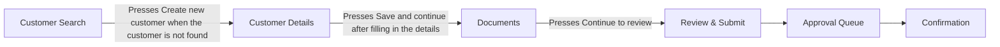

# Northwind customer onboarding

## Summary

Northwind Onboarding is the tool the team uses to set up a new customer. An Onboarding Officer first searches for the customer by postcode and surname so that no duplicate record is created. If the customer is new, the officer enters their details, uploads a photo of an identity document and submits the record for approval, at which point it locks. A Team Lead approves the record from the Approval Queue. The system then shows a Confirmation screen with a customer reference number, which the officer gives to the customer, and sends a welcome email to the address entered.

- Actors: Onboarding Officer, Team Lead, Customer, Document checker (role not identified by the expert)
- Recording: examples/onboarding/walkthrough.mp4
- Duration: 01:51
- Transcript source: file
- Screens: 6
- Data fields: 44
- Actions: 18
- Journey steps: 7
- Requirements: 21
- Acceptance criteria: 30
- Questions: 20
- Writing check: 2 requirements and 0 criteria have warnings; 48 notes
- Naming check: 63 terms in the glossary; 13 naming clashes to check on the Glossary sheet
- Personal data: Personal data seen: 3 emails, 2 phone numbers, 5 postcodes, 3 dates of birth, 10 names, 2 addresses, 1 other id on 6 frames. Check before sharing.
- Gaps: 12 gaps to close: 12 actions leading nowhere; 2 notes.
- Model: bring-your-own
- Model calls: 2
- Input tokens: 0
- Output tokens: 0
- Cache read tokens: 0
- Cache write tokens: 0
- Generated: 2026-09-14 21:16

## The journey, step by step

1. **Customer Search** (Onboarding Officer): The Onboarding Officer enters the customer's postcode and surname and presses Search to see whether the customer already exists. ([frame 0 @ 00:00](frames/frame_0000.jpg))
2. **Customer Search** (Onboarding Officer): When the customer is not in the results, the Onboarding Officer presses Create new customer. ([frame 0 @ 00:00](frames/frame_0000.jpg))
3. **Customer Details** (Onboarding Officer): The Onboarding Officer fills in the mandatory details (First name, Last name, Date of birth, Account type, Postcode), any optional contact and address details and the marketing consent tick, then presses Save and continue. ([frame 1 @ 00:15](frames/frame_0001.jpg))
4. **Documents** (Onboarding Officer): The Onboarding Officer chooses a photo of the customer's ID, picks the Document type, presses Upload so the document sits in the table as Pending check, then presses Continue to review. ([frame 2 @ 00:43](frames/frame_0002.jpg))
5. **Review & Submit** (Onboarding Officer): The Onboarding Officer reads through the summary of everything entered and presses Submit for approval, after which the record is locked for editing. ([frame 3 @ 01:02](frames/frame_0003.jpg))
6. **Approval Queue** (Team Lead): The submitted customer sits in the Approval Queue with status Awaiting approval and an assignee, and a Team Lead presses Approve. ([frame 4 @ 01:17](frames/frame_0004.jpg))
7. **Confirmation** (Onboarding Officer): The Confirmation screen shows the customer reference number, approver, approval time and that the welcome email was sent; the Onboarding Officer gives the reference to the customer. ([frame 5 @ 01:33](frames/frame_0005.jpg))

## Screen flow

Each box is a screen the expert showed, in the order they reached them; a labelled arrow is the action that moves from one screen to the next, and an unlabelled arrow is a step of the journey with no recorded action between the two.

If the diagram above does not show, read the same flow as a list:

1. S01 Customer Search → (Presses Create new customer when the customer is not found) → S02 Customer Details
2. S02 Customer Details → (Presses Save and continue after filling in the details) → S03 Documents
3. S03 Documents → (Presses Continue to review) → S04 Review & Submit
4. S04 Review & Submit → S05 Approval Queue
5. S05 Approval Queue → S06 Confirmation

## Screens

### S01: Customer Search

Check whether the customer already exists by postcode and surname before creating a new record. ([frame 0 @ 00:00](frames/frame_0000.jpg))

**Data fields**

- F001 Postcode (text; required: unknown; both; example: SW1A 1AA). Search criterion. Results include postcode SW1A 1AB for this search, so matching may not be exact. ([frame 0 @ 00:00](frames/frame_0000.jpg))
- F002 Surname (text; required: unknown; both; example: Lunmere). Search criterion. ([frame 0 @ 00:00](frames/frame_0000.jpg))
- F003 Customer ID (table column; required: unknown; seen on screen; example: C-625922). Results table. Format C- followed by six digits (C-625922, C-994911, C-595381). ([frame 0 @ 00:00](frames/frame_0000.jpg))
- F004 Name (table column; required: unknown; seen on screen; example: Wilina Lunmere). Results table. ([frame 0 @ 00:00](frames/frame_0000.jpg))
- F005 Date of birth (table column; required: unknown; seen on screen; example: 01/01/1982). Results table, DD/MM/YYYY. ([frame 0 @ 00:00](frames/frame_0000.jpg))
- F006 Postcode (table column; required: unknown; seen on screen; example: SW1A 1AA). Results table column, distinct from the Postcode search box. ([frame 0 @ 00:00](frames/frame_0000.jpg))
- F007 Account type (table column; required: unknown; seen on screen; example: Personal). Results table. Values seen: Personal, Business. ([frame 0 @ 00:00](frames/frame_0000.jpg))
- F008 Status (table column; required: unknown; seen on screen; example: Active). Results table, shown as a coloured badge. Values seen: Active (green), Closed (red). ([frame 0 @ 00:00](frames/frame_0000.jpg))

**Actions**

- A001 Enters postcode and surname and presses Search; matching existing customers are listed below on the same screen [button]. ([frame 0 @ 00:00](frames/frame_0000.jpg))
- A002 Presses Clear to empty the search fields [button]. ([frame 0 @ 00:00](frames/frame_0000.jpg))
- A003 Presses Open on a result row to open an existing customer (not shown in the recording) [button]. ([frame 0 @ 00:00](frames/frame_0000.jpg))
- A004 Presses Create new customer when the customer is not found [button]. Leads to Customer Details. ([frame 0 @ 00:00](frames/frame_0000.jpg))

### S02: Customer Details

Enter the new customer's personal details, contact details, address and marketing consent. ([frame 1 @ 00:15](frames/frame_0001.jpg))

**Data fields**

- F009 First name (text; required: yes; both; example: Eloette). Marked * on screen and named as mandatory by the expert. ([frame 1 @ 00:15](frames/frame_0001.jpg))
- F010 Last name (text; required: yes; both; example: Lunmere). Marked * on screen and named as mandatory by the expert. ([frame 1 @ 00:15](frames/frame_0001.jpg))
- F011 Date of birth (date; required: yes; both; example: 01/01/1981). Marked * on screen and named as mandatory by the expert. Hint under the field reads DD/MM/YYYY. ([frame 1 @ 00:15](frames/frame_0001.jpg))
- F012 Email address (text; required: no; seen on screen; example: eloette.lunmere@example.com). No * on screen (legend: fields marked * are required). The welcome email on the Confirmation screen is sent to this address. ([frame 1 @ 00:15](frames/frame_0001.jpg))
- F013 Phone number (text; required: no; seen on screen; example: 07700 900231). No * on screen. ([frame 1 @ 00:15](frames/frame_0001.jpg))
- F014 Account type (dropdown; required: yes; both; example: Personal). Marked * on screen. Expert: options are Personal or Business. ([frame 1 @ 00:15](frames/frame_0001.jpg))
- F015 Address line 1 (text; required: no; both; example: 14 Example Street). Expert says the address lines are optional; no * on screen. ([frame 1 @ 00:15](frames/frame_0001.jpg))
- F016 Address line 2 (text; required: no; both). Empty on the frame. Expert says the address lines are optional. ([frame 1 @ 00:15](frames/frame_0001.jpg))
- F017 Town / City (text; required: no; both; example: London). Expert says the town is optional; no * on screen. ([frame 1 @ 00:15](frames/frame_0001.jpg))
- F018 Postcode (text; required: yes; both; example: SW1A 1AA). Marked * on screen. Hint under the field reads 'UK postcode format, e.g. SW1A 1AA'. Expert: must be a valid UK format or the system will not save. ([frame 1 @ 00:15](frames/frame_0001.jpg))
- F019 Customer has given marketing consent (checkbox; required: no; both). Shown unticked on the frame; Review & Submit later shows Marketing consent: No. Expert: only ticked if the customer actually said yes. ([frame 1 @ 00:15](frames/frame_0001.jpg))

**Actions**

- A005 Picks the Account type (Personal or Business) from the dropdown [menu]. ([frame 1 @ 00:15](frames/frame_0001.jpg))
- A006 Ticks 'Customer has given marketing consent' only if the customer said yes [other]. ([frame 1 @ 00:15](frames/frame_0001.jpg))
- A007 Presses Back [button]. ([frame 1 @ 00:15](frames/frame_0001.jpg))
- A008 Presses Save and continue after filling in the details [button]. Leads to Documents. ([frame 1 @ 00:15](frames/frame_0001.jpg))

### S03: Documents

Upload proof of identity for the customer and see the check status of each uploaded document. ([frame 2 @ 00:43](frames/frame_0002.jpg))

**Data fields**

- F020 ID document (file; required: yes; both). Choose File control showing 'No file chosen'. Hint: 'PDF, JPG or PNG, up to 10 MB'. ([frame 2 @ 00:43](frames/frame_0002.jpg))
- F021 Document type (dropdown; required: yes; both; example: Passport). Expert mentions passport or driving licence. The uploaded documents table also shows a type 'Proof of address'. Full option list not seen. ([frame 2 @ 00:43](frames/frame_0002.jpg))
- F022 File (table column; required: unknown; seen on screen; example: passport_elunmere.jpg). Uploaded documents table. ([frame 2 @ 00:43](frames/frame_0002.jpg))
- F023 Document type (table column; required: unknown; seen on screen; example: Passport). Uploaded documents table column, distinct from the Document type dropdown. Values seen: Passport, Proof of address. ([frame 2 @ 00:43](frames/frame_0002.jpg))
- F024 Uploaded (table column; required: unknown; seen on screen; example: 10/09/2026 09:41). Uploaded documents table, date and time. ([frame 2 @ 00:43](frames/frame_0002.jpg))
- F025 Uploaded by (table column; required: unknown; seen on screen; example: Oderic Falstow). Uploaded documents table; matches the signed-in user. ([frame 2 @ 00:43](frames/frame_0002.jpg))
- F026 Status (table column; required: unknown; both; example: Pending check). Coloured badge. Values seen: Pending check (amber), Verified (green). Expert: shows pending until the document has been checked. ([frame 2 @ 00:43](frames/frame_0002.jpg))

**Actions**

- A009 Presses Choose File to pick the ID document image or PDF [button]. ([frame 2 @ 00:43](frames/frame_0002.jpg))
- A010 Picks the Document type from the dropdown [menu]. ([frame 2 @ 00:43](frames/frame_0002.jpg))
- A011 Presses Upload; the document appears in the Uploaded documents table with status Pending check [button]. ([frame 2 @ 00:43](frames/frame_0002.jpg))
- A012 Presses Back [button]. ([frame 2 @ 00:43](frames/frame_0002.jpg))
- A013 Presses Continue to review [button]. Leads to Review & Submit. ([frame 2 @ 00:43](frames/frame_0002.jpg))

### S04: Review & Submit

Read-only summary of everything entered so far, with the button that submits the record for approval and locks it. ([frame 3 @ 01:02](frames/frame_0003.jpg))

**Data fields**

- F027 Name (read-only; required: unknown; seen on screen; example: Eloette Lunmere). First name and last name shown together. ([frame 3 @ 01:02](frames/frame_0003.jpg))
- F028 Date of birth (read-only; required: unknown; seen on screen; example: 01/01/1981). ([frame 3 @ 01:02](frames/frame_0003.jpg))
- F029 Email address (read-only; required: unknown; seen on screen; example: eloette.lunmere@example.com). ([frame 3 @ 01:02](frames/frame_0003.jpg))
- F030 Phone number (read-only; required: unknown; seen on screen; example: 07700 900231). ([frame 3 @ 01:02](frames/frame_0003.jpg))
- F031 Address (read-only; required: unknown; seen on screen; example: 14 Example Street, London, SW1A 1AA). Address lines, town and postcode joined into one line with commas. ([frame 3 @ 01:02](frames/frame_0003.jpg))
- F032 Account type (read-only; required: unknown; seen on screen; example: Personal). ([frame 3 @ 01:02](frames/frame_0003.jpg))
- F033 Marketing consent (read-only; required: unknown; seen on screen; example: No). Unticked checkbox is shown as 'No'. ([frame 3 @ 01:02](frames/frame_0003.jpg))
- F034 ID document (read-only; required: unknown; seen on screen; example: Passport (passport_elunmere.jpg) · Pending check). Shows document type, file name and check status badge. Only the ID document is listed here, not the proof of address. ([frame 3 @ 01:02](frames/frame_0003.jpg))

**Actions**

- A014 Presses Back [button]. ([frame 3 @ 01:02](frames/frame_0003.jpg))
- A015 Presses Submit for approval; the record is locked for editing (the next screen shown in the recording was the Approval Queue, but the submit itself was not shown, so where the officer lands is unconfirmed) [button]. ([frame 3 @ 01:02](frames/frame_0003.jpg))

### S05: Approval Queue

List of customers submitted for approval, with status and assignee, where a Team Lead approves them. ([frame 4 @ 01:17](frames/frame_0004.jpg))

**Data fields**

- F035 Reference (table column; required: unknown; seen on screen; example: NW-2026-31360). Format NW-YYYY-NNNNN. The same kind of number is shown as Customer reference number on the Confirmation screen. ([frame 4 @ 01:17](frames/frame_0004.jpg))
- F036 Customer (table column; required: unknown; seen on screen; example: Odeina Wexshaw). ([frame 4 @ 01:17](frames/frame_0004.jpg))
- F037 Submitted (table column; required: unknown; seen on screen; example: 09/09/2026 16:20). Date and time. Screen says the queue is ordered oldest first, but the rows on the frame are not in strict date order (the Approved row dated 08/09/2026 is last). ([frame 4 @ 01:17](frames/frame_0004.jpg))
- F038 Submitted by (table column; required: unknown; seen on screen; example: Eloora Lunwick). Officer who submitted the record. ([frame 4 @ 01:17](frames/frame_0004.jpg))
- F039 Status (table column; required: unknown; both; example: Awaiting approval). Coloured badge. Values seen: Awaiting approval (blue), Approved (green). ([frame 4 @ 01:17](frames/frame_0004.jpg))
- F040 Assigned to (table column; required: unknown; both; example: Sorora Brinhurst). Values seen: Sorora Brinhurst, Unassigned. Expert does not know how the assignee is chosen. ([frame 4 @ 01:17](frames/frame_0004.jpg))

**Actions**

- A016 Team Lead presses Approve on a row with status Awaiting approval (button only shown to the Team Lead role; the press itself was not shown, so the screen that follows is unconfirmed) [button]. ([frame 4 @ 01:17](frames/frame_0004.jpg))

### S06: Confirmation

Shows that the customer record has been approved, with the customer reference number, approver, approval time and welcome email status. ([frame 5 @ 01:33](frames/frame_0005.jpg))

**Data fields**

- F041 Customer reference number (read-only; required: unknown; both; example: NW-2026-31365). Shown large in monospace. Expert: this reference is given to the customer. ([frame 5 @ 01:33](frames/frame_0005.jpg))
- F042 Approved by (read-only; required: unknown; seen on screen; example: Sorora Brinhurst (Team Lead)). Name with role in brackets. ([frame 5 @ 01:33](frames/frame_0005.jpg))
- F043 Approved on (read-only; required: unknown; seen on screen; example: 10/09/2026 10:31). Date and time. ([frame 5 @ 01:33](frames/frame_0005.jpg))
- F044 Welcome email (read-only; required: unknown; both; example: Sent to eloette.lunmere@example.com). Only a 'Sent to' state was seen; no bounce or failure state is shown. ([frame 5 @ 01:33](frames/frame_0005.jpg))

**Actions**

- A017 Presses Start another customer (not shown in the recording) [button]. ([frame 5 @ 01:33](frames/frame_0005.jpg))
- A018 Presses Print confirmation (not shown in the recording) [button]. ([frame 5 @ 01:33](frames/frame_0005.jpg))

## Requirements

### R001: As an Onboarding Officer, I need to search existing customers by postcode and surname before I create a record, so that I do not create a duplicate customer.

- functional, priority must, confidence high, screen Customer Search. ([frame 0 @ 00:07](frames/frame_0000.jpg))
- Why: Duplicate prevention is the stated purpose of the first screen.
- The expert said: "You put in the postcode and the surname and hit Search, and it lists anyone we already have, so you don't create a duplicate."
- *Writing check: info: "and" may join two thoughts in one sentence, so split it if it does.*

Acceptance criteria:

- AC001: Given An existing customer with surname Lunmere and postcode SW1A 1AA is on file, when The Onboarding Officer enters postcode SW1A 1AA and surname Lunmere on Customer Search and presses Search, then The results table shows that customer as a row. ([frame 0 @ 00:07](frames/frame_0000.jpg))
  - *Writing check: info: "and" in the "given" part may join two thoughts in one sentence, so split it if it does.; info: "and" in the "when" part may join two thoughts in one sentence, so split it if it does.*
- AC002: Given No customer on file has the surname entered, when The Onboarding Officer presses Search, then The results table shows no rows and the Create new customer button is available. ([frame 0 @ 00:07](frames/frame_0000.jpg))
  - *Writing check: info: "and" in the "then" part may join two thoughts in one sentence, so split it if it does.*

### R002: The Customer Search screen shows each matching customer as one row with Customer ID, Name, Date of birth, Postcode, Account type and Status.

- data, priority unknown, confidence medium, screen Customer Search. ([frame 0 @ 00:07](frames/frame_0000.jpg))
- Why: Column list taken from the results table on the frame; the expert did not name the columns.
- The expert said: "it lists anyone we already have"
- *Writing check: info: "and" may join two thoughts in one sentence, so split it if it does.*

Acceptance criteria:

- AC003: Given A search on Customer Search has returned at least one customer, when The Onboarding Officer looks at the results table, then Each row shows a value under Customer ID, Name, Date of birth, Postcode, Account type and Status. ([frame 0 @ 00:07](frames/frame_0000.jpg))
  - *Writing check: info: "and" in the "then" part may join two thoughts in one sentence, so split it if it does.*

### R003: The system saves Customer Details only when First name, Last name, Date of birth, Account type and Postcode are all filled in.

- validation, priority must, confidence high, screen Customer Details. ([frame 1 @ 00:15](frames/frame_0001.jpg))
- Why: The five fields carry a * on screen and the legend reads 'fields marked * are required'.
- The expert said: "First name, last name, date of birth, account type and postcode are mandatory; the rest we fill in when we have it."
- *Writing check: info: "and" may join two thoughts in one sentence, so split it if it does.; info: "all" is an absolute, so check it is really meant.*

Acceptance criteria:

- AC004: Given The Onboarding Officer is on Customer Details with First name, Last name, Date of birth, Account type and Postcode filled in, when The Onboarding Officer presses Save and continue, then The system saves the details and shows the Documents screen. ([frame 1 @ 00:15](frames/frame_0001.jpg))
  - *Writing check: info: "and" in the "given" part may join two thoughts in one sentence, so split it if it does.; info: "and" in the "when" part may join two thoughts in one sentence, so split it if it does.; info: "and" in the "then" part may join two thoughts in one sentence, so split it if it does.*
- AC005: Given The Onboarding Officer is on Customer Details with Date of birth left empty and the other four mandatory fields filled in, when The Onboarding Officer presses Save and continue, then The system stays on Customer Details and does not save the details. ([frame 1 @ 00:15](frames/frame_0001.jpg))
  - *Writing check: info: "and" in the "given" part may join two thoughts in one sentence, so split it if it does.; info: "and" in the "when" part may join two thoughts in one sentence, so split it if it does.; info: "and" in the "then" part may join two thoughts in one sentence, so split it if it does.*

### R004: The system rejects a Customer Details save when Postcode is not in a valid UK postcode format.

- validation, priority must, confidence high, screen Customer Details. ([frame 1 @ 00:25](frames/frame_0001.jpg))
- Why: Hint under the field on screen: 'UK postcode format, e.g. SW1A 1AA'. The exact rule is not stated.
- The expert said: "The postcode has to be a valid UK format, otherwise the system won't let you save."

Acceptance criteria:

- AC006: Given The Onboarding Officer has entered SW1A 1AA in Postcode with all other mandatory fields filled in, when The Onboarding Officer presses Save and continue, then The system saves the details. ([frame 1 @ 00:25](frames/frame_0001.jpg))
  - *Writing check: info: "and" in the "when" part may join two thoughts in one sentence, so split it if it does.*
- AC007: Given The Onboarding Officer has entered 12345 in Postcode with all other mandatory fields filled in, when The Onboarding Officer presses Save and continue, then The system stays on Customer Details and does not save the details. ([frame 1 @ 00:25](frames/frame_0001.jpg))
  - *Writing check: info: "and" in the "when" part may join two thoughts in one sentence, so split it if it does.; info: "and" in the "then" part may join two thoughts in one sentence, so split it if it does.*

### R005: The system saves Customer Details when Address line 1, Address line 2, Town / City, Email address and Phone number are all empty.

- validation, priority must, confidence medium, screen Customer Details. ([frame 1 @ 00:25](frames/frame_0001.jpg))
- Why: The expert names the address lines and town as optional; Email address and Phone number carry no * on screen.
- The expert said: "The address lines and the town are optional."
- *Writing check: info: "and" may join two thoughts in one sentence, so split it if it does.; info: "all" is an absolute, so check it is really meant.*

Acceptance criteria:

- AC008: Given The Onboarding Officer has filled in the five mandatory fields and left Address line 1, Address line 2, Town / City, Email address and Phone number empty, when The Onboarding Officer presses Save and continue, then The system saves the details and shows the Documents screen. ([frame 1 @ 00:25](frames/frame_0001.jpg))
  - *Writing check: info: "and" in the "given" part may join two thoughts in one sentence, so split it if it does.; info: "and" in the "when" part may join two thoughts in one sentence, so split it if it does.; info: "and" in the "then" part may join two thoughts in one sentence, so split it if it does.*

### R006: The Account type dropdown on Customer Details offers the options Personal and Business.

- data, priority must, confidence high, screen Customer Details. ([frame 1 @ 00:33](frames/frame_0001.jpg))
- Why: Both values also appear in the Account type column of the Customer Search results.
- The expert said: "Account type is a dropdown, personal or business"
- *Writing check: info: "and" may join two thoughts in one sentence, so split it if it does.*

Acceptance criteria:

- AC009: Given The Onboarding Officer is on Customer Details, when The Onboarding Officer opens the Account type dropdown, then The dropdown lists Personal and Business. ([frame 1 @ 00:33](frames/frame_0001.jpg))
  - *Writing check: info: "and" in the "then" part may join two thoughts in one sentence, so split it if it does.*

### R007: The system records marketing consent as Yes only when the Onboarding Officer has ticked 'Customer has given marketing consent'.

- data, priority must, confidence high, screen Customer Details. ([frame 1 @ 00:33](frames/frame_0001.jpg))
- Why: The checkbox is unticked on the frame and Review & Submit shows 'Marketing consent: No'. The business rule is that the officer ticks it only when the customer has said yes.
- The expert said: "the marketing consent box only gets ticked if the customer actually said yes"

Acceptance criteria:

- AC010: Given The Onboarding Officer leaves 'Customer has given marketing consent' unticked and saves Customer Details, when The Onboarding Officer reaches Review & Submit, then Marketing consent shows No. ([frame 1 @ 00:33](frames/frame_0001.jpg))
  - *Writing check: info: "and" in the "given" part may join two thoughts in one sentence, so split it if it does.*
- AC011: Given The Onboarding Officer ticks 'Customer has given marketing consent' and saves Customer Details, when The Onboarding Officer reaches Review & Submit, then Marketing consent shows Yes. ([frame 1 @ 00:33](frames/frame_0001.jpg))
  - *Writing check: info: "and" in the "given" part may join two thoughts in one sentence, so split it if it does.*

### R008: As an Onboarding Officer, I need to upload an image of the customer's ID document with its Document type, so that proof of identity is attached to the customer record.

- functional, priority must, confidence high, screen Documents. ([frame 2 @ 00:43](frames/frame_0002.jpg))
- Why: The Documents screen has a Choose File control, a Document type dropdown and an Upload button.
- The expert said: "We upload a photo of their ID, usually a passport or a driving licence, and pick the document type from the dropdown."
- *Writing check: info: "is attached" is passive, so say who or what does it.*

Acceptance criteria:

- AC012: Given The Onboarding Officer is on Documents and has chosen the file passport_elunmere.jpg and Document type Passport, when The Onboarding Officer presses Upload, then The Uploaded documents table shows a row with File passport_elunmere.jpg and Document type Passport. ([frame 2 @ 00:43](frames/frame_0002.jpg))
  - *Writing check: info: "and" in the "given" part may join two thoughts in one sentence, so split it if it does.; info: "and" in the "then" part may join two thoughts in one sentence, so split it if it does.*
- AC013: Given The Onboarding Officer is on Documents, when The Onboarding Officer opens the Document type dropdown, then The dropdown lists Passport and Driving licence. ([frame 2 @ 00:43](frames/frame_0002.jpg))
  - *Writing check: info: "and" in the "then" part may join two thoughts in one sentence, so split it if it does.*

### R009: The system accepts an ID document upload only when the file is a PDF, JPG or PNG.

- validation, priority unknown, confidence medium, screen Documents. ([frame 2 @ 00:43](frames/frame_0002.jpg))
- Why: Taken from the hint under the file control ('PDF, JPG or PNG, up to 10 MB'); the expert did not say it.
- The expert said: "We upload a photo of their ID"
- *Writing check: warn: "or" joins two thoughts in one sentence, so write one sentence per thought.*

Acceptance criteria:

- AC014: Given The Onboarding Officer has chosen a .docx file as the ID document, when The Onboarding Officer presses Upload, then The system does not add the file to the Uploaded documents table. ([frame 2 @ 00:43](frames/frame_0002.jpg))
- AC015: Given The Onboarding Officer has chosen a .png file under 10 MB as the ID document, when The Onboarding Officer presses Upload, then The system adds the file to the Uploaded documents table. ([frame 2 @ 00:43](frames/frame_0002.jpg))

### R010: The system accepts an ID document upload only when the file is 10 MB or smaller.

- validation, priority unknown, confidence medium, screen Documents. ([frame 2 @ 00:43](frames/frame_0002.jpg))
- Why: Taken from the hint under the file control ('PDF, JPG or PNG, up to 10 MB'); the expert did not say it.
- The expert said: "We upload a photo of their ID"
- *Writing check: warn: "or" joins two thoughts in one sentence, so write one sentence per thought.*

Acceptance criteria:

- AC016: Given The Onboarding Officer has chosen a JPG file of 11 MB as the ID document, when The Onboarding Officer presses Upload, then The system does not add the file to the Uploaded documents table. ([frame 2 @ 00:43](frames/frame_0002.jpg))
- AC017: Given The Onboarding Officer has chosen a JPG file of 10 MB as the ID document, when The Onboarding Officer presses Upload, then The system adds the file to the Uploaded documents table. ([frame 2 @ 00:43](frames/frame_0002.jpg))

### R011: The system shows an uploaded document with status Pending check until the document has been checked.

- workflow, priority must, confidence high, screen Documents. ([frame 2 @ 00:52](frames/frame_0002.jpg))
- Why: Pending check (amber) is visible in the Uploaded documents table on the frame.
- The expert said: "The status column shows pending until the document has been checked."
- *Writing check: info: "been checked" is passive, so say who or what does it.*

Acceptance criteria:

- AC018: Given The Onboarding Officer has just uploaded an ID document, when The Onboarding Officer looks at the Uploaded documents table, then The Status column for that document shows Pending check. ([frame 2 @ 00:52](frames/frame_0002.jpg))

### R012: The system changes the status of an uploaded document to Verified once the document has been checked.

- workflow, priority must, confidence medium, screen Documents. ([frame 2 @ 00:52](frames/frame_0002.jpg))
- Why: Verified (green) is visible in the Uploaded documents table. Who checks the document, and where, is unknown.
- The expert said: "Someone checks them, I'm honestly not sure who, it just changes to verified at some point."
- *Writing check: info: "been checked" is passive, so say who or what does it.*

Acceptance criteria:

- AC019: Given An uploaded document shows Status Pending check, when The document check is completed, then The Status column for that document shows Verified. ([frame 2 @ 00:52](frames/frame_0002.jpg))

### R013: The Documents screen lists each uploaded document with File, Document type, Uploaded date and time, Uploaded by and Status.

- data, priority unknown, confidence medium, screen Documents. ([frame 2 @ 00:52](frames/frame_0002.jpg))
- Why: Column list taken from the Uploaded documents table on the frame; the expert only mentioned the status column.
- The expert said: "The status column shows pending until the document has been checked."
- *Writing check: info: "and" may join two thoughts in one sentence, so split it if it does.*

Acceptance criteria:

- AC020: Given At least one document has been uploaded for the customer, when The Onboarding Officer looks at the Uploaded documents table on Documents, then Each row shows a value under File, Document type, Uploaded, Uploaded by and Status. ([frame 2 @ 00:52](frames/frame_0002.jpg))
  - *Writing check: info: "and" in the "then" part may join two thoughts in one sentence, so split it if it does.*

### R014: The Review & Submit screen shows a read-only summary of Name, Date of birth, Email address, Phone number, Address, Account type, Marketing consent and ID document with its check status.

- functional, priority must, confidence high, screen Review & Submit. ([frame 3 @ 01:02](frames/frame_0003.jpg))
- Why: All eight items are visible on the frame.
- The expert said: "Review and Submit is a summary of everything so far. You read it through, and if it all looks right you press Submit for approval."
- *Writing check: info: "and" may join two thoughts in one sentence, so split it if it does.*

Acceptance criteria:

- AC021: Given The Onboarding Officer has saved Customer Details for Eloette Lunmere and uploaded a Passport, when The Onboarding Officer presses Continue to review on Documents, then Review & Submit shows Name, Date of birth, Email address, Phone number, Address, Account type, Marketing consent and ID document with the values entered. ([frame 3 @ 01:02](frames/frame_0003.jpg))
  - *Writing check: info: "and" in the "given" part may join two thoughts in one sentence, so split it if it does.; info: "and" in the "then" part may join two thoughts in one sentence, so split it if it does.*
- AC022: Given The Onboarding Officer is on Review & Submit, when The Onboarding Officer clicks on any summary value, then The value cannot be edited on that screen. ([frame 3 @ 01:02](frames/frame_0003.jpg))

### R015: The system locks the customer record against editing once the Onboarding Officer has pressed Submit for approval.

- workflow, priority must, confidence high, screen Review & Submit. ([frame 3 @ 01:09](frames/frame_0003.jpg))
- Why: Also written on screen: 'After submission the record is locked for editing.'
- The expert said: "Once you submit, the record locks and you can't edit it any more."

Acceptance criteria:

- AC023: Given The Onboarding Officer has pressed Submit for approval on Review & Submit, when The Onboarding Officer opens that customer's Customer Details, then Every field is read-only and Save and continue is unavailable. ([frame 3 @ 01:09](frames/frame_0003.jpg))
  - *Writing check: info: "and" in the "then" part may join two thoughts in one sentence, so split it if it does.*

### R016: A Team Lead can send a submitted customer record back to the Onboarding Officer for editing.

- workflow, priority unknown, confidence low, screen Review & Submit. ([frame 3 @ 01:09](frames/frame_0003.jpg))
- Why: The expert was not sure and no send-back control was seen on any frame. Kept because it is the only stated way to correct a mistake after submission.
- The expert said: "You'd have to ask a team lead to send it back, I think."

Acceptance criteria:

- AC024: Given A customer record has been submitted for approval and is locked, when A Team Lead sends the record back, then The Onboarding Officer can edit the record again. ([frame 3 @ 01:09](frames/frame_0003.jpg))
  - *Writing check: info: "and" in the "given" part may join two thoughts in one sentence, so split it if it does.*

### R017: The Approval Queue lists every submitted customer as one row with Reference, Customer, Submitted date and time, Submitted by, Status and Assigned to.

- functional, priority must, confidence high, screen Approval Queue. ([frame 4 @ 01:17](frames/frame_0004.jpg))
- Why: Column list taken from the frame. The screen subtitle says oldest first, but the rows on the frame are not in date order, so ordering is left as a question.
- The expert said: "Every submitted customer sits here with a status, and it shows who it's assigned to"
- *Writing check: info: "and" may join two thoughts in one sentence, so split it if it does.; info: "every" is an absolute, so check it is really meant.*

Acceptance criteria:

- AC025: Given An Onboarding Officer has just submitted a customer for approval, when A user opens the Approval Queue, then The queue shows a row for that customer with Reference, Customer, Submitted, Submitted by, Status Awaiting approval and Assigned to. ([frame 4 @ 01:17](frames/frame_0004.jpg))
  - *Writing check: info: "and" in the "then" part may join two thoughts in one sentence, so split it if it does.*

### R018: The system shows the Approve button in the Approval Queue only to users in the Team Lead role.

- functional, priority must, confidence high, screen Approval Queue. ([frame 4 @ 01:26](frames/frame_0004.jpg))
- Why: Also stated in the banner on screen: 'Team leads only. The Approve action is shown to users in the Team Lead role.'
- The expert said: "Only team leads can approve. The Approve button doesn't show for the rest of us, and it says team leads only at the top."

Acceptance criteria:

- AC026: Given A user in the Team Lead role is signed in, when The user opens the Approval Queue, then Each row with Status Awaiting approval shows an Approve button. ([frame 4 @ 01:26](frames/frame_0004.jpg))
- AC027: Given A user in the Onboarding Officer role is signed in, when The user opens the Approval Queue, then No row shows an Approve button. ([frame 4 @ 01:26](frames/frame_0004.jpg))

### R019: Users outside the Team Lead role can view the Approval Queue.

- functional, priority must, confidence medium, screen Approval Queue. ([frame 4 @ 01:26](frames/frame_0004.jpg))
- Why: The banner on screen reads 'Other users can view the queue but cannot approve', and the expert (not a team lead) sees the queue without the Approve button.
- The expert said: "The Approve button doesn't show for the rest of us, and it says team leads only at the top."
- *Writing check: info: The statement does not say who or what does this, so start with the role or "The system".*

Acceptance criteria:

- AC028: Given A user in the Onboarding Officer role is signed in, when The user opens the Approval Queue, then The queue rows are displayed with the 'Team leads only' banner at the top. ([frame 4 @ 01:26](frames/frame_0004.jpg))

### R020: When a customer is approved, the system shows a Confirmation screen with Customer reference number, Approved by, Approved on and Welcome email status.

- functional, priority must, confidence high, screen Confirmation. ([frame 5 @ 01:33](frames/frame_0005.jpg))
- Why: All four items are visible on the frame. The reference number is what the Onboarding Officer gives to the customer.
- The expert said: "When it's approved, you get the Confirmation screen with a reference number. We give that reference to the customer."
- *Writing check: info: "and" may join two thoughts in one sentence, so split it if it does.; info: "is approved" is passive, so say who or what does it.*

Acceptance criteria:

- AC029: Given A customer row in the Approval Queue has Status Awaiting approval, when A Team Lead presses Approve on that row, then A Confirmation screen shows Customer reference number, Approved by with the Team Lead's name, Approved on with the current date and time, and Welcome email. ([frame 5 @ 01:33](frames/frame_0005.jpg))
  - *Writing check: info: "and" in the "then" part may join two thoughts in one sentence, so split it if it does.*

### R021: The system sends a welcome email to the Email address entered on Customer Details when the customer is approved.

- functional, priority must, confidence medium, screen Confirmation. ([frame 5 @ 01:39](frames/frame_0005.jpg))
- Why: The Confirmation screen shows 'Welcome email: Sent to eloette.lunmere@example.com'. The trigger being approval is implied by where the status appears; the expert did not say when it is sent.
- The expert said: "A welcome email goes out automatically to the address we entered."
- *Writing check: info: "is approved" is passive, so say who or what does it.*

Acceptance criteria:

- AC030: Given A customer was saved with Email address eloette.lunmere@example.com, when A Team Lead approves that customer, then A welcome email is sent to eloette.lunmere@example.com and the Confirmation screen shows 'Sent to eloette.lunmere@example.com'. ([frame 5 @ 01:39](frames/frame_0005.jpg))
  - *Writing check: info: "and" in the "then" part may join two thoughts in one sentence, so split it if it does.*

## Questions for the expert

Questions that hold up the most requirements come first.

### Q005: Are there validation rules on Date of birth (DD/MM/YYYY only, no future dates, minimum age), Email address and Phone number, and what does the officer see when a mandatory field is empty?

- Why it matters: Only the postcode rule was described; the other fields may also reject bad input, and the empty-field behaviour was not shown.
- Blocks R003, R005
- Category: validation rule (screen Customer Details). ([frame 1 @ 00:15](frames/frame_0001.jpg))
- What was said: "First name, last name, date of birth, account type and postcode are mandatory; the rest we fill in when we have it."

### Q009: What happens when an upload is the wrong file type or over 10 MB, and can an uploaded document be removed or replaced?

- Why it matters: The limit is shown on screen but no error or delete behaviour was seen.
- Blocks R009, R010
- Category: edge case (screen Documents). ([frame 2 @ 00:43](frames/frame_0002.jpg))
- What was said: "We upload a photo of their ID"

### Q010: Can a record be submitted for approval, and approved, while its ID document is still Pending check? The record on screen was submitted with the ID still pending.

- Why it matters: If verification must come first, both Submit for approval and Approve need a gate on document status.
- Blocks R015, R018
- Category: validation rule (screen Review & Submit). ([frame 3 @ 01:02](frames/frame_0003.jpg))
- What was said: "You read it through, and if it all looks right you press Submit for approval."

### Q011: How does a submitted record get sent back for editing, who can do it, and does that unlock the record and return it to the officer?

- Why it matters: The expert was unsure and no send-back or reject control was seen; without it a mistake after submission cannot be corrected.
- Blocks R015, R016
- Category: missing information (screen Review & Submit). ([frame 3 @ 01:09](frames/frame_0003.jpg))
- What was said: "You'd have to ask a team lead to send it back, I think."

### Q013: Can a team lead reject a record from the Approval Queue, and are there statuses other than Awaiting approval and Approved?

- Why it matters: Only an Approve action was seen; the team needs the full set of outcomes and statuses.
- Blocks R017, R018
- Category: missing information (screen Approval Queue). ([frame 4 @ 01:17](frames/frame_0004.jpg))
- What was said: "Every submitted customer sits here with a status"

### Q001: What counts as a match in Customer Search: exact surname and postcode, or partial / nearby matches? The results include postcode SW1A 1AB for a search on SW1A 1AA.

- Why it matters: The matching rule decides how well duplicates are caught and what a developer has to build.
- Blocks R001
- Category: ambiguity (screen Customer Search). ([frame 0 @ 00:07](frames/frame_0000.jpg))
- What was said: "it lists anyone we already have, so you don't create a duplicate."

### Q002: Must both Postcode and Surname be filled in to search, or can either be left blank?

- Why it matters: Determines search validation and whether a surname-only search is allowed.
- Blocks R001
- Category: validation rule (screen Customer Search). ([frame 0 @ 00:07](frames/frame_0000.jpg))
- What was said: "You put in the postcode and the surname and hit Search"

### Q003: What should happen when the officer presses Open on an existing customer, and can a customer with status Closed be onboarded again?

- Why it matters: The Open button and the Closed status were seen but never explained; the team needs to know what path an existing or closed customer follows.
- Blocks R002
- Category: edge case (screen Customer Search). ([frame 0 @ 00:07](frames/frame_0000.jpg))
- What was said: "it lists anyone we already have, so you don't create a duplicate."

### Q004: What exactly is the UK postcode validation rule (accepted patterns, spaces, upper/lower case) and what error message is shown when it fails?

- Why it matters: A developer cannot implement 'valid UK format' without the precise rule and the failure behaviour.
- Blocks R004
- Category: validation rule (screen Customer Details). ([frame 1 @ 00:25](frames/frame_0001.jpg))
- What was said: "The postcode has to be a valid UK format, otherwise the system won't let you save."

### Q007: Who checks uploaded documents and changes the status from Pending check to Verified, and is that done inside this system or elsewhere?

- Why it matters: The verification step is part of the process but the expert could not say who performs it or where.
- Blocks R012
- Category: missing information (screen Documents). ([frame 2 @ 00:52](frames/frame_0002.jpg))
- What was said: "Someone checks them, I'm honestly not sure who, it just changes to verified at some point."

### Q008: What are the full options in the Document type dropdown, and is a proof of address document required as well as the ID document?

- Why it matters: Passport and Proof of address were seen and driving licence was mentioned; the table lists two documents but the form is labelled 'Upload ID document'.
- Blocks R008
- Category: data (screen Documents). ([frame 2 @ 00:43](frames/frame_0002.jpg))
- What was said: "We upload a photo of their ID, usually a passport or a driving licence, and pick the document type from the dropdown."

### Q012: How is a submitted customer assigned to a team lead, and what does Unassigned mean for who picks it up?

- Why it matters: The assignment rule affects who sees which work; one row on screen is Unassigned.
- Blocks R017
- Category: missing information (screen Approval Queue). ([frame 4 @ 01:17](frames/frame_0004.jpg))
- What was said: "it shows who it's assigned to, though I've never worked out how it picks the person."

### Q014: Which users can view the Approval Queue, and do they see all officers' submissions or only their own?

- Why it matters: The banner says other users can view but cannot approve; the scope of what they can see is not stated.
- Blocks R019
- Category: permissions (screen Approval Queue). ([frame 4 @ 01:26](frames/frame_0004.jpg))
- What was said: "The Approve button doesn't show for the rest of us, and it says team leads only at the top."

### Q015: In what order should the Approval Queue list its rows? The screen says oldest first, but the rows on the frame are not in date order (the Approved row dated 08/09/2026 is last).

- Why it matters: The stated order and the shown order disagree; the team needs one rule, for example by status then by submitted date.
- Blocks R017
- Category: ambiguity (screen Approval Queue). ([frame 4 @ 01:17](frames/frame_0004.jpg))
- What was said: "Every submitted customer sits here with a status"

### Q016: What should happen when the welcome email bounces or no email address was entered: retry, notify the officer, show a failed state on the Confirmation screen?

- Why it matters: Today a bounce goes unnoticed; email is optional on Customer Details, so approvals with no address are possible.
- Blocks R021
- Category: integration (screen Confirmation). ([frame 5 @ 01:39](frames/frame_0005.jpg))
- What was said: "If the email bounces it just sort of sits there, nobody gets told."

### Q017: How is the customer reference number (format NW-2026-31365) generated, and how does it relate to the Customer ID (format C-625922) shown in search results?

- Why it matters: Two different identifiers were seen; the team needs to know which is the customer's identity and which is the onboarding case.
- Blocks R020
- Category: data (screen Confirmation). ([frame 5 @ 01:33](frames/frame_0005.jpg))
- What was said: "When it's approved, you get the Confirmation screen with a reference number. We give that reference to the customer."

### Q018: Who sees the Confirmation screen and when: does the Team Lead land on it after pressing Approve, does the Onboarding Officer see it automatically, or must the officer find the record again?

- Why it matters: The approval happens in a different role, possibly later; the officer needs a way to get the reference to the customer. The Approve press itself was not shown, so the screen that follows it is inferred.
- Blocks R020
- Category: ambiguity (screen Confirmation). ([frame 5 @ 01:33](frames/frame_0005.jpg))
- What was said: "When it's approved, you get the Confirmation screen with a reference number."

### Q006: Does Save and continue create a saved customer record at that point, and can an officer leave and come back to a half-finished onboarding?

- Why it matters: Decides whether draft records exist before documents are uploaded and how they show in search.
- Category: missing information (screen Customer Details). ([frame 1 @ 00:33](frames/frame_0001.jpg))
- What was said: "Then you press Save and continue."

### Q019: Which screen does the Onboarding Officer see after pressing Submit for approval? The recording moved to the Approval Queue, but the submit itself was not shown.

- Why it matters: The team needs to know whether the officer lands on the Approval Queue, a confirmation message or back on Customer Search.
- Category: ambiguity (screen Review & Submit). ([frame 3 @ 01:09](frames/frame_0003.jpg))
- What was said: "Once you submit, the record locks and you can't edit it any more."

### Q020: What does Print confirmation produce, and where does Start another customer take the officer?

- Why it matters: Both buttons are on the Confirmation screen but neither was pressed or described.
- Category: missing information (screen Confirmation). ([frame 5 @ 01:33](frames/frame_0005.jpg))
- What was said: "We give that reference to the customer."

## Gaps

What the analysis does not yet cover, so the next conversation with the expert can be aimed at the holes.

12 gaps to close: 12 actions leading nowhere; 2 notes.

**Actions leading nowhere**

- A001 Enters postcode and surname and presses Search; matching existing customers are listed below on the same screen: "Enters postcode and surname and presses Search; matching existing customers are listed below on the same screen" on the Customer Search screen has no next screen recorded; ask what appears after it.
- A002 Presses Clear to empty the search fields: "Presses Clear to empty the search fields" on the Customer Search screen has no next screen recorded; ask what appears after it.
- A003 Presses Open on a result row to open an existing customer (not shown in the recording): "Presses Open on a result row to open an existing customer (not shown in the recording)" on the Customer Search screen has no next screen recorded; ask what appears after it.
- A007 Presses Back: "Presses Back" on the Customer Details screen has no next screen recorded; ask what appears after it.
- A009 Presses Choose File to pick the ID document image or PDF: "Presses Choose File to pick the ID document image or PDF" on the Documents screen has no next screen recorded; ask what appears after it.
- A011 Presses Upload; the document appears in the Uploaded documents table with status Pending check: "Presses Upload; the document appears in the Uploaded documents table with status Pending check" on the Documents screen has no next screen recorded; ask what appears after it.
- A012 Presses Back: "Presses Back" on the Documents screen has no next screen recorded; ask what appears after it.
- A014 Presses Back: "Presses Back" on the Review & Submit screen has no next screen recorded; ask what appears after it.
- A015 Presses Submit for approval; the record is locked for editing (the next screen shown in the recording was the Approval Queue, but the submit itself was not shown, so where the officer lands is unconfirmed): "Presses Submit for approval; the record is locked for editing (the next screen shown in the recording was the Approval Queue, but the submit itself was not shown, so where the officer lands is unconfirmed)" on the Review & Submit screen has no next screen recorded; ask what appears after it.
- A016 Team Lead presses Approve on a row with status Awaiting approval (button only shown to the Team Lead role; the press itself was not shown, so the screen that follows is unconfirmed): "Team Lead presses Approve on a row with status Awaiting approval (button only shown to the Team Lead role; the press itself was not shown, so the screen that follows is unconfirmed)" on the Approval Queue screen has no next screen recorded; ask what appears after it.
- A017 Presses Start another customer (not shown in the recording): "Presses Start another customer (not shown in the recording)" on the Confirmation screen has no next screen recorded; ask what appears after it.
- A018 Presses Print confirmation (not shown in the recording): "Presses Print confirmation (not shown in the recording)" on the Confirmation screen has no next screen recorded; ask what appears after it.

**Low-confidence requirement** (note)

- R016 A Team Lead can send a submitted customer record back to the Onboarding Officer for editing.: R016 was inferred from the screen rather than said by the expert; confirm it with them.

**Actor never named in a requirement** (note)

- Document checker (role not identified by the expert) Document checker (role not identified by the expert): "Document checker (role not identified by the expert)" is listed as an actor but no requirement names them; ask what they need from the system.

## Personal data seen

Personal data seen: 3 emails, 2 phone numbers, 5 postcodes, 3 dates of birth, 10 names, 2 addresses, 1 other id on 6 frames. Check before sharing.

| Kind | Value (masked) | Where | Time | Frame |
|---|---|---|---|---|
| uk postcode | SW***AA | frame text | 00:00 | ([frame 0 @ 00:00](frames/frame_0000.jpg)) |
| person name | O*** F*** | frame text | 00:15 | ([frame 1 @ 00:15](frames/frame_0001.jpg)) |
| person name | L*** | frame text | 00:15 | ([frame 1 @ 00:15](frames/frame_0001.jpg)) |
| date of birth | 01/**/**81 | frame text | 00:15 | ([frame 1 @ 00:15](frames/frame_0001.jpg)) |
| email | el***@example.com | frame text | 00:15 | ([frame 1 @ 00:15](frames/frame_0001.jpg)) |
| phone | 07*** ****31 | frame text | 00:15 | ([frame 1 @ 00:15](frames/frame_0001.jpg)) |
| uk postcode | SW***AA | frame text | 00:15 | ([frame 1 @ 00:15](frames/frame_0001.jpg)) |
| uk postcode | SW** *AA | frame text | 00:15 | ([frame 1 @ 00:15](frames/frame_0001.jpg)) |
| person name | O*** F*** | frame text | 00:43 | ([frame 2 @ 00:43](frames/frame_0002.jpg)) |
| other id | 1* | frame text | 00:43 | ([frame 2 @ 00:43](frames/frame_0002.jpg)) |
| person name | O*** F*** | frame text | 01:02 | ([frame 3 @ 01:02](frames/frame_0003.jpg)) |
| person name | E*** L*** | frame text | 01:02 | ([frame 3 @ 01:02](frames/frame_0003.jpg)) |
| date of birth | 01/**/**81 | frame text | 01:02 | ([frame 3 @ 01:02](frames/frame_0003.jpg)) |
| email | el***@example.com | frame text | 01:02 | ([frame 3 @ 01:02](frames/frame_0003.jpg)) |
| phone | 07*** ****31 | frame text | 01:02 | ([frame 3 @ 01:02](frames/frame_0003.jpg)) |
| address | 1* E*** S*** | frame text | 01:02 | ([frame 3 @ 01:02](frames/frame_0003.jpg)) |
| uk postcode | SW** *AA | frame text | 01:02 | ([frame 3 @ 01:02](frames/frame_0003.jpg)) |
| person name | O*** F*** | frame text | 01:33 | ([frame 5 @ 01:33](frames/frame_0005.jpg)) |
| email | el***@example.com | frame text | 01:33 | ([frame 5 @ 01:33](frames/frame_0005.jpg)) |
| uk postcode | SW** *AA | example value | 00:00 | ([frame 0 @ 00:00](frames/frame_0000.jpg)) |
| person name | L*** | example value | 00:00 | ([frame 0 @ 00:00](frames/frame_0000.jpg)) |
| person name | W*** L*** | example value | 00:00 | ([frame 0 @ 00:00](frames/frame_0000.jpg)) |
| date of birth | 01/**/**82 | example value | 00:00 | ([frame 0 @ 00:00](frames/frame_0000.jpg)) |
| person name | E*** | example value | 00:15 | ([frame 1 @ 00:15](frames/frame_0001.jpg)) |
| address | 1* E*** S*** | example value | 00:15 | ([frame 1 @ 00:15](frames/frame_0001.jpg)) |
| person name | O*** W*** | example value | 01:17 | ([frame 4 @ 01:17](frames/frame_0004.jpg)) |

## Glossary

| Term | Kind | Where | First seen | Frame | Used in | Definition | Notes |
|---|---|---|---|---|---|---|---|
| Customer | role | listed as an actor | 00:07 | 0 | S01, S02, S03, S05, S06, A001, A003, A004, A006, A017, R001, R002, R003, R004, R005, R006, R007, R008, R015, R016, R017, R020, R021, AC001, AC002, AC003, AC004, AC005, AC007, AC009, AC010, AC011, AC020, AC021, AC023, AC024, AC025, AC029, AC030, Q001, Q003, Q006, Q012, Q017, Q020 |  |  |
| Document checker (role not identified by the expert) | role | listed as an actor | 00:00 | 0 |  |  |  |
| Onboarding Officer | role | listed as an actor | 00:00 | 0 | R001, R007, R008, R015, R016, R020, AC001, AC002, AC003, AC004, AC005, AC006, AC007, AC008, AC009, AC010, AC011, AC012, AC013, AC014, AC015, AC016, AC017, AC018, AC020, AC021, AC022, AC023, AC024, AC025, AC027, AC028, Q018, Q019 |  |  |
| Team Lead | role | listed as an actor | 01:17 | 4 | S05, A016, R016, R018, R019, AC024, AC026, AC028, AC029, AC030, Q012, Q013, Q018 |  |  |
| Approval Queue | screen | screen S05 | 01:17 | 4 | A015, R017, R018, R019, AC025, AC026, AC027, AC028, AC029, Q013, Q014, Q015, Q019 |  |  |
| Confirmation | screen | screen S06 | 01:33 | 5 | A018, R020, R021, AC029, AC030, Q016, Q018, Q020 |  |  |
| Customer Details | screen | screen S02 | 00:15 | 1 | R003, R004, R005, R006, R021, AC004, AC005, AC007, AC009, AC010, AC011, AC021, AC023 |  |  |
| Customer Search | screen | screen S01 | 00:00 | 0 | R002, R006, AC001, AC003, Q001 |  |  |
| Documents | screen | screen S03 | 00:43 | 2 | A011, R008, R011, R012, R013, AC004, AC008, AC012, AC013, AC014, AC015, AC016, AC017, AC018, AC020, AC021, Q007 |  |  |
| Review & Submit | screen | screen S04 | 01:02 | 3 | R007, R014, AC010, AC011, AC021, AC022, AC023 |  |  |
| Account type | field | Customer Search, Customer Details and Review & Submit screens | 00:00 | 0 | A005, R002, R003, R006, R014, AC003, AC004, AC009, AC021 |  | Info: the field "Account type" appears on 3 screens (Customer Search, Customer Details, Review & Submit), so check it means the same thing on each. |
| Address | field | Review & Submit screen | 01:02 | 3 | S02, R005, R014, R021, AC008, AC021, AC030, Q005, Q008, Q016 |  |  |
| Address line 1 | field | Customer Details screen | 00:15 | 1 | R005, AC008 |  | "Address line 1" (field, Customer Details screen) and "Address line 2" (field, Customer Details screen) are one or two letters apart, so pick one spelling and use it everywhere. |
| Address line 2 | field | Customer Details screen | 00:15 | 1 | R005, AC008 |  | "Address line 1" (field, Customer Details screen) and "Address line 2" (field, Customer Details screen) are one or two letters apart, so pick one spelling and use it everywhere. |
| Approved by | field | Confirmation screen | 01:33 | 5 | R020, AC029 |  | "Approved by" (field, Confirmation screen) and "Approved on" (field, Confirmation screen) are one or two letters apart, so pick one spelling and use it everywhere. |
| Approved on | field | Confirmation screen | 01:33 | 5 | R020, AC029 |  | "Approved by" (field, Confirmation screen) and "Approved on" (field, Confirmation screen) are one or two letters apart, so pick one spelling and use it everywhere. |
| Assigned to | field | Approval Queue screen | 01:17 | 4 | R017, AC025, Q012 |  |  |
| Customer | field | Approval Queue screen | 01:17 | 4 | S01, S02, S03, S05, S06, A001, A003, A004, A006, A017, R001, R002, R003, R004, R005, R006, R007, R008, R015, R016, R017, R020, R021, AC001, AC002, AC003, AC004, AC005, AC007, AC009, AC010, AC011, AC020, AC021, AC023, AC024, AC025, AC029, AC030, Q001, Q003, Q006, Q012, Q017, Q020 |  | "Customer" (field, Approval Queue screen) and "Customer ID" (field, Customer Search screen) are one or two letters apart, so pick one spelling and use it everywhere. |
| Customer has given marketing consent | field | Customer Details screen | 00:15 | 1 | A006, R007, AC010, AC011 |  |  |
| Customer ID | field | Customer Search screen | 00:00 | 0 | R002, AC003, Q017 |  | "Customer" (field, Approval Queue screen) and "Customer ID" (field, Customer Search screen) are one or two letters apart, so pick one spelling and use it everywhere. |
| Customer reference number | field | Confirmation screen | 01:33 | 5 | S06, R020, AC029, Q017 |  |  |
| Date of birth | field | Customer Search, Customer Details and Review & Submit screens | 00:00 | 0 | R002, R003, R014, AC003, AC004, AC005, AC021, Q005 |  | Info: the field "Date of birth" appears on 3 screens (Customer Search, Customer Details, Review & Submit), so check it means the same thing on each. |
| Document type | field | Documents screen | 00:43 | 2 | A010, R008, R013, AC012, AC013, AC020, Q008 |  |  |
| Email address | field | Customer Details and Review & Submit screens | 00:15 | 1 | R005, R014, R021, AC008, AC021, AC030, Q005, Q016 |  | Info: the field "Email address" appears on 2 screens (Customer Details, Review & Submit), so check it means the same thing on each. |
| File | field | Documents screen | 00:43 | 2 | A009, R008, R009, R010, R013, AC001, AC002, AC012, AC014, AC015, AC016, AC017, AC020, Q009 |  |  |
| First name | field | Customer Details screen | 00:15 | 1 | R003, AC004 |  |  |
| ID document | field | Documents and Review & Submit screens | 00:43 | 2 | A009, R008, R009, R010, R014, AC014, AC015, AC016, AC017, AC018, AC021, Q008, Q010 |  | Info: the field "ID document" appears on 2 screens (Documents, Review & Submit), so check it means the same thing on each. |
| Last name | field | Customer Details screen | 00:15 | 1 | R003, AC004 |  |  |
| Marketing consent | field | Review & Submit screen | 01:02 | 3 | S02, A006, R007, R014, AC010, AC011, AC021 |  |  |
| Name | field | Customer Search and Review & Submit screens | 00:00 | 0 | R002, R003, R005, R014, AC003, AC004, AC021, AC029 |  | Info: the field "Name" appears on 2 screens (Customer Search, Review & Submit), so check it means the same thing on each. |
| Phone number | field | Customer Details and Review & Submit screens | 00:15 | 1 | R005, R014, AC008, AC021, Q005 |  | Info: the field "Phone number" appears on 2 screens (Customer Details, Review & Submit), so check it means the same thing on each. |
| Postcode | field | Customer Search and Customer Details screens | 00:00 | 0 | S01, A001, R001, R002, R003, R004, AC001, AC003, AC004, AC006, AC007, Q001, Q002, Q004 |  | Info: the field "Postcode" appears on 2 screens (Customer Search, Customer Details), so check it means the same thing on each. |
| Reference | field | Approval Queue screen | 01:17 | 4 | S06, R017, R020, AC025, AC029, Q017 |  |  |
| Status | field | Customer Search, Documents and Approval Queue screens | 00:00 | 0 | S03, S05, S06, A011, A016, R002, R011, R012, R013, R014, R017, R020, R021, AC003, AC018, AC019, AC020, AC025, AC026, AC029, Q003, Q007, Q013 |  | Info: the field "Status" appears on 3 screens (Customer Search, Documents, Approval Queue), so check it means the same thing on each. |
| Submitted | field | Approval Queue screen | 01:17 | 4 | S05, R016, R017, AC024, AC025, Q010, Q011, Q012 |  | "Submitted" (field, Approval Queue screen) and "Submitted by" (field, Approval Queue screen) are one or two letters apart, so pick one spelling and use it everywhere. |
| Submitted by | field | Approval Queue screen | 01:17 | 4 | R017, AC025 |  | "Submitted" (field, Approval Queue screen) and "Submitted by" (field, Approval Queue screen) are one or two letters apart, so pick one spelling and use it everywhere. |
| Surname | field | Customer Search screen | 00:00 | 0 | S01, A001, R001, AC001, AC002, Q001, Q002 |  |  |
| Town / City | field | Customer Details screen | 00:15 | 1 | R005, AC008 |  |  |
| Uploaded | field | Documents screen | 00:43 | 2 | S03, A011, R011, R012, R013, AC012, AC014, AC015, AC016, AC017, AC018, AC019, AC020, AC021, Q007, Q009 |  | "Uploaded" (field, Documents screen) and "Uploaded by" (field, Documents screen) are one or two letters apart, so pick one spelling and use it everywhere. |
| Uploaded by | field | Documents screen | 00:43 | 2 | R013, AC020 |  | "Uploaded" (field, Documents screen) and "Uploaded by" (field, Documents screen) are one or two letters apart, so pick one spelling and use it everywhere. |
| Welcome email | field | Confirmation screen | 01:33 | 5 | S06, R020, R021, AC029, AC030, Q016 |  |  |
| Account type (Personal or Business) | action | menu on Customer Details screen | 00:15 | 1 | A005 |  |  |
| Approve on a row with status Awaiting approval (button only shown | action | button on Approval Queue screen | 01:17 | 4 | A016 |  |  |
| Back | action | button on Customer Details, Documents and Review & Submit screens | 00:15 | 1 | A007, A012, A014, R016, AC024, Q006, Q011 |  |  |
| Choose File | action | button on Documents screen | 00:43 | 2 | A009, R008 |  |  |
| Clear | action | button on Customer Search screen | 00:00 | 0 | A002 |  |  |
| Continue | action | button on Documents screen | 00:43 | 2 | A008, A013, AC004, AC005, AC006, AC007, AC008, AC021, AC023, Q006 |  |  |
| Create new customer when the customer is not found | action | button on Customer Search screen | 00:00 | 0 | A004 |  |  |
| Customer has given marketing consent | action | other on Customer Details screen | 00:15 | 1 | A006, R007, AC010, AC011 |  |  |
| Document type | action | menu on Documents screen | 00:43 | 2 | A010, R008, R013, AC012, AC013, AC020, Q008 |  |  |
| Open on a result row | action | button on Customer Search screen | 00:00 | 0 | A003 |  |  |
| Print confirmation (not shown in the recording) | action | button on Confirmation screen | 01:33 | 5 | A018 |  |  |
| Save and continue after filling in the details | action | button on Customer Details screen | 00:15 | 1 | A008 |  |  |
| Search; matching existing customers are listed below on the same screen | action | button on Customer Search screen | 00:00 | 0 | A001 |  |  |
| Start another customer (not shown in the recording) | action | button on Confirmation screen | 01:33 | 5 | A017 |  |  |
| Submit for approval; the record is locked for editing (the next screen shown in the recording was the Approval Queue, but the submit itself was not shown | action | button on Review & Submit screen | 01:02 | 3 | A015 |  |  |
| Upload; the document appears in the Uploaded documents table with status Pending check | action | button on Documents screen | 00:43 | 2 | A011 |  |  |
| Active | status value | value of the "Status" field on Customer Search screen | 00:00 | 0 |  |  |  |
| Approved | status value | in R020 | 01:33 | 5 | S06, R020, R021, AC029, Q010, Q013, Q015 |  |  |
| Awaiting approval | status value | value of the "Status" field on Approval Queue screen | 01:17 | 4 | A016, AC025, AC026, AC029, Q013 |  |  |
| Pending check | status value | value of the "Status" field on Documents screen | 00:43 | 2 | A011, R011, AC018, AC019, Q007, Q010 |  |  |
| Submitted | status value | in R017 | 01:17 | 4 | S05, R016, R017, AC024, AC025, Q010, Q011, Q012 |  |  |
| Verified | status value | in R012 | 00:52 | 2 | R012, AC019, Q007 |  |  |

Naming to check:

- "Address line 1" (field, Customer Details screen) and "Address line 2" (field, Customer Details screen) are one or two letters apart, so pick one spelling and use it everywhere.
- "Approved by" (field, Confirmation screen) and "Approved on" (field, Confirmation screen) are one or two letters apart, so pick one spelling and use it everywhere.
- "Customer" (field, Approval Queue screen) and "Customer ID" (field, Customer Search screen) are one or two letters apart, so pick one spelling and use it everywhere.
- "Submitted" (field, Approval Queue screen) and "Submitted by" (field, Approval Queue screen) are one or two letters apart, so pick one spelling and use it everywhere.
- "Uploaded" (field, Documents screen) and "Uploaded by" (field, Documents screen) are one or two letters apart, so pick one spelling and use it everywhere.
- Info: the field "Postcode" appears on 2 screens (Customer Search, Customer Details), so check it means the same thing on each.
- Info: the field "Name" appears on 2 screens (Customer Search, Review & Submit), so check it means the same thing on each.
- Info: the field "Date of birth" appears on 3 screens (Customer Search, Customer Details, Review & Submit), so check it means the same thing on each.
- Info: the field "Account type" appears on 3 screens (Customer Search, Customer Details, Review & Submit), so check it means the same thing on each.
- Info: the field "Status" appears on 3 screens (Customer Search, Documents, Approval Queue), so check it means the same thing on each.
- Info: the field "Email address" appears on 2 screens (Customer Details, Review & Submit), so check it means the same thing on each.
- Info: the field "Phone number" appears on 2 screens (Customer Details, Review & Submit), so check it means the same thing on each.
- Info: the field "ID document" appears on 2 screens (Documents, Review & Submit), so check it means the same thing on each.

## What was said

- 00:00 **Expert:** So this is Northwind Onboarding, the tool we use to set up new customers. The first screen is Customer Search. ([frame 0 @ 00:00](frames/frame_0000.jpg))
- 00:07 **Expert:** You put in the postcode and the surname and hit Search, and it lists anyone we already have, so you don't create a duplicate. ([frame 0 @ 00:07](frames/frame_0000.jpg))
- 00:15 **Expert:** If they're new, you go to Customer Details. First name, last name, date of birth, account type and postcode are mandatory; the rest we fill in when we have it. ([frame 1 @ 00:15](frames/frame_0001.jpg))
- 00:25 **Expert:** The postcode has to be a valid UK format, otherwise the system won't let you save. The address lines and the town are optional. ([frame 1 @ 00:25](frames/frame_0001.jpg))
- 00:33 **Expert:** Account type is a dropdown, personal or business, and the marketing consent box only gets ticked if the customer actually said yes. Then you press Save and continue. ([frame 1 @ 00:33](frames/frame_0001.jpg))
- 00:43 **Expert:** Next is Documents. We upload a photo of their ID, usually a passport or a driving licence, and pick the document type from the dropdown. ([frame 2 @ 00:43](frames/frame_0002.jpg))
- 00:52 **Expert:** The status column shows pending until the document has been checked. Someone checks them, I'm honestly not sure who, it just changes to verified at some point. ([frame 2 @ 00:52](frames/frame_0002.jpg))
- 01:02 **Expert:** Review and Submit is a summary of everything so far. You read it through, and if it all looks right you press Submit for approval. ([frame 3 @ 01:02](frames/frame_0003.jpg))
- 01:09 **Expert:** Once you submit, the record locks and you can't edit it any more. You'd have to ask a team lead to send it back, I think. ([frame 3 @ 01:09](frames/frame_0003.jpg))
- 01:16 **Expert:** This is the Approval Queue. Every submitted customer sits here with a status, and it shows who it's assigned to, though I've never worked out how it picks the person. ([frame 3 @ 01:16](frames/frame_0003.jpg))
- 01:26 **Expert:** Only team leads can approve. The Approve button doesn't show for the rest of us, and it says team leads only at the top. ([frame 4 @ 01:26](frames/frame_0004.jpg))
- 01:33 **Expert:** When it's approved, you get the Confirmation screen with a reference number. We give that reference to the customer. ([frame 5 @ 01:33](frames/frame_0005.jpg))
- 01:39 **Expert:** A welcome email goes out automatically to the address we entered. If the email bounces it just sort of sits there, nobody gets told. ([frame 5 @ 01:39](frames/frame_0005.jpg))
- 01:47 **Expert:** And that's the whole onboarding process, start to finish. ([frame 5 @ 01:47](frames/frame_0005.jpg))
