# Northwind Customer Onboarding

## Summary

Northwind Onboarding is the tool the Onboarding Officer uses to set up a new customer. The officer first searches by postcode and surname so that no duplicate record is created, then enters the customer's details, uploads a photo of their ID and reviews a summary before submitting the record for approval. Submission locks the record and places it in the Approval Queue. A Team Lead approves it from the queue, which produces a Confirmation screen with a customer reference number that the officer gives to the customer. The system then sends a welcome email to the address entered.

- Actors: Onboarding Officer, Team Lead, Customer, Document checker (role not named by the expert, see Q001)
- Recording: examples/onboarding/walkthrough.mp4
- Duration: 01:51
- Transcript source: file
- Screens: 6
- Data fields: 59
- Actions: 12
- Journey steps: 11
- Requirements: 32
- Acceptance criteria: 44
- Questions: 17
- Writing check: 1 requirement and 13 criteria have warnings; 47 notes
- Naming check: 71 terms in the glossary; 15 naming clashes to check on the Glossary sheet
- Personal data: Personal data seen: 3 emails, 2 phone numbers, 5 postcodes, 2 dates of birth, 7 names, 2 addresses, 1 other id on 5 frames. Check before sharing.
- Gaps: 7 gaps to close: 4 fields never mentioned, 3 actions leading nowhere; 11 notes.
- Model: bring-your-own
- Model calls: 2
- Input tokens: 0
- Output tokens: 0
- Cache read tokens: 0
- Cache write tokens: 0
- Generated: 2026-09-13 21:39

## The journey, step by step

1. **Customer Search** (Onboarding Officer): The Onboarding Officer enters the postcode and surname on Customer Search and presses Search to see whether the customer already exists. ([frame 0 @ 00:00](frames/frame_0000.jpg))
2. **Customer Search** (Onboarding Officer): When the customer is not in the results, the Onboarding Officer presses Create new customer. ([frame 0 @ 00:07](frames/frame_0000.jpg))
3. **Customer Details** (Onboarding Officer): The Onboarding Officer fills in the mandatory details (First name, Last name, Date of birth, Account type, Postcode) plus any optional details on Customer Details. ([frame 1 @ 00:15](frames/frame_0001.jpg))
4. **Customer Details** (Onboarding Officer): The Onboarding Officer ticks marketing consent only when the customer said yes, then presses Save and continue. ([frame 1 @ 00:33](frames/frame_0001.jpg))
5. **Documents** (Onboarding Officer): On Documents, the Onboarding Officer chooses the ID file, picks the Document type and presses Upload; the document appears in the table with status Pending check. ([frame 2 @ 00:43](frames/frame_0002.jpg))
6. **Documents**: Someone the expert could not name checks the document and its status changes to Verified. ([frame 2 @ 00:52](frames/frame_0002.jpg))
7. **Documents** (Onboarding Officer): The Onboarding Officer presses Continue to review. ([frame 2 @ 00:52](frames/frame_0002.jpg))
8. **Review & Submit** (Onboarding Officer): The Onboarding Officer reads the Review & Submit summary and presses Submit for approval; the record is then locked for editing. ([frame 3 @ 01:02](frames/frame_0003.jpg))
9. **Approval Queue** (Team Lead): The submitted customer appears in the Approval Queue with status Awaiting approval and an assignee; a Team Lead presses Approve. ([frame 4 @ 01:17](frames/frame_0004.jpg))
10. **Confirmation** (Onboarding Officer): After approval the Confirmation screen shows the customer reference number, which the Onboarding Officer gives to the customer. ([frame 5 @ 01:33](frames/frame_0005.jpg))
11. **Confirmation**: The system sends a welcome email to the email address entered on Customer Details. ([frame 5 @ 01:39](frames/frame_0005.jpg))

## Screen flow

Each box is a screen the expert showed, in the order they reached them; a labelled arrow is the action that moves from one screen to the next, and an unlabelled arrow is a step of the journey with no recorded action between the two.

```mermaid
flowchart LR
    S01["Customer Search"]
    S02["Customer Details"]
    S03["Documents"]
    S04["Review & Submit"]
    S05["Approval Queue"]
    S06["Confirmation"]
    S01 -- "Presses Create new customer when the customer is not already on the system" --> S02
    S02 -- "Presses Save and continue after filling in the mandatory details" --> S03
    S03 -- "Presses Continue to review" --> S04
    S04 -- "Reads the summary and presses Submit for approval; the record is locked and appears in the Approval Queue" --> S05
    S05 -- "A team lead presses Approve on an 'Awaiting approval' row" --> S06
```

If the diagram above does not show, read the same flow as a list:

1. S01 Customer Search → (Presses Create new customer when the customer is not already on the system) → S02 Customer Details
2. S02 Customer Details → (Presses Save and continue after filling in the mandatory details) → S03 Documents
3. S03 Documents → (Presses Continue to review) → S04 Review & Submit
4. S04 Review & Submit → (Reads the summary and presses Submit for approval; the record is locked and appears in the Approval Queue) → S05 Approval Queue
5. S05 Approval Queue → (A team lead presses Approve on an 'Awaiting approval' row) → S06 Confirmation

## Screens

### S01: Customer Search

Check whether a customer already exists (by postcode and surname) before creating a new record. ([frame 0 @ 00:00](frames/frame_0000.jpg))

**Data fields**

- F001 Postcode (text; required: unknown; both; example: SW1A 1AA). Search criterion. ([frame 0 @ 00:00](frames/frame_0000.jpg))
- F002 Surname (text; required: unknown; both; example: Shah). Search criterion. ([frame 0 @ 00:00](frames/frame_0000.jpg))
- F003 Search (other; required: unknown; both). Button; runs the search. ([frame 0 @ 00:00](frames/frame_0000.jpg))
- F004 Clear (other; required: unknown; seen on screen). Button next to Search. Its behaviour was not demonstrated. ([frame 0 @ 00:00](frames/frame_0000.jpg))
- F005 Results (read-only; required: unknown; seen on screen; example: 3 matches). Heading over the results table; reads 'Results (3 matches)' and shows the match count. ([frame 0 @ 00:00](frames/frame_0000.jpg))
- F006 Customer ID (table column; required: unknown; seen on screen; example: C-104221). Other values seen: C-098774, C-071930. ([frame 0 @ 00:00](frames/frame_0000.jpg))
- F007 Name (table column; required: unknown; seen on screen; example: Rohan Shah). Other values seen: Meera Shah, Anil Shah. ([frame 0 @ 00:00](frames/frame_0000.jpg))
- F008 Date of birth (table column; required: unknown; seen on screen; example: 12/03/1979). DD/MM/YYYY. Other values seen: 30/11/1985, 04/07/1962. ([frame 0 @ 00:00](frames/frame_0000.jpg))
- F009 Postcode (table column; required: unknown; seen on screen; example: SW1A 1AA). Column of the results table (distinct from the Postcode search box F001). One result shows SW1A 1AB although SW1A 1AA was searched, so the match is not exact on postcode. ([frame 0 @ 00:00](frames/frame_0000.jpg))
- F010 Account type (table column; required: unknown; seen on screen; example: Personal). Values seen: Personal, Business. ([frame 0 @ 00:00](frames/frame_0000.jpg))
- F011 Status (table column; required: unknown; seen on screen; example: Active). Shown as a coloured badge. Values seen: Active (green), Closed (red). ([frame 0 @ 00:00](frames/frame_0000.jpg))
- F012 Open (other; required: unknown; seen on screen). Button on every result row, including the Closed customer. Where it leads was not shown. ([frame 0 @ 00:00](frames/frame_0000.jpg))
- F013 Create new customer (other; required: unknown; seen on screen). Button under the results table. ([frame 0 @ 00:00](frames/frame_0000.jpg))

**Actions**

- A001 Enters the postcode and surname and presses Search; the matching existing customers are listed below [button]. Leads to Customer Search. ([frame 0 @ 00:00](frames/frame_0000.jpg))
- A002 Presses Open on a result row to view an existing customer [button]. ([frame 0 @ 00:00](frames/frame_0000.jpg))
- A003 Presses Create new customer when the customer is not already on the system [button]. Leads to Customer Details. ([frame 0 @ 00:00](frames/frame_0000.jpg))

### S02: Customer Details

Capture a new customer's personal details, address and marketing consent. ([frame 1 @ 00:15](frames/frame_0001.jpg))

**Data fields**

- F014 First name (text; required: yes; both; example: Priya). Marked * on screen; expert said mandatory. ([frame 1 @ 00:15](frames/frame_0001.jpg))
- F015 Last name (text; required: yes; both; example: Shah). Marked * on screen; expert said mandatory. ([frame 1 @ 00:15](frames/frame_0001.jpg))
- F016 Date of birth (date; required: yes; both; example: 04/03/1975). Marked *; hint text under the field reads DD/MM/YYYY. ([frame 1 @ 00:15](frames/frame_0001.jpg))
- F017 Email address (text; required: no; seen on screen; example: priya.shah@example.com). No * on screen; expert said fields other than the mandatory five are filled in when available. Used later as the welcome email address. ([frame 1 @ 00:15](frames/frame_0001.jpg))
- F018 Phone number (text; required: no; seen on screen; example: 07000 12345678). No * on screen. ([frame 1 @ 00:15](frames/frame_0001.jpg))
- F019 Account type (dropdown; required: yes; both; example: Personal). Marked *. Expert: options are personal or business. ([frame 1 @ 00:15](frames/frame_0001.jpg))
- F020 Address line 1 (text; required: no; both; example: 48 Greek Street). Expert said address lines are optional; no * on screen. ([frame 1 @ 00:15](frames/frame_0001.jpg))
- F021 Address line 2 (text; required: no; both; example: Soho). Optional. ([frame 1 @ 00:15](frames/frame_0001.jpg))
- F022 Town / City (text; required: no; both; example: London). Expert said the town is optional; no * on screen. ([frame 1 @ 00:15](frames/frame_0001.jpg))
- F023 Postcode (text; required: yes; both; example: SW1A 1AA). Marked *. Hint under the field: 'UK postcode format, e.g. SW1A 1AA'. Expert: must be a valid UK format or the system will not save. ([frame 1 @ 00:15](frames/frame_0001.jpg))
- F024 Customer has given marketing consent (checkbox; required: no; both). Unticked in the frame. Expert: only ticked if the customer actually said yes. ([frame 1 @ 00:15](frames/frame_0001.jpg))
- F025 Back (other; required: unknown; seen on screen). Button. ([frame 1 @ 00:15](frames/frame_0001.jpg))
- F026 Save and continue (other; required: unknown; both). Primary button; leads to Documents. ([frame 1 @ 00:15](frames/frame_0001.jpg))

**Actions**

- A004 Picks the account type (Personal or Business) from the Account type dropdown [menu]. ([frame 1 @ 00:15](frames/frame_0001.jpg))
- A005 Ticks 'Customer has given marketing consent' when the customer has said yes [other]. ([frame 1 @ 00:15](frames/frame_0001.jpg))
- A006 Presses Save and continue after filling in the mandatory details [button]. Leads to Documents. ([frame 1 @ 00:15](frames/frame_0001.jpg))

### S03: Documents

Upload proof of identity for the new customer and see the status of uploaded documents. ([frame 2 @ 00:43](frames/frame_0002.jpg))

**Data fields**

- F027 ID document (file; required: yes; both). Marked *. 'Choose File' control showing placeholder 'No file chosen'. Hint under the field: 'PDF, JPG or PNG, up to 10 MB'. ([frame 2 @ 00:43](frames/frame_0002.jpg))
- F028 Document type (dropdown; required: yes; both; example: Passport). Marked *. Expert mentioned passport or driving licence; the table also shows 'Proof of address' as a type. ([frame 2 @ 00:43](frames/frame_0002.jpg))
- F029 Upload (other; required: unknown; both). Button beside the file and type controls. ([frame 2 @ 00:43](frames/frame_0002.jpg))
- F030 File (table column; required: unknown; seen on screen; example: passport_pshah.jpg). Uploaded documents table. Second row: council_tax_2026.pdf. ([frame 2 @ 00:43](frames/frame_0002.jpg))
- F031 Document type (table column; required: unknown; seen on screen; example: Passport). Column of the Uploaded documents table (distinct from the Document type dropdown F028). Second row: Proof of address. ([frame 2 @ 00:43](frames/frame_0002.jpg))
- F032 Uploaded (table column; required: unknown; seen on screen; example: 10/09/2026 09:41). Date and time of upload. Second row: 10/09/2026 09:43. ([frame 2 @ 00:43](frames/frame_0002.jpg))
- F033 Uploaded by (table column; required: unknown; seen on screen; example: Jo Patel). Name of the signed-in user who uploaded. ([frame 2 @ 00:43](frames/frame_0002.jpg))
- F034 Status (table column; required: unknown; both; example: Pending check). Badge. Values seen: Pending check (amber), Verified (green). Expert: pending until someone checks it. ([frame 2 @ 00:43](frames/frame_0002.jpg))
- F035 Back (other; required: unknown; seen on screen). Button. ([frame 2 @ 00:43](frames/frame_0002.jpg))
- F036 Continue to review (other; required: unknown; seen on screen). Primary button; leads to Review & Submit. ([frame 2 @ 00:43](frames/frame_0002.jpg))

**Actions**

- A007 Chooses a file for the ID document, picks the Document type from the dropdown and presses Upload; the document appears in the Uploaded documents table with status Pending check [button]. Leads to Documents. ([frame 2 @ 00:43](frames/frame_0002.jpg))
- A008 Presses Continue to review [button]. Leads to Review & Submit. ([frame 2 @ 00:43](frames/frame_0002.jpg))

### S04: Review & Submit

Show a read-only summary of everything captured so the officer can check it and submit the record for approval. ([frame 3 @ 01:02](frames/frame_0003.jpg))

**Data fields**

- F037 Name (read-only; required: unknown; seen on screen; example: Priya Shah). First name and last name combined. ([frame 3 @ 01:02](frames/frame_0003.jpg))
- F038 Date of birth (read-only; required: unknown; seen on screen; example: 04/03/1975). ([frame 3 @ 01:02](frames/frame_0003.jpg))
- F039 Email address (read-only; required: unknown; seen on screen; example: priya.shah@example.com). ([frame 3 @ 01:02](frames/frame_0003.jpg))
- F040 Phone number (read-only; required: unknown; seen on screen; example: 07000 12345678). ([frame 3 @ 01:02](frames/frame_0003.jpg))
- F041 Address (read-only; required: unknown; seen on screen; example: 48 Greek Street, Soho, London, SW1A 1AA). Address line 1, line 2, town and postcode joined with commas. ([frame 3 @ 01:02](frames/frame_0003.jpg))
- F042 Account type (read-only; required: unknown; seen on screen; example: Personal). ([frame 3 @ 01:02](frames/frame_0003.jpg))
- F043 Marketing consent (read-only; required: unknown; seen on screen; example: No). Matches the unticked checkbox on Customer Details. ([frame 3 @ 01:02](frames/frame_0003.jpg))
- F044 ID document (read-only; required: unknown; seen on screen; example: Passport (passport_pshah.jpg) · Pending check). Shows document type, file name and status badge. The proof of address document is not listed here. ([frame 3 @ 01:02](frames/frame_0003.jpg))
- F045 Back (other; required: unknown; seen on screen). Button. ([frame 3 @ 01:02](frames/frame_0003.jpg))
- F046 Submit for approval (other; required: unknown; both). Green primary button. Screen text: 'After submission the record is locked for editing.' ([frame 3 @ 01:02](frames/frame_0003.jpg))

**Actions**

- A009 Reads the summary and presses Submit for approval; the record is locked and appears in the Approval Queue [button]. Leads to Approval Queue. ([frame 3 @ 01:02](frames/frame_0003.jpg))

### S05: Approval Queue

List customers submitted for approval, oldest first, with status and assignee; team leads approve from here. ([frame 4 @ 01:17](frames/frame_0004.jpg))

**Data fields**

- F047 Reference (table column; required: unknown; seen on screen; example: NW-2026-04412). Format NW-YYYY-NNNNN. Other values: NW-2026-04415, NW-2026-04417, NW-2026-04409. ([frame 4 @ 01:17](frames/frame_0004.jpg))
- F048 Customer (table column; required: unknown; seen on screen; example: Tomasz Nowak). Other values: Grace Adeyemi, Priya Shah, Ben Carter. ([frame 4 @ 01:17](frames/frame_0004.jpg))
- F049 Submitted (table column; required: unknown; seen on screen; example: 09/09/2026 16:20). Date and time. Rows are described as oldest first, but the Approved row (08/09/2026 11:14) is last. ([frame 4 @ 01:17](frames/frame_0004.jpg))
- F050 Submitted by (table column; required: unknown; seen on screen; example: Sam Okafor). Other value: Jo Patel. ([frame 4 @ 01:17](frames/frame_0004.jpg))
- F051 Status (table column; required: unknown; both; example: Awaiting approval). Badge. Values seen: Awaiting approval (blue), Approved (green). ([frame 4 @ 01:17](frames/frame_0004.jpg))
- F052 Assigned to (table column; required: unknown; both; example: Lena Fischer). Other value: Unassigned. Expert does not know how the assignee is chosen. ([frame 4 @ 01:17](frames/frame_0004.jpg))
- F053 Action (table column; required: unknown; both; example: Approve). Green Approve button on Awaiting approval rows; a dash on the Approved row. Banner above the table: 'Team leads only. The Approve action is shown to users in the Team Lead role. Other users can view the queue but cannot approve.' ([frame 4 @ 01:17](frames/frame_0004.jpg))

**Actions**

- A010 A team lead presses Approve on an 'Awaiting approval' row [button]. Leads to Confirmation. ([frame 4 @ 01:17](frames/frame_0004.jpg))

### S06: Confirmation

Confirm that the customer record has been approved and show the customer reference number, approver and welcome email status. ([frame 5 @ 01:33](frames/frame_0005.jpg))

**Data fields**

- F054 Customer reference number (read-only; required: unknown; both; example: NW-2026-04417). Shown large in monospace. Same reference as the Approval Queue row for Priya Shah. ([frame 5 @ 01:33](frames/frame_0005.jpg))
- F055 Approved by (read-only; required: unknown; seen on screen; example: Lena Fischer (Team Lead)). Name and role of the approver. ([frame 5 @ 01:33](frames/frame_0005.jpg))
- F056 Approved on (read-only; required: unknown; seen on screen; example: 10/09/2026 10:31). Date and time. ([frame 5 @ 01:33](frames/frame_0005.jpg))
- F057 Welcome email (read-only; required: unknown; both; example: Sent to priya.shah@example.com). Shows only that it was sent; no bounce or delivery status. ([frame 5 @ 01:33](frames/frame_0005.jpg))
- F058 Start another customer (other; required: unknown; seen on screen). Primary button. ([frame 5 @ 01:33](frames/frame_0005.jpg))
- F059 Print confirmation (other; required: unknown; seen on screen). Secondary button. ([frame 5 @ 01:33](frames/frame_0005.jpg))

**Actions**

- A011 Presses Start another customer to begin the next onboarding [button]. ([frame 5 @ 01:33](frames/frame_0005.jpg))
- A012 Presses Print confirmation [button]. ([frame 5 @ 01:33](frames/frame_0005.jpg))

## Requirements

### R001: The system lists the existing customers that match the entered postcode and surname when the Onboarding Officer presses Search.

- functional, priority must, confidence high, screen Customer Search. ([frame 0 @ 00:07](frames/frame_0000.jpg))
- Why: Customer Search is the first step of onboarding and exists to stop duplicate customer records.
- The expert said: "You put in the postcode and the surname and hit Search, and it lists anyone we already have, so you don't create a duplicate."
- *Writing check: info: "and" may join two thoughts in one sentence, so split it if it does.*

Acceptance criteria:

- AC001: Given the Onboarding Officer is on Customer Search and existing customers with surname Shah at postcode SW1A 1AA are on the system, when they enter postcode 'SW1A 1AA' and surname 'Shah' and press Search, then the results table lists those existing customers. ([frame 0 @ 00:07](frames/frame_0000.jpg))
  - *Writing check: info: "and" in the "given" part may join two thoughts in one sentence, so split it if it does.; warn: "and" in the "when" part may join two thoughts in one sentence, so split it if it does.*
- AC002: Given the Onboarding Officer is on Customer Search and no customer on the system matches the entered postcode and surname, when they press Search, then the results table lists no customers. ([frame 0 @ 00:07](frames/frame_0000.jpg))
  - *Writing check: info: "and" in the "given" part may join two thoughts in one sentence, so split it if it does.*

### R002: The system shows Customer ID, Name, Date of birth, Postcode, Account type and Status for each customer in the search results.

- data, priority unknown, confidence low, screen Customer Search. ([frame 0 @ 00:07](frames/frame_0000.jpg))
- Why: The six columns are visible on the results table in frame 0; the expert did not name them.
- The expert said: "it lists anyone we already have"
- *Writing check: info: "and" may join two thoughts in one sentence, so split it if it does.*

Acceptance criteria:

- AC003: Given a search has returned at least one customer, when the Onboarding Officer looks at the results table, then each row shows Customer ID, Name, Date of birth (DD/MM/YYYY), Postcode, Account type and a Status badge. ([frame 0 @ 00:07](frames/frame_0000.jpg))
  - *Writing check: info: "and" in the "then" part may join two thoughts in one sentence, so split it if it does.*

### R003: The system shows the number of matches in the heading above the search results.

- functional, priority unknown, confidence low, screen Customer Search. ([frame 0 @ 00:07](frames/frame_0000.jpg))
- Why: Frame 0 shows the heading 'Results (3 matches)'.
- The expert said: "it lists anyone we already have"

Acceptance criteria:

- AC004: Given a search has returned three customers, when the results are shown, then the heading above the table reads 'Results (3 matches)'. ([frame 0 @ 00:07](frames/frame_0000.jpg))

### R004: The system shows an Open button on every row of the search results.

- functional, priority unknown, confidence low, screen Customer Search. ([frame 0 @ 00:07](frames/frame_0000.jpg))
- Why: Open appears on every row in frame 0, including the Closed customer; where it leads was not shown (see Q008).
- The expert said: "it lists anyone we already have"
- *Writing check: info: "every" is an absolute, so check it is really meant.*

Acceptance criteria:

- AC005: Given a search has returned customers with status Active and status Closed, when the results are shown, then every row, including the Closed customer, has an Open button. ([frame 0 @ 00:07](frames/frame_0000.jpg))
  - *Writing check: info: "and" in the "given" part may join two thoughts in one sentence, so split it if it does.*

### R005: The system opens Customer Details when the Onboarding Officer presses Create new customer.

- workflow, priority must, confidence medium, screen Customer Search. ([frame 1 @ 00:15](frames/frame_0001.jpg))
- Why: The Create new customer button sits under the results table in frame 0 and the expert described the move to Customer Details.
- The expert said: "If they're new, you go to Customer Details."

Acceptance criteria:

- AC006: Given the Onboarding Officer is on Customer Search, when they press Create new customer, then the system opens Customer Details with an empty form. ([frame 1 @ 00:15](frames/frame_0001.jpg))

### R006: The system requires First name, Last name, Date of birth, Account type and Postcode before it saves a new customer.

- validation, priority must, confidence high, screen Customer Details. ([frame 1 @ 00:15](frames/frame_0001.jpg))
- Why: The five fields are marked * on screen and the expert named them as mandatory.
- The expert said: "First name, last name, date of birth, account type and postcode are mandatory; the rest we fill in when we have it."
- *Writing check: info: "and" may join two thoughts in one sentence, so split it if it does.*

Acceptance criteria:

- AC007: Given the Onboarding Officer is on Customer Details and Postcode is blank, when they press Save and continue, then the system stays on Customer Details and does not save the customer. ([frame 1 @ 00:15](frames/frame_0001.jpg))
  - *Writing check: info: "and" in the "given" part may join two thoughts in one sentence, so split it if it does.; warn: "and" in the "when" part may join two thoughts in one sentence, so split it if it does.; info: "and" in the "then" part may join two thoughts in one sentence, so split it if it does.*
- AC008: Given the Onboarding Officer is on Customer Details, when they look at the form, then First name, Last name, Date of birth, Account type and Postcode are each marked with *. ([frame 1 @ 00:15](frames/frame_0001.jpg))
  - *Writing check: info: "and" in the "then" part may join two thoughts in one sentence, so split it if it does.*
- AC009: Given the Onboarding Officer has filled in First name, Last name, Date of birth, Account type and a valid Postcode only, when they press Save and continue, then the system saves the customer. ([frame 1 @ 00:15](frames/frame_0001.jpg))
  - *Writing check: info: "and" in the "given" part may join two thoughts in one sentence, so split it if it does.; warn: "and" in the "when" part may join two thoughts in one sentence, so split it if it does.*

### R007: The system saves a new customer when Email address, Phone number, Address line 1, Address line 2 and Town / City are blank.

- validation, priority must, confidence high, screen Customer Details. ([frame 1 @ 00:25](frames/frame_0001.jpg))
- Why: None of these fields is marked * on screen; the expert said the address lines and town are optional and the rest is filled in when available.
- The expert said: "The address lines and the town are optional."
- *Writing check: info: "and" may join two thoughts in one sentence, so split it if it does.*

Acceptance criteria:

- AC010: Given the Onboarding Officer has filled in the five mandatory fields and left Email address, Phone number, Address line 1, Address line 2 and Town / City blank, when they press Save and continue, then the system saves the customer and opens Documents. ([frame 1 @ 00:25](frames/frame_0001.jpg))
  - *Writing check: info: "and" in the "given" part may join two thoughts in one sentence, so split it if it does.; warn: "and" in the "when" part may join two thoughts in one sentence, so split it if it does.; info: "and" in the "then" part may join two thoughts in one sentence, so split it if it does.*

### R008: The system saves Customer Details only when the Postcode is in a valid UK postcode format.

- validation, priority must, confidence high, screen Customer Details. ([frame 1 @ 00:25](frames/frame_0001.jpg))
- Why: Hint under the field reads 'UK postcode format, e.g. SW1A 1AA'. The exact pattern and the error message were not shown (see Q006).
- The expert said: "The postcode has to be a valid UK format, otherwise the system won't let you save."

Acceptance criteria:

- AC011: Given the Onboarding Officer has filled in the mandatory fields with Postcode 'SW1A 1AA', when they press Save and continue, then the system saves the customer. ([frame 1 @ 00:25](frames/frame_0001.jpg))
  - *Writing check: warn: "and" in the "when" part may join two thoughts in one sentence, so split it if it does.*
- AC012: Given the Onboarding Officer has filled in the mandatory fields with Postcode '12345', when they press Save and continue, then the system does not save the customer and stays on Customer Details. ([frame 1 @ 00:25](frames/frame_0001.jpg))
  - *Writing check: warn: "and" in the "when" part may join two thoughts in one sentence, so split it if it does.; info: "and" in the "then" part may join two thoughts in one sentence, so split it if it does.*

### R009: The Account type dropdown offers exactly two options: Personal and Business.

- data, priority must, confidence high, screen Customer Details. ([frame 1 @ 00:33](frames/frame_0001.jpg))
- Why: Both values also appear in the Customer Search results.
- The expert said: "Account type is a dropdown, personal or business"
- *Writing check: info: "and" may join two thoughts in one sentence, so split it if it does.*

Acceptance criteria:

- AC013: Given the Onboarding Officer is on Customer Details, when they open the Account type dropdown, then the dropdown lists Personal and Business and no other option. ([frame 1 @ 00:33](frames/frame_0001.jpg))
  - *Writing check: info: "and" in the "then" part may join two thoughts in one sentence, so split it if it does.*

### R010: The Onboarding Officer ticks 'Customer has given marketing consent' only when the customer has said yes.

- workflow, priority must, confidence high, screen Customer Details. ([frame 1 @ 00:33](frames/frame_0001.jpg))
- Why: Business rule stated by the expert. The value is carried to Review & Submit as Marketing consent Yes or No.
- The expert said: "the marketing consent box only gets ticked if the customer actually said yes"

Acceptance criteria:

- AC014: Given the Onboarding Officer left 'Customer has given marketing consent' unticked on Customer Details, when they reach Review & Submit, then the Marketing consent row shows 'No'. ([frame 1 @ 00:33](frames/frame_0001.jpg))
- AC015: Given the Onboarding Officer ticked 'Customer has given marketing consent' on Customer Details, when they reach Review & Submit, then the Marketing consent row shows 'Yes'. ([frame 1 @ 00:33](frames/frame_0001.jpg))

### R011: The system opens Documents when the Onboarding Officer presses Save and continue with valid Customer Details.

- workflow, priority must, confidence high, screen Customer Details. ([frame 1 @ 00:33](frames/frame_0001.jpg))
- Why: Save and continue is the primary button on Customer Details; the expert went straight on with 'Next is Documents'.
- The expert said: "Then you press Save and continue."
- *Writing check: info: "and" may join two thoughts in one sentence, so split it if it does.*

Acceptance criteria:

- AC016: Given the Onboarding Officer has filled in Customer Details with all five mandatory fields and a valid Postcode, when they press Save and continue, then the system opens Documents. ([frame 1 @ 00:33](frames/frame_0001.jpg))
  - *Writing check: info: "and" in the "given" part may join two thoughts in one sentence, so split it if it does.; warn: "and" in the "when" part may join two thoughts in one sentence, so split it if it does.*

### R012: The system adds the chosen file to the Uploaded documents table when the Onboarding Officer presses Upload with a file chosen and a Document type selected.

- functional, priority must, confidence high, screen Documents. ([frame 2 @ 00:43](frames/frame_0002.jpg))
- Why: ID document and Document type are both marked * on screen. The full list of document types was not shown (see Q010).
- The expert said: "We upload a photo of their ID, usually a passport or a driving licence, and pick the document type from the dropdown."
- *Writing check: info: "and" may join two thoughts in one sentence, so split it if it does.; info: "table" describes how to build it rather than what it must do.*

Acceptance criteria:

- AC017: Given the Onboarding Officer is on Documents, has chosen the file 'passport_pshah.jpg' and selected Document type 'Passport', when they press Upload, then a row for passport_pshah.jpg with Document type Passport appears in the Uploaded documents table. ([frame 2 @ 00:43](frames/frame_0002.jpg))
  - *Writing check: info: "and" in the "given" part may join two thoughts in one sentence, so split it if it does.*
- AC018: Given the Onboarding Officer is on Documents and has not chosen a file, when they press Upload, then the system adds no row to the Uploaded documents table. ([frame 2 @ 00:43](frames/frame_0002.jpg))
  - *Writing check: info: "and" in the "given" part may join two thoughts in one sentence, so split it if it does.*

### R013: The system accepts ID document files in PDF, JPG or PNG format.

- validation, priority unknown, confidence low, screen Documents. ([frame 2 @ 00:43](frames/frame_0002.jpg))
- Why: Taken from the hint text under the ID document control: 'PDF, JPG or PNG, up to 10 MB'. Not mentioned by the expert.
- The expert said: "We upload a photo of their ID"
- *Writing check: warn: "or" joins two thoughts in one sentence, so write one sentence per thought.*

Acceptance criteria:

- AC019: Given the Onboarding Officer is on Documents, when they choose a PNG file and press Upload with a Document type selected, then the system adds the file to the Uploaded documents table. ([frame 2 @ 00:43](frames/frame_0002.jpg))
  - *Writing check: warn: "and" in the "when" part may join two thoughts in one sentence, so split it if it does.*
- AC020: Given the Onboarding Officer is on Documents, when they choose a DOCX file and press Upload with a Document type selected, then the system does not add the file to the Uploaded documents table. ([frame 2 @ 00:43](frames/frame_0002.jpg))
  - *Writing check: warn: "and" in the "when" part may join two thoughts in one sentence, so split it if it does.*

### R014: The system accepts ID document files up to 10 MB in size.

- validation, priority unknown, confidence low, screen Documents. ([frame 2 @ 00:43](frames/frame_0002.jpg))
- Why: Taken from the hint text under the ID document control: 'PDF, JPG or PNG, up to 10 MB'. Not mentioned by the expert.
- The expert said: "We upload a photo of their ID"

Acceptance criteria:

- AC021: Given the Onboarding Officer is on Documents, when they choose a 9 MB JPG file and press Upload with a Document type selected, then the system adds the file to the Uploaded documents table. ([frame 2 @ 00:43](frames/frame_0002.jpg))
  - *Writing check: warn: "and" in the "when" part may join two thoughts in one sentence, so split it if it does.*
- AC022: Given the Onboarding Officer is on Documents, when they choose an 11 MB JPG file and press Upload with a Document type selected, then the system does not add the file to the Uploaded documents table. ([frame 2 @ 00:43](frames/frame_0002.jpg))
  - *Writing check: warn: "and" in the "when" part may join two thoughts in one sentence, so split it if it does.*

### R015: The system shows File, Document type, Uploaded, Uploaded by and Status for each row of the Uploaded documents table.

- data, priority unknown, confidence medium, screen Documents. ([frame 2 @ 00:52](frames/frame_0002.jpg))
- Why: The five columns are visible in frame 2; the expert named only the status column.
- The expert said: "The status column shows pending until the document has been checked."
- *Writing check: info: "and" may join two thoughts in one sentence, so split it if it does.; info: "table" describes how to build it rather than what it must do.*

Acceptance criteria:

- AC023: Given at least one document has been uploaded for the customer, when the Onboarding Officer looks at the Uploaded documents table, then each row shows File, Document type, Uploaded (date and time, DD/MM/YYYY HH:MM), Uploaded by and a Status badge. ([frame 2 @ 00:52](frames/frame_0002.jpg))
  - *Writing check: info: "and" in the "then" part may join two thoughts in one sentence, so split it if it does.*

### R016: The system sets the status of a newly uploaded document to 'Pending check'.

- workflow, priority must, confidence high, screen Documents. ([frame 2 @ 00:52](frames/frame_0002.jpg))
- Why: Frame 2 shows the badge 'Pending check' (amber) on the passport row.
- The expert said: "The status column shows pending until the document has been checked."

Acceptance criteria:

- AC024: Given the Onboarding Officer has just uploaded a document, when the row appears in the Uploaded documents table, then its Status badge reads 'Pending check'. ([frame 2 @ 00:52](frames/frame_0002.jpg))

### R017: The system changes the status of a document to 'Verified' when the document has been checked.

- workflow, priority must, confidence high, screen Documents. ([frame 2 @ 00:52](frames/frame_0002.jpg))
- Why: Frame 2 shows the badge 'Verified' (green) on the proof of address row. Who checks, and where, is unknown (see Q001).
- The expert said: "Someone checks them, I'm honestly not sure who, it just changes to verified at some point."
- *Writing check: info: "been checked" is passive, so say who or what does it.*

Acceptance criteria:

- AC025: Given a document has Status 'Pending check', when the document has been checked, then its Status badge reads 'Verified'. ([frame 2 @ 00:52](frames/frame_0002.jpg))

### R018: Review & Submit shows the entered Name, Date of birth, Email address, Phone number, Address, Account type, Marketing consent and ID document as read-only text.

- functional, priority must, confidence high, screen Review & Submit. ([frame 3 @ 01:02](frames/frame_0003.jpg))
- Why: The summary rows are visible in frame 3. The proof of address document is not listed there (see Q010).
- The expert said: "Review and Submit is a summary of everything so far. You read it through, and if it all looks right you press Submit for approval."
- *Writing check: info: "and" may join two thoughts in one sentence, so split it if it does.; info: The statement does not say who or what does this, so start with the role or "The system".*

Acceptance criteria:

- AC026: Given the Onboarding Officer entered Priya Shah, 04/03/1975, priya.shah@example.com, 07000 12345678, 48 Greek Street, Soho, London, SW1A 1AA, Personal and consent unticked, and uploaded a passport, when they open Review & Submit, then the screen shows Name 'Priya Shah', Date of birth '04/03/1975', Email address, Phone number, Address '48 Greek Street, Soho, London, SW1A 1AA', Account type 'Personal', Marketing consent 'No' and ID document 'Passport (passport_pshah.jpg)' with its status badge. ([frame 3 @ 01:02](frames/frame_0003.jpg))
  - *Writing check: info: "and" in the "given" part may join two thoughts in one sentence, so split it if it does.; info: "and" in the "then" part may join two thoughts in one sentence, so split it if it does.*
- AC027: Given the Onboarding Officer is on Review & Submit, when they try to type into any summary value, then no value can be changed on that screen. ([frame 3 @ 01:02](frames/frame_0003.jpg))

### R019: The system makes the customer record read-only after the Onboarding Officer presses Submit for approval.

- workflow, priority must, confidence high, screen Review & Submit. ([frame 3 @ 01:09](frames/frame_0003.jpg))
- Why: Also stated on screen: 'After submission the record is locked for editing.'
- The expert said: "Once you submit, the record locks and you can't edit it any more."

Acceptance criteria:

- AC028: Given the Onboarding Officer is on Review & Submit for a customer, when they press Submit for approval, then the customer record can no longer be edited on Customer Details or Documents. ([frame 3 @ 01:09](frames/frame_0003.jpg))
  - *Writing check: warn: "or" in the "then" part joins two thoughts in one sentence, so write one sentence per thought.*
- AC029: Given the Onboarding Officer is on Review & Submit, when they look at the Submit for approval button, then the text 'After submission the record is locked for editing.' is shown next to it. ([frame 3 @ 01:09](frames/frame_0003.jpg))

### R020: The system adds the customer to the Approval Queue with status 'Awaiting approval' when the Onboarding Officer presses Submit for approval.

- workflow, priority must, confidence high, screen Review & Submit. ([frame 4 @ 01:17](frames/frame_0004.jpg))
- Why: Priya Shah, submitted in the recording, appears in the queue in frame 4 with the badge 'Awaiting approval'.
- The expert said: "Every submitted customer sits here with a status"

Acceptance criteria:

- AC030: Given the Onboarding Officer has pressed Submit for approval for Priya Shah, when a user opens the Approval Queue, then a row for Priya Shah is present with Status 'Awaiting approval'. ([frame 4 @ 01:17](frames/frame_0004.jpg))

### R021: A Team Lead sends a submitted customer record back to the Onboarding Officer for editing.

- workflow, priority unknown, confidence low, screen Review & Submit. ([frame 3 @ 01:09](frames/frame_0003.jpg))
- Why: The expert was unsure and no send-back control was seen. Needs confirming before it is built (see Q005).
- The expert said: "You'd have to ask a team lead to send it back, I think."
- *Writing check: info: The statement does not say who or what does this, so start with the role or "The system".*

Acceptance criteria:

- AC031: Given a customer record has Status 'Awaiting approval' in the Approval Queue, when a Team Lead sends the record back, then the Onboarding Officer can edit the record on Customer Details again. ([frame 3 @ 01:09](frames/frame_0003.jpg))

### R022: The Approval Queue shows Reference, Customer, Submitted, Submitted by, Status, Assigned to and Action for every submitted customer.

- functional, priority must, confidence high, screen Approval Queue. ([frame 4 @ 01:17](frames/frame_0004.jpg))
- Why: The seven columns are visible in frame 4; the expert named status and assignee.
- The expert said: "Every submitted customer sits here with a status, and it shows who it's assigned to"
- *Writing check: info: "and" may join two thoughts in one sentence, so split it if it does.; info: "every" is an absolute, so check it is really meant.*

Acceptance criteria:

- AC032: Given at least one customer has been submitted for approval, when a user opens the Approval Queue, then each row shows Reference, Customer, Submitted (DD/MM/YYYY HH:MM), Submitted by, a Status badge, Assigned to and Action. ([frame 4 @ 01:17](frames/frame_0004.jpg))
  - *Writing check: info: "and" in the "then" part may join two thoughts in one sentence, so split it if it does.*

### R023: The Approval Queue orders customers by Submitted date and time with the oldest at the top.

- functional, priority unknown, confidence low, screen Approval Queue. ([frame 4 @ 01:17](frames/frame_0004.jpg))
- Why: The subtitle in frame 4 reads 'Customers submitted for approval, oldest first', but the Approved row (08/09/2026 11:14) is last, which contradicts it (see Q016).
- The expert said: "Every submitted customer sits here with a status"
- *Writing check: info: "and" may join two thoughts in one sentence, so split it if it does.*

Acceptance criteria:

- AC033: Given customers were submitted on 08/09/2026 11:14 and 09/09/2026 16:20, when a user opens the Approval Queue, then the row submitted on 08/09/2026 11:14 is above the row submitted on 09/09/2026 16:20. ([frame 4 @ 01:17](frames/frame_0004.jpg))
  - *Writing check: info: "and" in the "given" part may join two thoughts in one sentence, so split it if it does.*

### R024: The system shows the Approve action only to users in the Team Lead role.

- functional, priority must, confidence high, screen Approval Queue. ([frame 4 @ 01:26](frames/frame_0004.jpg))
- Why: Banner on screen: 'Team leads only. The Approve action is shown to users in the Team Lead role. Other users can view the queue but cannot approve.' The frame contradicts this (see Q003).
- The expert said: "Only team leads can approve. The Approve button doesn't show for the rest of us, and it says team leads only at the top."

Acceptance criteria:

- AC034: Given a user in the Team Lead role is signed in, when they open the Approval Queue, then every row with Status 'Awaiting approval' shows an Approve button in the Action column. ([frame 4 @ 01:26](frames/frame_0004.jpg))
- AC035: Given a user in the Onboarding Officer role, and not the Team Lead role, is signed in, when they open the Approval Queue, then no row shows an Approve button. ([frame 4 @ 01:26](frames/frame_0004.jpg))
  - *Writing check: info: "and" in the "given" part may join two thoughts in one sentence, so split it if it does.*
- AC036: Given any user opens the Approval Queue, when the page loads, then a banner at the top reads 'Team leads only.'. ([frame 4 @ 01:26](frames/frame_0004.jpg))

### R025: The system lets a user outside the Team Lead role view the Approval Queue.

- functional, priority must, confidence medium, screen Approval Queue. ([frame 4 @ 01:26](frames/frame_0004.jpg))
- Why: The banner says other users can view the queue, and the expert, an Onboarding Officer, is viewing it in the recording.
- The expert said: "The Approve button doesn't show for the rest of us, and it says team leads only at the top."

Acceptance criteria:

- AC037: Given a user in the Onboarding Officer role, and not the Team Lead role, is signed in, when they open the Approval Queue, then the queue rows are shown to them. ([frame 4 @ 01:26](frames/frame_0004.jpg))
  - *Writing check: info: "and" in the "given" part may join two thoughts in one sentence, so split it if it does.*

### R026: The system sets the status of a customer to 'Approved' when a Team Lead presses Approve on that customer's row.

- workflow, priority must, confidence high, screen Approval Queue. ([frame 4 @ 01:26](frames/frame_0004.jpg))
- Why: Frame 4 shows the badge 'Approved' (green) with a dash in the Action column on the approved row.
- The expert said: "Only team leads can approve."

Acceptance criteria:

- AC038: Given a Team Lead is on the Approval Queue and a row has Status 'Awaiting approval', when they press Approve on that row, then that row's Status badge reads 'Approved' and its Action column shows a dash. ([frame 4 @ 01:26](frames/frame_0004.jpg))
  - *Writing check: info: "and" in the "given" part may join two thoughts in one sentence, so split it if it does.; info: "and" in the "then" part may join two thoughts in one sentence, so split it if it does.*

### R027: The system shows the approver assigned to each submitted customer in the Assigned to column.

- workflow, priority unknown, confidence medium, screen Approval Queue. ([frame 4 @ 01:17](frames/frame_0004.jpg))
- Why: Assigned to shows 'Lena Fischer' and 'Unassigned' in frame 4. The rule for choosing the assignee is unknown (see Q002).
- The expert said: "it shows who it's assigned to, though I've never worked out how it picks the person"

Acceptance criteria:

- AC039: Given a customer has been submitted for approval, when a user opens the Approval Queue, then the Assigned to column for that customer shows either an approver's name or 'Unassigned'. ([frame 4 @ 01:17](frames/frame_0004.jpg))
  - *Writing check: warn: "or" in the "then" part joins two thoughts in one sentence, so write one sentence per thought.*

### R028: The system shows the Confirmation screen with the Customer reference number after a customer is approved.

- functional, priority must, confidence high, screen Confirmation. ([frame 5 @ 01:33](frames/frame_0005.jpg))
- Why: The reference is shown large in monospace in frame 5 and matches the Approval Queue row for the same customer.
- The expert said: "When it's approved, you get the Confirmation screen with a reference number. We give that reference to the customer."
- *Writing check: info: "is approved" is passive, so say who or what does it.*

Acceptance criteria:

- AC040: Given a Team Lead has approved the customer with reference NW-2026-04417, when the Confirmation screen opens, then the Customer reference number 'NW-2026-04417' is shown, matching the Reference in the Approval Queue. ([frame 5 @ 01:33](frames/frame_0005.jpg))

### R029: The Confirmation screen shows Approved by with the approver's name and role, and Approved on with the date and time of approval.

- data, priority unknown, confidence low, screen Confirmation. ([frame 5 @ 01:33](frames/frame_0005.jpg))
- Why: Frame 5 shows 'Approved by: Lena Fischer (Team Lead)' and 'Approved on: 10/09/2026 10:31'. Not mentioned by the expert.
- The expert said: "When it's approved, you get the Confirmation screen"
- *Writing check: info: "and" may join two thoughts in one sentence, so split it if it does.*

Acceptance criteria:

- AC041: Given Lena Fischer (Team Lead) approved the customer on 10/09/2026 10:31, when the Confirmation screen opens, then the screen shows 'Approved by: Lena Fischer (Team Lead)' and 'Approved on: 10/09/2026 10:31'. ([frame 5 @ 01:33](frames/frame_0005.jpg))
  - *Writing check: info: "and" in the "then" part may join two thoughts in one sentence, so split it if it does.*

### R030: The system gives each submitted customer a unique reference in the form NW-YYYY-NNNNN.

- data, priority unknown, confidence low, screen Confirmation. ([frame 5 @ 01:33](frames/frame_0005.jpg))
- Why: Inferred from the references seen: NW-2026-04409, NW-2026-04412, NW-2026-04415, NW-2026-04417. The reference already exists in the Approval Queue, so it is created at submission (see Q017).
- The expert said: "you get the Confirmation screen with a reference number"

Acceptance criteria:

- AC042: Given two customers have been submitted for approval, when a user reads their references in the Approval Queue, then each reference matches the pattern NW-YYYY-NNNNN and the two references differ. ([frame 5 @ 01:33](frames/frame_0005.jpg))
  - *Writing check: info: "and" in the "then" part may join two thoughts in one sentence, so split it if it does.*

### R031: The system sends a welcome email to the Email address entered on Customer Details when the customer is approved.

- functional, priority must, confidence high, screen Confirmation. ([frame 5 @ 01:39](frames/frame_0005.jpg))
- Why: Frame 5 shows 'Welcome email: Sent to priya.shah@example.com'. Bounce handling and a blank address are open (see Q004, Q013).
- The expert said: "A welcome email goes out automatically to the address we entered."
- *Writing check: info: "is approved" is passive, so say who or what does it.*

Acceptance criteria:

- AC043: Given the customer's Email address on Customer Details is priya.shah@example.com, when a Team Lead approves the customer, then the system sends one welcome email to priya.shah@example.com. ([frame 5 @ 01:39](frames/frame_0005.jpg))

### R032: The Confirmation screen shows the welcome email status with the address the email was sent to.

- data, priority unknown, confidence low, screen Confirmation. ([frame 5 @ 01:39](frames/frame_0005.jpg))
- Why: Frame 5 shows only 'Sent to <address>'; no bounce or delivery status is shown.
- The expert said: "A welcome email goes out automatically to the address we entered."

Acceptance criteria:

- AC044: Given the welcome email has been sent to priya.shah@example.com, when the Confirmation screen opens, then the Welcome email row reads 'Sent to priya.shah@example.com'. ([frame 5 @ 01:39](frames/frame_0005.jpg))

## Questions for the expert

Questions that hold up the most requirements come first.

### Q011: Can a record be submitted for approval, and then approved, while its ID document is still 'Pending check'?

- Why it matters: Review & Submit shows the ID document as 'Pending check' with Submit for approval available, so the dependency between verification and approval is unclear.
- Blocks R019, R020, R026
- Category: edge case (screen Review & Submit). ([frame 3 @ 01:02](frames/frame_0003.jpg))
- What was said: "You read it through, and if it all looks right you press Submit for approval."

### Q003: Frame 4 shows Approve buttons while signed in as Jo Patel, Onboarding Officer. Is that a test setting, does Jo also hold the Team Lead role, or should Approve be hidden for everyone outside the Team Lead role?

- Why it matters: The expert's words and the banner say only Team Leads see Approve, but the screen shows it to an Onboarding Officer; the permission rule must be confirmed.
- Blocks R024, R025
- Category: permissions (screen Approval Queue). ([frame 4 @ 01:26](frames/frame_0004.jpg))
- What was said: "The Approve button doesn't show for the rest of us, and it says team leads only at the top."

### Q004: What should happen when the welcome email bounces: who is told, does the Confirmation screen show the failure, and can the email be resent?

- Why it matters: Today a bounce goes unnoticed, so a customer may never get their welcome email.
- Blocks R031, R032
- Category: edge case (screen Confirmation). ([frame 5 @ 01:39](frames/frame_0005.jpg))
- What was said: "If the email bounces it just sort of sits there, nobody gets told."

### Q005: Can a submitted (locked) record be sent back for editing, who can do it, and what happens to its Approval Queue row and reference number?

- Why it matters: The expert was unsure whether Team Leads can unlock a record; without this, a mistake found after submission has no fix path.
- Blocks R019, R021
- Category: permissions (screen Review & Submit). ([frame 3 @ 01:09](frames/frame_0003.jpg))
- What was said: "You'd have to ask a team lead to send it back, I think."

### Q007: Must a search be run before Create new customer can be pressed, and what does the screen show when the search finds no matches?

- Why it matters: The duplicate check only works if the search cannot be skipped; the no-match state was not shown.
- Blocks R001, R005
- Category: edge case (screen Customer Search). ([frame 0 @ 00:07](frames/frame_0000.jpg))
- What was said: "it lists anyone we already have, so you don't create a duplicate."

### Q010: Which document types are in the Document type dropdown, and is a proof of address document required as well as an ID document?

- Why it matters: The expert mentioned only passport or driving licence, but the table shows a 'Proof of address' upload, and Review & Submit lists only the ID document.
- Blocks R012, R018
- Category: data (screen Documents). ([frame 2 @ 00:43](frames/frame_0002.jpg))
- What was said: "We upload a photo of their ID, usually a passport or a driving licence, and pick the document type from the dropdown."

### Q012: Are Date of birth (DD/MM/YYYY, age limits), Email address and Phone number validated, and what are the rules?

- Why it matters: Only the postcode rule was stated; the hint DD/MM/YYYY suggests format checking but nothing was said about it.
- Blocks R006, R007
- Category: validation rule (screen Customer Details). ([frame 1 @ 00:15](frames/frame_0001.jpg))
- What was said: "First name, last name, date of birth, account type and postcode are mandatory; the rest we fill in when we have it."

### Q013: If Email address is left blank on Customer Details (it is optional), what happens to the welcome email on approval?

- Why it matters: The welcome email goes to the entered address, but the address is not mandatory.
- Blocks R007, R031
- Category: edge case (screen Confirmation). ([frame 5 @ 01:39](frames/frame_0005.jpg))
- What was said: "A welcome email goes out automatically to the address we entered."

### Q015: Can a Team Lead reject a submitted customer, and which statuses exist besides 'Awaiting approval' and 'Approved'?

- Why it matters: Only an Approve action was shown; a rejection path and its statuses are needed to complete the approval workflow.
- Blocks R022, R026
- Category: missing information (screen Approval Queue). ([frame 4 @ 01:17](frames/frame_0004.jpg))
- What was said: "Every submitted customer sits here with a status"

### Q001: Who checks uploaded documents and changes their status from 'Pending check' to 'Verified', and on which screen do they do it?

- Why it matters: The verification step has no known actor or screen, so it cannot be built or tested.
- Blocks R017
- Category: missing information (screen Documents). ([frame 2 @ 00:52](frames/frame_0002.jpg))
- What was said: "Someone checks them, I'm honestly not sure who, it just changes to verified at some point."

### Q002: How is the 'Assigned to' approver chosen for a submitted customer, and why are some rows 'Unassigned'?

- Why it matters: The assignment rule must be specified before the queue can be built; Priya Shah's row shows Unassigned while other rows show Lena Fischer.
- Blocks R027
- Category: missing information (screen Approval Queue). ([frame 4 @ 01:17](frames/frame_0004.jpg))
- What was said: "it shows who it's assigned to, though I've never worked out how it picks the person"

### Q006: What exactly counts as a valid UK postcode (pattern, spacing, upper or lower case), and what error message is shown when it fails?

- Why it matters: The developer needs the validation rule and the error behaviour to implement the save block.
- Blocks R008
- Category: validation rule (screen Customer Details). ([frame 1 @ 00:25](frames/frame_0001.jpg))
- What was said: "The postcode has to be a valid UK format, otherwise the system won't let you save."

### Q008: What does the Open button on a search result do, and what should happen for a customer whose Status is Closed (for example Anil Shah)?

- Why it matters: Open is shown on every row including a Closed customer, but the expert did not say where it leads or whether a closed customer can be onboarded again.
- Blocks R004
- Category: ambiguity (screen Customer Search). ([frame 0 @ 00:07](frames/frame_0000.jpg))
- What was said: "it lists anyone we already have"

### Q009: Does the search match on both postcode and surname, and how exact is the match? One result shows postcode SW1A 1AB although SW1A 1AA was entered.

- Why it matters: The matching rule decides which existing customers are found and whether duplicates slip through.
- Blocks R001
- Category: validation rule (screen Customer Search). ([frame 0 @ 00:07](frames/frame_0000.jpg))
- What was said: "You put in the postcode and the surname and hit Search"

### Q014: How does the Onboarding Officer reach the Confirmation screen after a Team Lead approves, and are they told of the approval or a rejection?

- Why it matters: Approval is done by a different person, possibly later, so the officer's path to the Confirmation screen and the reference number is not shown.
- Blocks R028
- Category: missing information (screen Confirmation). ([frame 5 @ 01:33](frames/frame_0005.jpg))
- What was said: "When it's approved, you get the Confirmation screen with a reference number."

### Q016: Is the Approval Queue sorted oldest first, and do approved customers stay in the queue? The subtitle says 'oldest first' but the Approved row, submitted 08/09/2026 11:14, is at the bottom.

- Why it matters: The sort order and whether approved rows remain decide how the queue is built and how long it grows.
- Blocks R023
- Category: ambiguity (screen Approval Queue). ([frame 4 @ 01:17](frames/frame_0004.jpg))
- What was said: "Every submitted customer sits here with a status"

### Q017: Is the customer reference (NW-YYYY-NNNNN) created at submission, is the number part sequential, and does the year reset the sequence?

- Why it matters: The reference is shown in the Approval Queue before approval and is given to the customer, so its format and uniqueness rule must be specified.
- Blocks R030
- Category: data (screen Confirmation). ([frame 5 @ 01:33](frames/frame_0005.jpg))
- What was said: "you get the Confirmation screen with a reference number"

## Gaps

What the analysis does not yet cover, so the next conversation with the expert can be aimed at the holes.

7 gaps to close: 4 fields never mentioned, 3 actions leading nowhere; 11 notes.

**Fields never mentioned**

- F004 Clear: The field "Clear" on the Customer Search screen is not named in any requirement or criterion; ask whether it matters and what rule applies to it.
- F036 Continue to review: The field "Continue to review" on the Documents screen is not named in any requirement or criterion; ask whether it matters and what rule applies to it.
- F058 Start another customer: The field "Start another customer" on the Confirmation screen is not named in any requirement or criterion; ask whether it matters and what rule applies to it.
- F059 Print confirmation: The field "Print confirmation" on the Confirmation screen is not named in any requirement or criterion; ask whether it matters and what rule applies to it.

**Actions leading nowhere**

- A002 Presses Open on a result row to view an existing customer: "Presses Open on a result row to view an existing customer" on the Customer Search screen has no next screen recorded; ask what appears after it.
- A011 Presses Start another customer to begin the next onboarding: "Presses Start another customer to begin the next onboarding" on the Confirmation screen has no next screen recorded; ask what appears after it.
- A012 Presses Print confirmation: "Presses Print confirmation" on the Confirmation screen has no next screen recorded; ask what appears after it.

**Low-confidence requirements** (note)

- R002 The system shows Customer ID, Name, Date of birth, Postcode, Account type and Status for each customer in the search results.: R002 was inferred from the screen rather than said by the expert; confirm it with them.
- R003 The system shows the number of matches in the heading above the search results.: R003 was inferred from the screen rather than said by the expert; confirm it with them.
- R004 The system shows an Open button on every row of the search results.: R004 was inferred from the screen rather than said by the expert; confirm it with them.
- R013 The system accepts ID document files in PDF, JPG or PNG format.: R013 was inferred from the screen rather than said by the expert; confirm it with them.
- R014 The system accepts ID document files up to 10 MB in size.: R014 was inferred from the screen rather than said by the expert; confirm it with them.
- R021 A Team Lead sends a submitted customer record back to the Onboarding Officer for editing.: R021 was inferred from the screen rather than said by the expert; confirm it with them.
- R023 The Approval Queue orders customers by Submitted date and time with the oldest at the top.: R023 was inferred from the screen rather than said by the expert; confirm it with them.
- R029 The Confirmation screen shows Approved by with the approver's name and role, and Approved on with the date and time of approval.: R029 was inferred from the screen rather than said by the expert; confirm it with them.
- R030 The system gives each submitted customer a unique reference in the form NW-YYYY-NNNNN.: R030 was inferred from the screen rather than said by the expert; confirm it with them.
- R032 The Confirmation screen shows the welcome email status with the address the email was sent to.: R032 was inferred from the screen rather than said by the expert; confirm it with them.

**Actor never named in a requirement** (note)

- Document checker (role not named by the expert, see Q001) Document checker (role not named by the expert, see Q001): "Document checker (role not named by the expert, see Q001)" is listed as an actor but no requirement names them; ask what they need from the system.

## Personal data seen

Personal data seen: 3 emails, 2 phone numbers, 5 postcodes, 2 dates of birth, 7 names, 2 addresses, 1 other id on 5 frames. Check before sharing.

| Kind | Value (masked) | Where | Time | Frame |
|---|---|---|---|---|
| person name | J*** P*** O*** | frame text | 00:00 | ([frame 0 @ 00:00](frames/frame_0000.jpg)) |
| uk postcode | SW***AA | frame text | 00:00 | ([frame 0 @ 00:00](frames/frame_0000.jpg)) |
| person name | J*** | frame text | 00:15 | ([frame 1 @ 00:15](frames/frame_0001.jpg)) |
| person name | L*** | frame text | 00:15 | ([frame 1 @ 00:15](frames/frame_0001.jpg)) |
| date of birth | 04/**/**75 | frame text | 00:15 | ([frame 1 @ 00:15](frames/frame_0001.jpg)) |
| email | pr***@example.com | frame text | 00:15 | ([frame 1 @ 00:15](frames/frame_0001.jpg)) |
| phone | 07*** ******78 | frame text | 00:15 | ([frame 1 @ 00:15](frames/frame_0001.jpg)) |
| uk postcode | SW***AA | frame text | 00:15 | ([frame 1 @ 00:15](frames/frame_0001.jpg)) |
| uk postcode | SW** *AA | frame text | 00:15 | ([frame 1 @ 00:15](frames/frame_0001.jpg)) |
| person name | J*** P*** | frame text | 00:43 | ([frame 2 @ 00:43](frames/frame_0002.jpg)) |
| other id | 1* | frame text | 00:43 | ([frame 2 @ 00:43](frames/frame_0002.jpg)) |
| person name | J*** P*** O*** | frame text | 01:02 | ([frame 3 @ 01:02](frames/frame_0003.jpg)) |
| person name | P*** S*** | frame text | 01:02 | ([frame 3 @ 01:02](frames/frame_0003.jpg)) |
| date of birth | 04/**/**75 | frame text | 01:02 | ([frame 3 @ 01:02](frames/frame_0003.jpg)) |
| email | pr***@example.com | frame text | 01:02 | ([frame 3 @ 01:02](frames/frame_0003.jpg)) |
| phone | 07*** ******78 | frame text | 01:02 | ([frame 3 @ 01:02](frames/frame_0003.jpg)) |
| address | 4* G*** S*** | frame text | 01:02 | ([frame 3 @ 01:02](frames/frame_0003.jpg)) |
| uk postcode | SW** *AA | frame text | 01:02 | ([frame 3 @ 01:02](frames/frame_0003.jpg)) |
| person name | J*** P*** O*** | frame text | 01:33 | ([frame 5 @ 01:33](frames/frame_0005.jpg)) |
| email | pr***@example.com | frame text | 01:33 | ([frame 5 @ 01:33](frames/frame_0005.jpg)) |
| uk postcode | SW** *AA | example value | 00:00 | ([frame 0 @ 00:00](frames/frame_0000.jpg)) |
| address | 4* G*** S*** | example value | 00:15 | ([frame 1 @ 00:15](frames/frame_0001.jpg)) |

## Glossary

| Term | Kind | Where | First seen | Frame | Used in | Definition | Notes |
|---|---|---|---|---|---|---|---|
| Customer | role | listed as an actor | 00:07 | 0 | S01, S02, S03, S05, S06, A001, A002, A003, A005, A011, R001, R002, R004, R005, R006, R007, R008, R009, R010, R011, R019, R020, R021, R022, R023, R026, R027, R028, R030, R031, AC001, AC002, AC003, AC004, AC005, AC006, AC007, AC008, AC009, AC010, AC011, AC012, AC013, AC014, AC015, AC016, AC023, AC028, AC031, AC032, AC033, AC039, AC040, AC041, AC042, AC043, Q002, Q007, Q008, Q013, Q015, Q016, Q017 |  |  |
| Document checker (role not named by the expert, see Q001) | role | listed as an actor | 00:00 | 0 |  |  |  |
| Onboarding Officer | role | listed as an actor | 00:00 | 0 | R001, R005, R010, R011, R012, R019, R020, R021, R025, AC001, AC002, AC003, AC006, AC007, AC008, AC009, AC010, AC011, AC012, AC013, AC014, AC015, AC016, AC017, AC018, AC019, AC020, AC021, AC022, AC023, AC024, AC026, AC027, AC028, AC029, AC030, AC031, AC035, AC037, Q003, Q014 |  |  |
| Team Lead | role | listed as an actor | 01:17 | 4 | S05, A010, R021, R024, R025, R026, R029, AC031, AC034, AC035, AC036, AC037, AC038, AC040, AC041, AC043, Q003, Q014, Q015 |  |  |
| Approval Queue | screen | screen S05 | 01:17 | 4 | A009, R020, R022, R023, R025, R028, R030, AC030, AC031, AC032, AC033, AC034, AC035, AC036, AC037, AC038, AC039, AC040, AC042, Q005, Q016 |  |  |
| Confirmation | screen | screen S06 | 01:33 | 5 | A012, R028, R029, R030, R032, AC040, AC041, AC044, Q004, Q014 |  |  |
| Customer Details | screen | screen S02 | 00:15 | 1 | R005, R008, R011, R031, AC006, AC007, AC008, AC012, AC013, AC014, AC015, AC016, AC028, AC031, AC043, Q013 |  |  |
| Customer Search | screen | screen S01 | 00:00 | 0 | R001, R009, AC001, AC002, AC006 |  |  |
| Documents | screen | screen S03 | 00:43 | 2 | S03, A007, R011, R012, R015, AC010, AC016, AC017, AC018, AC019, AC020, AC021, AC022, AC023, AC024, AC028, Q001 |  |  |
| Review & Submit | screen | screen S04 | 01:02 | 3 | R010, R018, AC014, AC015, AC026, AC027, AC028, AC029 |  |  |
| Account type | field | Customer Search, Customer Details and Review & Submit screens | 00:00 | 0 | A004, R002, R006, R009, R018, AC003, AC008, AC009, AC013, AC026 |  | Info: the field "Account type" appears on 3 screens (Customer Search, Customer Details, Review & Submit), so check it means the same thing on each. |
| Action | field | Approval Queue screen | 01:17 | 4 | R022, R024, R026, AC032, AC034, AC038 |  |  |
| Address | field | Review & Submit screen | 01:02 | 3 | S02, R007, R017, R018, R031, R032, AC010, AC026, AC043, Q010, Q012, Q013 |  |  |
| Address line 1 | field | Customer Details screen | 00:15 | 1 | R007, AC010 |  | "Address line 1" (field, Customer Details screen) and "Address line 2" (field, Customer Details screen) are one or two letters apart, so pick one spelling and use it everywhere. |
| Address line 2 | field | Customer Details screen | 00:15 | 1 | R007, AC010 |  | "Address line 1" (field, Customer Details screen) and "Address line 2" (field, Customer Details screen) are one or two letters apart, so pick one spelling and use it everywhere. |
| Approved by | field | Confirmation screen | 01:33 | 5 | R029, AC041 |  | "Approved by" (field, Confirmation screen) and "Approved on" (field, Confirmation screen) are one or two letters apart, so pick one spelling and use it everywhere. |
| Approved on | field | Confirmation screen | 01:33 | 5 | R029, AC041 |  | "Approved by" (field, Confirmation screen) and "Approved on" (field, Confirmation screen) are one or two letters apart, so pick one spelling and use it everywhere. |
| Assigned to | field | Approval Queue screen | 01:17 | 4 | R022, R027, AC032, AC039, Q002 |  |  |
| Back | field | Customer Details, Documents and Review & Submit screens | 00:15 | 1 | R021, AC031, Q005 |  | Info: the field "Back" appears on 3 screens (Customer Details, Documents, Review & Submit), so check it means the same thing on each. |
| Clear | field | Customer Search screen | 00:00 | 0 |  |  |  |
| Continue to review | field | Documents screen | 00:43 | 2 | A008 |  |  |
| Create new customer | field | Customer Search screen | 00:00 | 0 | A003, R005, AC006, Q007 |  |  |
| Customer | field | Approval Queue screen | 01:17 | 4 | S01, S02, S03, S05, S06, A001, A002, A003, A005, A011, R001, R002, R004, R005, R006, R007, R008, R009, R010, R011, R019, R020, R021, R022, R023, R026, R027, R028, R030, R031, AC001, AC002, AC003, AC004, AC005, AC006, AC007, AC008, AC009, AC010, AC011, AC012, AC013, AC014, AC015, AC016, AC023, AC028, AC031, AC032, AC033, AC039, AC040, AC041, AC042, AC043, Q002, Q007, Q008, Q013, Q015, Q016, Q017 |  | "Customer" (field, Approval Queue screen) and "Customer ID" (field, Customer Search screen) are one or two letters apart, so pick one spelling and use it everywhere. |
| Customer has given marketing consent | field | Customer Details screen | 00:15 | 1 | A005, R010, AC014, AC015 |  |  |
| Customer ID | field | Customer Search screen | 00:00 | 0 | R002, AC003 |  | "Customer" (field, Approval Queue screen) and "Customer ID" (field, Customer Search screen) are one or two letters apart, so pick one spelling and use it everywhere. |
| Customer reference number | field | Confirmation screen | 01:33 | 5 | S06, R028, AC040 |  |  |
| Date of birth | field | Customer Search, Customer Details and Review & Submit screens | 00:00 | 0 | R002, R006, R018, AC003, AC008, AC009, AC026, Q012 |  | Info: the field "Date of birth" appears on 3 screens (Customer Search, Customer Details, Review & Submit), so check it means the same thing on each. |
| Document type | field | Documents screen | 00:43 | 2 | A007, R012, R015, AC017, AC019, AC020, AC021, AC022, AC023, Q010 |  |  |
| Email address | field | Customer Details and Review & Submit screens | 00:15 | 1 | R007, R018, R031, AC010, AC026, AC043, Q012, Q013 |  | Info: the field "Email address" appears on 2 screens (Customer Details, Review & Submit), so check it means the same thing on each. |
| File | field | Documents screen | 00:43 | 2 | A007, R012, R013, R014, R015, AC017, AC018, AC019, AC020, AC021, AC022, AC023 |  |  |
| First name | field | Customer Details screen | 00:15 | 1 | R006, AC008, AC009 |  |  |
| ID document | field | Documents and Review & Submit screens | 00:43 | 2 | A007, R012, R013, R014, R018, AC026, Q010, Q011 |  | Info: the field "ID document" appears on 2 screens (Documents, Review & Submit), so check it means the same thing on each. |
| Last name | field | Customer Details screen | 00:15 | 1 | R006, AC008, AC009 |  |  |
| Marketing consent | field | Review & Submit screen | 01:02 | 3 | S02, A005, R010, R018, AC014, AC015, AC026 |  |  |
| Name | field | Customer Search and Review & Submit screens | 00:00 | 0 | R002, R006, R018, R029, AC003, AC008, AC009, AC026, AC039 |  | Info: the field "Name" appears on 2 screens (Customer Search, Review & Submit), so check it means the same thing on each. |
| Open | field | Customer Search screen | 00:00 | 0 | A002, R004, R005, R011, R031, AC005, AC006, AC010, AC013, AC016, AC026, AC030, AC032, AC033, AC034, AC035, AC036, AC037, AC039, AC040, AC041, AC044, Q008 |  |  |
| Phone number | field | Customer Details and Review & Submit screens | 00:15 | 1 | R007, R018, AC010, AC026, Q012 |  | Info: the field "Phone number" appears on 2 screens (Customer Details, Review & Submit), so check it means the same thing on each. |
| Postcode | field | Customer Search and Customer Details screens | 00:00 | 0 | S01, A001, R001, R002, R006, R008, AC001, AC002, AC003, AC007, AC008, AC009, AC011, AC012, AC016, Q006, Q009 |  | Info: the field "Postcode" appears on 2 screens (Customer Search, Customer Details), so check it means the same thing on each. |
| Print confirmation | field | Confirmation screen | 01:33 | 5 | A012 |  |  |
| Reference | field | Approval Queue screen | 01:17 | 4 | S06, R022, R028, R030, AC032, AC040, AC042, Q005, Q017 |  |  |
| Results | field | Customer Search screen | 00:00 | 0 | R002, R003, R004, R005, R009, AC001, AC002, AC003, AC004, AC005 |  |  |
| Save and continue | field | Customer Details screen | 00:15 | 1 | A006, R011, AC007, AC009, AC010, AC011, AC012, AC016 |  |  |
| Search | field | Customer Search screen | 00:00 | 0 | A001, R001, R002, R003, R004, R009, AC001, AC002, AC003, AC004, AC005, AC006, Q007, Q008, Q009 |  |  |
| Start another customer | field | Confirmation screen | 01:33 | 5 | A011 |  |  |
| Status | field | Customer Search, Documents and Approval Queue screens | 00:00 | 0 | S03, S05, S06, A007, R002, R015, R016, R017, R020, R022, R023, R026, R032, AC003, AC005, AC023, AC024, AC025, AC026, AC030, AC031, AC032, AC034, AC038, Q001, Q008, Q015 |  | Info: the field "Status" appears on 3 screens (Customer Search, Documents, Approval Queue), so check it means the same thing on each. |
| Submit for approval | field | Review & Submit screen | 01:02 | 3 | A009, R018, R019, R020, AC028, AC029, AC030 |  |  |
| Submitted | field | Approval Queue screen | 01:17 | 4 | S05, R020, R021, R022, R023, R027, R030, AC032, AC033, AC039, AC042, Q002, Q005, Q011, Q015, Q016 |  | "Submitted" (field, Approval Queue screen) and "Submitted by" (field, Approval Queue screen) are one or two letters apart, so pick one spelling and use it everywhere. |
| Submitted by | field | Approval Queue screen | 01:17 | 4 | R022, AC032 |  | "Submitted" (field, Approval Queue screen) and "Submitted by" (field, Approval Queue screen) are one or two letters apart, so pick one spelling and use it everywhere. |
| Surname | field | Customer Search screen | 00:00 | 0 | S01, A001, R001, AC001, AC002, Q009 |  |  |
| Town / City | field | Customer Details screen | 00:15 | 1 | R007, AC010 |  |  |
| Upload | field | Documents screen | 00:43 | 2 | S03, A007, R012, R013, R014, AC017, AC018, AC019, AC020, AC021, AC022 |  | "Upload" (field, Documents screen) and "Uploaded" (field, Documents screen) are one or two letters apart, so pick one spelling and use it everywhere. |
| Uploaded | field | Documents screen | 00:43 | 2 | S03, A007, R012, R015, R016, AC017, AC018, AC019, AC020, AC021, AC022, AC023, AC024, AC026, Q001 |  | "Upload" (field, Documents screen) and "Uploaded" (field, Documents screen) are one or two letters apart, so pick one spelling and use it everywhere. "Uploaded" (field, Documents screen) and "Uploaded by" (field, Documents screen) are one or two letters apart, so pick one spelling and use it everywhere. |
| Uploaded by | field | Documents screen | 00:43 | 2 | R015, AC023 |  | "Uploaded" (field, Documents screen) and "Uploaded by" (field, Documents screen) are one or two letters apart, so pick one spelling and use it everywhere. |
| Welcome email | field | Confirmation screen | 01:33 | 5 | S06, R031, R032, AC043, AC044, Q004, Q013 |  |  |
| Awaiting approval | action | button on Approval Queue screen | 01:17 | 4 | A010, R020, AC030, AC031, AC034, AC038, Q015 |  |  |
| Continue | action | button on Documents screen | 00:43 | 2 | A006, A008, R011, AC007, AC009, AC010, AC011, AC012, AC016 |  |  |
| Create new customer when the customer is not already on the system | action | button on Customer Search screen | 00:00 | 0 | A003 |  |  |
| Customer has given marketing consent | action | other on Customer Details screen | 00:15 | 1 | A005, R010, AC014, AC015 |  |  |
| Open on a result row | action | button on Customer Search screen | 00:00 | 0 | A002 |  |  |
| Print confirmation | action | button on Confirmation screen | 01:33 | 5 | A012 |  |  |
| Save and continue after filling in the mandatory details | action | button on Customer Details screen | 00:15 | 1 | A006 |  |  |
| Search; the matching existing customers are listed below | action | button on Customer Search screen | 00:00 | 0 | A001 |  |  |
| Start another customer | action | button on Confirmation screen | 01:33 | 5 | A011 |  |  |
| Submit for approval; the record is locked and appears in the Approval Queue | action | button on Review & Submit screen | 01:02 | 3 | A009 |  |  |
| Active | status value | value of the "Status" field on Customer Search screen | 00:00 | 0 | AC005 |  |  |
| Approved | status value | in R026 | 01:26 | 4 | S06, R023, R026, R028, R029, R031, AC038, AC040, AC041, Q011, Q015, Q016 |  |  |
| Awaiting approval | status value | value of the "Status" field on Approval Queue screen | 01:17 | 4 | A010, R020, AC030, AC031, AC034, AC038, Q015 |  |  |
| Closed | status value | in AC005 | 00:07 | 0 | R004, AC005, Q008 |  |  |
| Pending check | status value | value of the "Status" field on Documents screen | 00:43 | 2 | A007, R016, AC024, AC025, Q001, Q011 |  |  |
| Submitted | status value | in R022 | 01:17 | 4 | S05, R020, R021, R022, R023, R027, R030, AC032, AC033, AC039, AC042, Q002, Q005, Q011, Q015, Q016 |  |  |
| Verified | status value | in R017 | 00:52 | 2 | R017, AC025, Q001 |  |  |

Naming to check:

- "Address line 1" (field, Customer Details screen) and "Address line 2" (field, Customer Details screen) are one or two letters apart, so pick one spelling and use it everywhere.
- "Approved by" (field, Confirmation screen) and "Approved on" (field, Confirmation screen) are one or two letters apart, so pick one spelling and use it everywhere.
- "Customer" (field, Approval Queue screen) and "Customer ID" (field, Customer Search screen) are one or two letters apart, so pick one spelling and use it everywhere.
- "Submitted" (field, Approval Queue screen) and "Submitted by" (field, Approval Queue screen) are one or two letters apart, so pick one spelling and use it everywhere.
- "Upload" (field, Documents screen) and "Uploaded" (field, Documents screen) are one or two letters apart, so pick one spelling and use it everywhere.
- "Uploaded" (field, Documents screen) and "Uploaded by" (field, Documents screen) are one or two letters apart, so pick one spelling and use it everywhere.
- Info: the field "Postcode" appears on 2 screens (Customer Search, Customer Details), so check it means the same thing on each.
- Info: the field "Name" appears on 2 screens (Customer Search, Review & Submit), so check it means the same thing on each.
- Info: the field "Date of birth" appears on 3 screens (Customer Search, Customer Details, Review & Submit), so check it means the same thing on each.
- Info: the field "Account type" appears on 3 screens (Customer Search, Customer Details, Review & Submit), so check it means the same thing on each.
- Info: the field "Status" appears on 3 screens (Customer Search, Documents, Approval Queue), so check it means the same thing on each.
- Info: the field "Email address" appears on 2 screens (Customer Details, Review & Submit), so check it means the same thing on each.
- Info: the field "Phone number" appears on 2 screens (Customer Details, Review & Submit), so check it means the same thing on each.
- Info: the field "Back" appears on 3 screens (Customer Details, Documents, Review & Submit), so check it means the same thing on each.
- Info: the field "ID document" appears on 2 screens (Documents, Review & Submit), so check it means the same thing on each.

## What was said

- 00:00 **Expert:** So this is Northwind Onboarding, the tool we use to set up new customers. The first screen is Customer Search. ([frame 0 @ 00:00](frames/frame_0000.jpg))
- 00:07 **Expert:** You put in the postcode and the surname and hit Search, and it lists anyone we already have, so you don't create a duplicate. ([frame 0 @ 00:07](frames/frame_0000.jpg))
- 00:15 **Expert:** If they're new, you go to Customer Details. First name, last name, date of birth, account type and postcode are mandatory; the rest we fill in when we have it. ([frame 1 @ 00:15](frames/frame_0001.jpg))
- 00:25 **Expert:** The postcode has to be a valid UK format, otherwise the system won't let you save. The address lines and the town are optional. ([frame 1 @ 00:25](frames/frame_0001.jpg))
- 00:33 **Expert:** Account type is a dropdown, personal or business, and the marketing consent box only gets ticked if the customer actually said yes. Then you press Save and continue. ([frame 1 @ 00:33](frames/frame_0001.jpg))
- 00:43 **Expert:** Next is Documents. We upload a photo of their ID, usually a passport or a driving licence, and pick the document type from the dropdown. ([frame 2 @ 00:43](frames/frame_0002.jpg))
- 00:52 **Expert:** The status column shows pending until the document has been checked. Someone checks them, I'm honestly not sure who, it just changes to verified at some point. ([frame 2 @ 00:52](frames/frame_0002.jpg))
- 01:02 **Expert:** Review and Submit is a summary of everything so far. You read it through, and if it all looks right you press Submit for approval. ([frame 3 @ 01:02](frames/frame_0003.jpg))
- 01:09 **Expert:** Once you submit, the record locks and you can't edit it any more. You'd have to ask a team lead to send it back, I think. ([frame 3 @ 01:09](frames/frame_0003.jpg))
- 01:16 **Expert:** This is the Approval Queue. Every submitted customer sits here with a status, and it shows who it's assigned to, though I've never worked out how it picks the person. ([frame 3 @ 01:16](frames/frame_0003.jpg))
- 01:26 **Expert:** Only team leads can approve. The Approve button doesn't show for the rest of us, and it says team leads only at the top. ([frame 4 @ 01:26](frames/frame_0004.jpg))
- 01:33 **Expert:** When it's approved, you get the Confirmation screen with a reference number. We give that reference to the customer. ([frame 5 @ 01:33](frames/frame_0005.jpg))
- 01:39 **Expert:** A welcome email goes out automatically to the address we entered. If the email bounces it just sort of sits there, nobody gets told. ([frame 5 @ 01:39](frames/frame_0005.jpg))
- 01:47 **Expert:** And that's the whole onboarding process, start to finish. ([frame 5 @ 01:47](frames/frame_0005.jpg))
